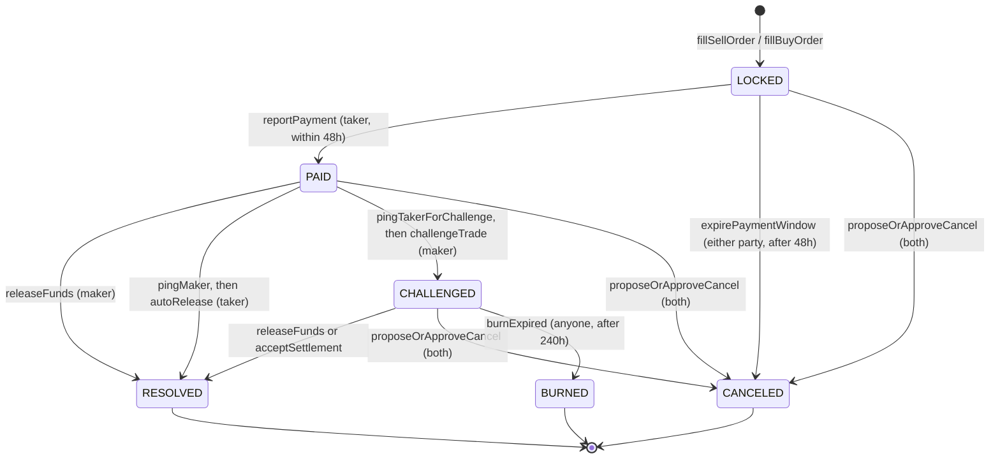
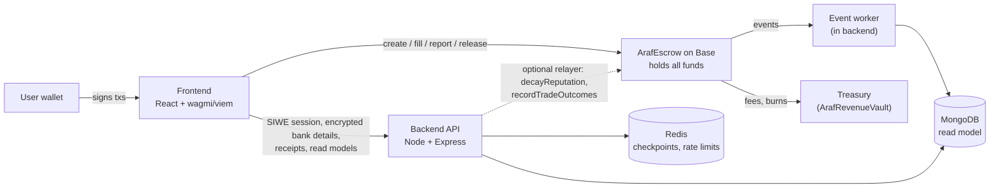

<p align="center">
  
</p>

<h1 align="center">Araf Protocol</h1>

<p align="center">
  <strong>Escrow for trading stablecoins against bank transfers, with no moderator:<br>
  if a dispute drags on, both sides' deposits slowly burn.</strong>
</p>

<p align="center"><em>Trust the Time, Not the Oracle.</em></p>

<p align="center">
  <a href="https://github.com/MyDemir/Araf-Protocol/actions/workflows/ci.yml"></a>
  <a href="LICENSE"></a>
  
  
</p>

> **Status:** testnet software, not audited. Do not use with real funds. See [Project status](#project-status).

---

## The problem

People who swap stablecoins (USDT, USDC) for money in a bank account usually do it peer to peer: one side
sends tokens, the other sends a bank transfer. The bank transfer happens off-chain, so no smart contract can
see whether it arrived. Today's P2P platforms solve this with a moderator who reads screenshots and decides who
is right. That makes the platform a custodian of trust: users depend on its staff, its response time and its
judgment, and the platform carries the liability of every decision.

## How Araf works

Araf does not try to find out who is right. It makes an unresolved trade expensive for **both** sides, so the
cheapest move for each of them is to finish honestly.

1. **Order.** A user posts a parent order to sell or buy crypto. Orders can be filled in parts.
2. **Fill = lock.** Each fill creates a child trade. The *maker* (crypto seller) has the tokens plus a bond
   locked in `ArafEscrow`; the *taker* (fiat payer) posts a bond too.
3. **Pay off-chain.** The taker sends the bank transfer within 48 hours and calls `reportPayment`.
4. **Release.** The maker sees the money and calls `releaseFunds`. Both bonds come back, minus a small fee.

If something goes wrong, time decides, not a person:

- **Taker never reports payment:** after 48 hours either party can call `expirePaymentWindow`; the maker is refunded
  and the taker loses 2% of their bond.
- **Maker goes silent after payment:** the taker pings (`pingMaker`) and, 24 hours later, calls `autoRelease`.
- **Maker says the money never arrived:** the maker pings first (`pingTakerForChallenge`), then opens a
  challenge with `challengeTrade`. This starts the **bleeding escrow**: after a 48-hour grace period both bonds
  shrink every hour, and later the locked tokens too. The parties can still release, cancel together, or agree
  on a split (`proposeSettlement` / `acceptSettlement`). At hour 240 anyone can call `burnExpired`, and
  everything left goes to the treasury.

Lying or stalling costs the liar as well, so there is no reason to drag a dispute out. The contract never
interprets receipts or intent; it only enforces deadlines and payouts.

### Child-trade lifecycle

States and transitions below are the `TradeState` enum and the functions in
[`contracts/src/ArafEscrow.sol`](contracts/src/ArafEscrow.sol#L54-L62). A child trade starts in `LOCKED` when an
order is filled (`fillSellOrder` / `fillBuyOrder`). `TradeState.OPEN` exists in the enum, but trades start
directly in `LOCKED`; `OPEN` is used only on the order side (`OrderState`).



While a trade is `CHALLENGED` the amounts bleed on this schedule (hours counted from `challengeTrade`):

| Window | What shrinks | Rate | Lost by hour 240 |
|---|---|---|---|
| 0-48h | nothing (grace period) | - | - |
| 48-240h | taker bond | 0.42% per hour | about 80.6% |
| 48-240h | maker bond | 0.26% per hour | about 49.9% |
| 144-240h | locked tokens | 0.68% per hour | about 65.3% |
| 240h | `burnExpired` sends the whole remaining balance to the treasury | - | 100% |

`getCurrentAmounts(tradeId)` returns the live post-decay amounts. No decay runs in any other state.

## Key parameters

Every value below is read from the contract source. "Constant" means it cannot be changed after deployment;
"default" means the owner can change it within the stated bounds.

| Parameter | Value | Kind | Source |
|---|---|---|---|
| Protocol fee, taker | 15 bps (0.15%) of the trade amount | default | [`ArafEscrow.sol#L261`](contracts/src/ArafEscrow.sol#L261) |
| Protocol fee, maker | 15 bps (0.15%); 0 on Tier 0 orders | default | [`#L262`](contracts/src/ArafEscrow.sol#L262), [`#L722`](contracts/src/ArafEscrow.sol#L722) |
| Fee ceiling | 2,000 bps per side | constant | [`#L307`](contracts/src/ArafEscrow.sol#L307) |
| Payment window | 48 hours after lock | constant | [`#L269`](contracts/src/ArafEscrow.sol#L269) |
| Grace period | 48 hours (before bleeding; also the earliest `pingMaker` after payment) | constant | [`#L266`](contracts/src/ArafEscrow.sol#L266) |
| Maker challenge ping | earliest 24h after payment; challenge allowed in `[ping+24h, ping+48h)` | constant | [`#L969`](contracts/src/ArafEscrow.sol#L969), [`#L279`](contracts/src/ArafEscrow.sol#L279) |
| Auto-release wait | 24 hours after `pingMaker` | constant | [`#L1137`](contracts/src/ArafEscrow.sol#L1137) |
| Liveness penalty | 2% of bond (`autoRelease`: both bonds; `expirePaymentWindow`: taker bond) | constant | [`#L264`](contracts/src/ArafEscrow.sol#L264) |
| Taker bond decay | 42 bps per hour, from hour 48 | constant | [`#L289`](contracts/src/ArafEscrow.sol#L289) |
| Maker bond decay | 26 bps per hour, from hour 48 | constant | [`#L290`](contracts/src/ArafEscrow.sol#L290) |
| Token (principal) decay | 34 bps x 2 = 68 bps per hour, from 96h after grace (hour 144) | constant | [`#L291`](contracts/src/ArafEscrow.sol#L291), [`#L270`](contracts/src/ArafEscrow.sol#L270), [`#L1378`](contracts/src/ArafEscrow.sol#L1378) |
| Maximum bleeding | 240 hours after challenge, then `burnExpired` | constant | [`#L271`](contracts/src/ArafEscrow.sol#L271) |
| Settlement proposal deadline | 10 minutes to 7 days | constant | [`ArafSettlementLib.sol#L35-L36`](contracts/src/ArafSettlementLib.sol#L35-L36) |
| Minimum wallet age (taker) | 2 days after `registerWallet` | constant | [`#L280`](contracts/src/ArafEscrow.sol#L280) |
| Minimum native balance (taker) | 0.001 ETH | constant | [`#L293`](contracts/src/ArafEscrow.sol#L293) |
| Trade cooldown, Tier 0 and 1 | 4 hours (max 30 days); Tier 0 and 1 orders; not applied to Tier 2+ | default | [`#L281-L282`](contracts/src/ArafEscrow.sol#L281-L282), [`#L296`](contracts/src/ArafEscrow.sol#L296), [`#L597`](contracts/src/ArafEscrow.sol#L597) |

**Tiers.** A wallet's tier comes from its on-chain reputation. Higher tiers post smaller bonds. A clean history
lowers the bond by 1 percentage point; open risk points raise it by 3
([`#L254-L255`](contracts/src/ArafEscrow.sol#L254-L255)).

| Tier | Maker bond | Taker bond | Min. successful trades | Max. risk points |
|---|---|---|---|---|
| 0 | 0% | 0% | 0 | 100 |
| 1 | 8% | 10% | 15 | 80 |
| 2 | 6% | 8% | 50 | 50 |
| 3 | 5% | 5% | 100 | 30 |
| 4 | 2% | 2% | 200 | 15 |

Sources: bonds [`#L242-L252`](contracts/src/ArafEscrow.sol#L242-L252) (constant); thresholds
[`#L511-L512`](contracts/src/ArafEscrow.sol#L511-L512) (defaults, owner-adjustable). Tiers above 0 also require
15 days since the first successful trade ([`ArafReputationLib.sol#L77`](contracts/src/ArafReputationLib.sol#L77)),
and the owner sets per-token amount caps for Tiers 0-3 (`setTokenConfig`). Only trades of at least 20 USD count
toward reputation ([`#L287`](contracts/src/ArafEscrow.sol#L287)).

## Architecture



**Contracts** (`contracts/`, Solidity 0.8.24, Hardhat ^2.22, OpenZeppelin ^5.0.2). `ArafEscrow.sol` is the
only source of truth: orders, child trades, bonds, bleeding, reputation and payouts. It links two libraries,
`ArafReputationLib` and `ArafSettlementLib`. `ArafRevenueVault.sol` splits protocol revenue into reward and
treasury reserves, and `ArafRewards.sol` pays "Proof of Peace" rewards for fast clean releases. Neither can
change a trade's outcome.

**Backend** (`backend/`, Node 22, Express ^4.19, Mongoose ^8.4, Redis ^4.6, ethers ^6). Sign-In with Ethereum
sessions, AES-256-GCM encrypted storage of bank details and receipts (key from env or AWS KMS), an event worker
that mirrors contract events into MongoDB (with checkpoints, replay and a dead-letter queue), and REST routes for
orders, trades, stats and rewards.

**Frontend** (`frontend/`, React ^18.3, Vite ^5.3, wagmi ^2.12, viem ^2.21, Tailwind). Screens: Home,
Marketplace, Trade Room, Operations Center, Profile Center and an owner-only Admin view. All fund-moving
actions are signed by the user's wallet directly against the contract.

### Trust boundaries

- **The backend never holds funds and cannot move escrow.** Payouts happen only through contract functions
  that check the caller (maker, taker) and the state. The optional `RELAYER_PRIVATE_KEY` is used only for
  permissionless maintenance calls (`decayReputation`, `ArafRewards.recordTradeOutcomes`).
- **The contract owner can** (`onlyOwner` in `ArafEscrow.sol`): change the treasury address (`setTreasury`),
  fees within the 2,000 bps ceiling (`setFeeConfig`), cooldowns (`setCooldownConfig`), supported tokens and tier
  caps (`setTokenConfig`), reputation policy and tier thresholds, and `pause` / `unpause`.
- **The owner cannot** take escrowed funds or decide a trade. There is no withdraw or rescue function, and
  `pause` blocks only new orders and fills; open trades can always be closed. Fees are snapshotted per order, so
  a fee change does not affect trades already open.
- The owner is a single address today. Moving it to a multisig is part of the mainnet checklist
  ([GOVERNANCE_READINESS](docs/EN/GOVERNANCE_READINESS.md)).

## Project status

- **Network:** built for Base. The Base Sepolia testnet deployment is in progress; no public contract address
  or app URL is published yet. No mainnet deployment.
  <!-- TODO: after the Base Sepolia deploy, add the BaseScan contract link and the live frontend URL here. -->
- **Audit:** no external security audit has been done.
- **Tests** (measured 7 October 2026 on commit `aaea9bb`):

  | Package | Runner | Result |
  |---|---|---|
  | contracts | Hardhat + Chai | 267 passing |
  | backend | Jest | 463 passing (93 suites) |
  | frontend | Vitest | 634 passing (82 files) |

- **Mainnet readiness:** tracked in [docs/TR/MAINNET_READINESS_CHECKLIST.md](docs/TR/MAINNET_READINESS_CHECKLIST.md).
- **Known limits:** open design questions are listed in [docs/EN/BACKLOG.md](docs/EN/BACKLOG.md). Examples: Tier 0
  has no bond, tier promotion depends on trade count rather than volume, and penalties go to the treasury rather
  than to the wronged party.

## Quick start

Requirements: Node.js 22 (see `.nvmrc`), npm, and MongoDB + Redis for the backend (local Docker is enough; see
[docs/EN/DEPLOYMENT_GUIDE.md](docs/EN/DEPLOYMENT_GUIDE.md) section 1).

```bash
nvm use                 # Node 22 from .nvmrc
npm run setup           # npm ci in contracts, backend, frontend + creates missing .env files
```

`npm run setup` runs `npm run init:env`, which creates missing `.env` files from `.env.example` and generates
`JWT_SECRET` and `MASTER_ENCRYPTION_KEY` for `backend/.env`. It never overwrites an existing file; run
`node scripts/init-env.js --fix-secrets` to regenerate placeholder secrets. For a local Hardhat node set
`BASE_RPC_URL=http://127.0.0.1:8545` and `EXPECTED_CHAIN_ID=31337` in `backend/.env`.

```bash
# Tests (test files live under test/<package>/)
npm run test:all                  # backend + frontend + contracts + ABI drift
npm --prefix contracts test       # Hardhat
npm --prefix backend test         # Jest
npm --prefix frontend test        # Vitest
npm run test:abi-drift            # contract ABI vs. ABI strings used by frontend and backend

# Lint
npm run lint                      # backend + frontend + contracts (solhint)

# Run locally
npm run dev:backend
npm run dev:frontend

# Build
npm run build:frontend
npm run build:frontend:testnet    # Base Sepolia build (sets VITE_TARGET_CHAIN=base-sepolia)

# Gas baseline
npm --prefix contracts run gas:baseline
```

## Deploy

Contracts deploy in a fixed order (`ArafReputationLib`, then `ArafSettlementLib`, then `ArafEscrow`) with
`npm --prefix contracts run deploy:base-sepolia`, which reads `BASE_SEPOLIA_RPC_URL` and `DEPLOYER_PRIVATE_KEY` from
`contracts/.env` and refuses a public deploy without explicit confirmation (`CONFIRM_PUBLIC_DEPLOY=yes`). The rewards stack (`ArafRevenueVault`, `ArafRewards`) is deployed separately with
`deploy:rewards:base-sepolia`. The full step-by-step runbook, including verification on BaseScan and the testnet
frontend build, is in [docs/EN/DEPLOY_BASE_SEPOLIA.md](docs/EN/DEPLOY_BASE_SEPOLIA.md)
(Türkçe: [docs/TR/DEPLOY_BASE_SEPOLIA.md](docs/TR/DEPLOY_BASE_SEPOLIA.md)). Local deployment against a Hardhat
node is covered in [docs/EN/DEPLOYMENT_GUIDE.md](docs/EN/DEPLOYMENT_GUIDE.md).

## Documentation

Start at the documentation index: [docs/README.md](docs/README.md). The most important documents:

| Document | What it covers |
|---|---|
| [Architecture](docs/EN/ARCHITECTURE.md) ([TR](docs/TR/ARCHITECTURE.md)) | Full technical reference: contract surface, state machine, payouts, backend worker |
| [Game theory](docs/EN/GAME_THEORY.md) ([TR](docs/TR/GAME_THEORY.md)) | Why the bleeding escrow pushes both sides toward a clean finish |
| [Incentives and rewards](docs/EN/ARCHITECTURE_INCENTIVES.md) ([TR](docs/TR/ARCHITECTURE_INCENTIVES.md)) | Revenue vault and Proof of Peace rewards |
| [API](docs/EN/API.md) ([TR](docs/TR/API.md)) | Backend REST endpoints |
| [Environment variables](docs/EN/ENV.md) ([TR](docs/TR/ENV.md)) | Every `.env` setting for contracts, backend and frontend |
| [Governance readiness](docs/EN/GOVERNANCE_READINESS.md) ([TR](docs/TR/GOVERNANCE_READINESS.md)) | Owner powers and the path to a multisig |
| [Rewards rollout](docs/EN/REWARDS_ROLLOUT.md) ([TR](docs/TR/REWARDS_ROLLOUT.md)), [abuse observability](docs/EN/REWARDS_ABUSE_OBSERVABILITY.md) ([TR](docs/TR/REWARDS_ABUSE_OBSERVABILITY.md)) | Proof of Peace go-live order and abuse monitoring |
| [Backlog](docs/EN/BACKLOG.md) ([TR](docs/TR/BACKLOG.md)) | Known limits and deferred design changes |
| [Gas baseline](docs/GAS_BASELINE.md) | Measured gas cost per function |
| [Colosseum submission](docs/colosseum/) | Hackathon submission material |

## Repository layout

```text
.
├── contracts/   Solidity sources (src/), Hardhat config, deploy and ops scripts
├── backend/     Express API, event worker, jobs, Mongo models (scripts/)
├── frontend/    React + Vite app (src/), static assets (public/)
├── test/        Tests per package: contracts/, backend/, frontend/, ui-lab/
├── docs/        EN/ and TR/ documentation, colosseum/ submission material
├── scripts/     init-env.js (creates local .env files)
└── package.json Root scripts: setup, test:all, lint, dev, build
```

Full tree: [docs/EN/REPOSITORY_TREE.md](docs/EN/REPOSITORY_TREE.md).

## Security

This code has **not been audited** and is intended for **testnet use only**. Do not deposit real funds.

If you find a vulnerability, please do not open a public issue. Report it privately through
[GitHub Security Advisories](https://github.com/MyDemir/Araf-Protocol/security/advisories/new) for this
repository. For non-sensitive bugs, use [GitHub Issues](https://github.com/MyDemir/Araf-Protocol/issues).

## License

Licensed under the [Apache License 2.0](LICENSE).

---

## Türkçe özet

**Araf Protocol**, stablecoin (USDT/USDC) ile banka havalesi arasında eşler arası takas için moderatörsüz bir
emanet (escrow) kontratıdır. Satıcı token'ları ve teminatını kontrata kilitler, alıcı da teminat yatırır; alıcı
havaleyi 48 saat içinde yapıp bildirir, satıcı serbest bırakır. Anlaşmazlıkta kimse hakemlik yapmaz: 48 saatlik
ek süreden sonra iki tarafın teminatı saatlik erir, 144. saatten itibaren kilitli token da erir, 240. saatte kalan
her şey hazineye gider. Yalan söylemek ya da oyalamak iki tarafa da pahalıya patlar. Durum: Base Sepolia testnet
yayını hazırlanıyor, harici denetim yok, gerçek fonla kullanmayın. Kurulum: Node 22, `npm run setup`, testler
`npm run test:all`. Belgeler: [docs/README.md](docs/README.md), [Mimari](docs/TR/ARCHITECTURE.md),
[Oyun teorisi](docs/TR/GAME_THEORY.md), [Base Sepolia deploy](docs/TR/DEPLOY_BASE_SEPOLIA.md),
[Backlog](docs/TR/BACKLOG.md).
