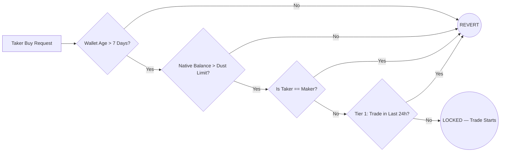
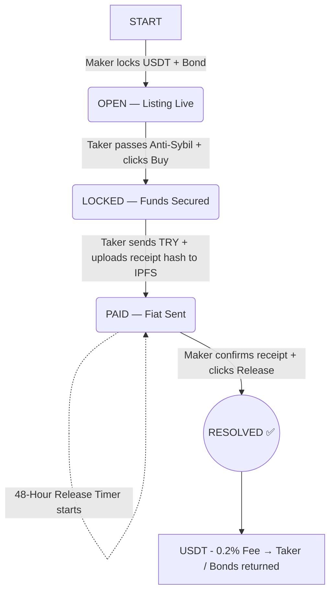

# 🌀 Araf Protocol — Canonical Architecture Document

> **Version:** 1.3 (Web2.5 Hybrid Reality)  
> **Status:** Architecture Finalized — Mainnet Ready  
> **Network:** Base (Layer 2)  
> **Last Updated:** March 2026

---

## 📌 Table of Contents

1. [Vision & Core Philosophy](#1-vision--core-philosophy)
2. [Hybrid Architecture: On-Chain vs Off-Chain](#2-hybrid-architecture-on-chain-vs-off-chain)
3. [System Participants](#3-system-participants)
4. [Tier & Bond System](#4-tier--bond-system)
5. [Anti-Sybil Shield](#5-anti-sybil-shield)
6. [Standard Trade Flow (Happy Path)](#6-standard-trade-flow-happy-path)
7. [Dispute System — Bleeding Escrow & Collaborative Cancel](#7-dispute-system--bleeding-escrow--collaborative-cancel)
8. [Reputation, Scoring & Penalties](#8-reputation-scoring--penalties)
9. [Treasury Model](#9-treasury-model)
10. [Attack Vectors & Known Limitations](#10-attack-vectors--known-limitations)
11. [Finalized Protocol Parameters](#11-finalized-protocol-parameters)
12. [Future Evolution Path](#12-future-evolution-path)

---

## 1. Vision & Core Philosophy

Araf Protocol is a **non-custodial, humanless, oracle-free** peer-to-peer escrow system enabling trustless exchange between fiat currency (TRY) and crypto assets (USDT).

### Core Principles

| Principle | Description |
|---|---|
| **Non-Custodial** | The platform never holds user funds. Everything is locked in transparent on-chain smart contracts. |
| **Oracle-Free Dispute Resolution** | The system has no access to bank data, external APIs, or real-world payment verification for **arbitration**. Disputes are resolved via time-decay mechanism, not oracles. |
| **Humanless** | No moderators, arbitrators, or jury systems. All resolution is automated by code and timers. |
| **MAD-Based Security** | Security relies on Mutually Assured Destruction game theory — dishonest behavior always results in financial loss. |
| **Code is Law** | Operational cost is zero. No customer service. No dispute moderators. |

### The "Oracle-Free" Clarification

**What we mean by Oracle-Free:**
- ❌ No oracle verifies bank transfers
- ❌ No oracle decides who is "right" in disputes
- ❌ No external data feeds control escrow release
- ✅ Dispute resolution is **time-based** (Bleeding Escrow), not data-based

**What uses off-chain infrastructure:**
- 🔐 PII data storage (IBAN, Telegram handles) — **GDPR/KVKK compliance requirement**
- 📊 Orderbook & trade indexing — **Performance optimization**
- 📈 Analytics & statistics — **User experience enhancement**

> **Why the distinction matters:** Traditional P2P platforms use oracles or human moderators to **judge disputes**. Araf Protocol uses oracles only for **data storage that cannot legally exist on-chain**. The dispute resolution mechanism remains fully autonomous and deterministic.

---

## 2. Hybrid Architecture: On-Chain vs Off-Chain

Araf Protocol operates as a **Web2.5 Hybrid System** where critical security-sensitive operations happen on-chain, while privacy-sensitive and performance-critical data live off-chain.

### Architecture Decision Matrix

| Component | Storage | Rationale |
|-----------|---------|-----------|
| **USDT/USDC Escrow** | On-Chain (Smart Contract) | **Security:** Immutable, trustless, non-custodial |
| **Trade State Machine** | On-Chain (Smart Contract) | **Security:** Bleeding Escrow timer is autonomous |
| **Reputation Scores** | On-Chain (Smart Contract) | **Integrity:** Permanent, unforgeable proof of history |
| **Bond Calculations** | On-Chain (Smart Contract) | **Determinism:** No backend can manipulate penalties |
| **PII Data (IBAN, Phone)** | Off-Chain (MongoDB + KMS) | **Privacy:** GDPR/KVKK "Right to be Forgotten" |
| **Orderbook & Listings** | Off-Chain (MongoDB) | **Performance:** Sub-second query times for UX |
| **Analytics Dashboard** | Off-Chain (MongoDB) | **Flexibility:** Real-time stats, charts, filtering |

### Why Off-Chain for PII?

**Legal Requirements:**
```
EU GDPR Article 17: Right to Erasure ("Right to be Forgotten")
Turkey KVKK Article 7: Data Subject Rights (Deletion, Correction)
```

**Blockchain Reality:**
```solidity
// ❌ ILLEGAL: Public blockchain cannot store personal data
mapping(address => string) public userIBAN; 
// → Immutable, public, violates GDPR

// ❌ STILL ILLEGAL: Encrypted data still violates deletion rights
mapping(address => bytes) public encryptedIBAN;
// → Cannot be deleted, only access to keys can be revoked
```

**Solution:**
```javascript
// ✅ COMPLIANT: Off-chain encrypted storage with KMS
MongoDB User Schema:
{
  wallet_address: "0x123...",
  pii_data: {
    iban_enc: "AES-256-GCM encrypted",
    telegram_enc: "AES-256-GCM encrypted"
  },
  // Can be DELETED on user request
}
```

### Why Off-Chain for Orderbook?

**Performance Requirements:**

| Metric | On-Chain | Off-Chain (MongoDB) |
|--------|----------|---------------------|
| Query Time | 2-5 seconds | **< 50ms** |
| Filter/Sort | Gas-expensive | **Free** |
| Pagination | Complex | **Native** |
| Real-time Updates | Block-dependent | **Instant** |

**Example:**
```javascript
// User searches: "Show me TRY listings between 1000-5000, sorted by rate"

// ❌ ON-CHAIN: Loop through all trades, filter client-side
// Cost: ~0.01 ETH gas + 5 second wait

// ✅ OFF-CHAIN: MongoDB indexed query
const listings = await Listing.find({
  fiat_currency: 'TRY',
  'limits.min': { $lte: 5000 },
  'limits.max': { $gte: 1000 },
  status: 'OPEN'
}).sort({ rate: 1 }).limit(20);
// Cost: Free, < 50ms response
```

### The "Zero Trust" Backend Model

Despite using off-chain infrastructure, **the backend cannot steal funds or manipulate outcomes**:

```
✅ Backend has ZERO private keys (Relayer pattern)
✅ Backend cannot release escrow (only users can sign)
✅ Backend cannot skip Bleeding Escrow timer (on-chain enforced)
✅ Backend cannot fake reputation scores (verified on-chain)
❌ Backend CAN decrypt PII (necessary evil for UX)
```

**Mitigation:**
- PII access is rate-limited (Redis: 3 requests per 10 minutes)
- Every PII fetch generates audit logs (immutable, timestamped)
- Future: Zero-knowledge proofs for IBAN verification (see Section 12)

---

## 3. System Participants

| Role | Label | Description |
|---|---|---|
| **Maker** (Satıcı) | Seller | Opens the listing. Locks USDT + collateral bond into the contract. |
| **Taker** (Alıcı) | Buyer | Sends fiat (TRY) off-chain. Triggers escrow release. |
| **Treasury** | Protocol | Receives protocol fees (0.2%) and burned/decayed funds from failed disputes. |
| **Backend (Relayer)** | Infrastructure | Stores encrypted PII, indexes orderbook, relays signed transactions. **Cannot control funds.** |

---

## 4. Tier & Bond System

Optimized for high-volume traders while maintaining strict entry barriers for new wallets to solve the "Cold Start" problem safely.

| Tier | Criteria | Trade Limit (TRY) | Maker Bond | Taker Bond | Trade Frequency |
|---|---|---|---|---|---|
| **Tier 1** | 0–3 Completed Trades | 500 – **5,000 ₺** | %18 | **%0** | **Max 1 per 24h** |
| **Tier 2** | 3+ Successful Trades | 5,001 – **50,000 ₺** | %15 | %12 | **Unlimited** |
| **Tier 3** | High-Volume Traders | **50,001 ₺ +** | %10 | %8 | **Unlimited** |

> **Note:** Tier 1 Taker's 0% bond is protected exclusively by the on-chain Anti-Sybil Shield and the 24h cooldown to prevent mass-griefing. Tier 2 and 3 have no volume limits.

### Bond Modifiers (Reputation-Based)

| Condition | Bond Adjustment |
|---|---|
| 0 failed disputes | **−3%** discount |
| 1 failed dispute | **+5%** penalty |

---

## 5. Anti-Sybil Shield

Four on-chain filters protect the system from bot networks, griefing attacks, and self-trading at zero cost.



| Filter | Rule | Purpose |
| --- | --- | --- |
| **Self-Trade Prevention** | `msg.sender != maker` | Blocks users from acting as taker on their own listings |
| **Wallet Age** | > 7 days old | Blocks freshly created sybil wallets |
| **Dust Limit** | Must hold ~$2 in native gas token | Blocks zero-balance throwaway wallets |
| **Cooldown** | Max 1 trade per 24h (Tier 1) | Limits bot-scale spam attacks |

---

## 6. Standard Trade Flow (Happy Path)



### State Definitions

| State | Triggered By | Description |
| --- | --- | --- |
| `OPEN` | Maker | Listing is live. USDT + Maker bond locked **on-chain**. |
| `LOCKED` | Taker | Trade started. Taker bond locked **on-chain**. Anti-Sybil passed. |
| `PAID` | Taker | Fiat sent off-chain. IPFS receipt hash recorded **on-chain**. 48h timer starts **on-chain**. |
| `RESOLVED` | Maker or Contract | Successful close. **0.2% Success Fee** deducted **on-chain**. Funds distributed. |
| `CANCELED` | Collaborative | Trade voided via 2/2 EIP-712 signatures. USDT returns to Maker. Bonds fully refunded. No fee charged. |

---

## 7. Dispute System — Bleeding Escrow & Collaborative Cancel

This is the canonical dispute resolution model. It is **time-based, oracle-free, and psychologically coercive** by design. The contract cannot see the bank. Instead of pretending to judge, it makes dishonesty and stubbornness **mathematically expensive**.

### Full State Machine

```text
PAID
  │
  ├──[Maker clicks Release]──────────────────────────── RESOLVED ✅
  │
  └──[Maker clicks Challenge]
            │
          GRACE PERIOD (48h)
          ├── No financial penalty (on-chain timer)
          ├── Both parties negotiate off-chain
          │
          ├──[Collaborative Cancel (2/2 EIP-712 Signatures)]
          │    Maker "Propose Cancel" + Taker "Approve" ─── CANCELED 🔄
          │    (USDT returned to Maker, Bonds fully refunded)
          │
          ├──[Mutual Release]──────────────────────────── RESOLVED ✅
          │
          └──[No Agreement after 48h] (One party refuses/ignores)
                      │
                  BLEEDING ⏳ (on-chain autonomous)
                  ├── Asymmetric daily decay begins
                  ├── Challenge-opener's bond decays faster
                  │
                  ├──[Maker clicks Release]──────────────── RESOLVED ✅ (remaining funds)
                  ├──[Collaborative Cancel (2/2)]────────── CANCELED 🔄 (remaining funds)
                  └──[10 Days pass — No agreement]
                            │
                          BURNED 💀
                          (All remaining funds → Treasury)
```

### Bleeding Decay Rates (Balanced)

| Asset | Challenge Opener | Other Party | Starts |
| --- | --- | --- | --- |
| **Bond** | **−15% / day** | −10% / day | Day 1 of Bleeding (Hour 48) |
| **USDT** | −4% / day (shared) | −4% / day (shared) | **Day 4 of Bleeding** (Hour 120) |

> **Why USDT starts on Day 4:** Grace period (48h) + buffer days for weekend bank delays. This protects honest parties from immediate loss while still creating urgency.

---

## 8. Reputation, Scoring & Penalties

Simple, wallet-native reputation. No tokens, no accounts, no complex levels.

### Update Logic

| Outcome | Winning Party | Losing Party |
| --- | --- | --- |
| Dispute-free close | +1 Successful | +1 Successful |
| Dispute → resolved | +1 Successful | +1 Failed |
| BURNED | +1 Failed | +1 Failed |

### The 30-Day Ban (Blacklist)

If a wallet accumulates **2 or more `failedDisputes`**, it receives an automatic **30-day suspension** from acting as a Taker.

---

## 9. Treasury Model

Funds enter the treasury from three sources to act as **Protocol Revenue**:

| Source | Amount |
| --- | --- |
| **Success Fee** | **0.2%** of USDT from every successfully resolved trade |
| Bleeding decay (bonds) | 10–15% per day from active bleeding escrows |
| Bleeding decay (USDT) | 4% per day from both parties (after Day 4) |
| BURNED outcomes | 100% of remaining funds |

---

## 10. Attack Vectors & Known Limitations

| Attack | Risk | Mitigation | Status |
| --- | --- | --- | --- |
| **Fake receipt upload** | High | IPFS hash = proof of upload, not payment. Challenge timer + bond risk discourages false claims. | ⚠️ Partial |
| **Seller griefing** | Medium | Asymmetric bond decay (Opener loses faster) | ✅ Addressed |
| **Chargeback (bank reversal)** | Medium | Off-chain risk. Outside smart contract scope. Mitigated by Insurance Fund for T3. | ⚠️ Partial |
| **Sybil reputation farming** | Low | Min. tx amount + Unique counterparty weighting slows coordination. | ✅ Addressed |
| **Challenge timer spam (Tier 1)** | High | 24h cooldown + Dust filter + wallet age filter | ✅ Addressed |
| **Self-Trading (Wash Trade)** | High | On-chain `msg.sender != maker` check. | ✅ Addressed |
| **Unilateral Cancel Griefing** | High | Collaborative Cancel (2/2 signatures required) | ✅ Addressed |

---

## 11. Finalized Protocol Parameters

1. **Network:** **Base (Layer 2)** — Chosen for low gas fees, Ethereum-level security, and high USDT liquidity.
2. **Treasury Destination:** Protocol Revenue (Araf Treasury Contract).
3. **Protocol Fee:** **0.2%** on successful trades.
4. **USDT Decay Split:** Symmetrical (4% / 4%) starting on **Day 4**.
5. **Grace Period Length:** Strictly **48 Hours**.
6. **Blacklist Mechanism:** 30-Day time-limited ban (Taker-only restriction).

---

## 12. Future Evolution Path

### Phase 1: Current (Web2.5 Hybrid) ✅

```
On-Chain:  Escrow, State Machine, Reputation, Anti-Sybil
Off-Chain: PII Storage, Orderbook Cache, Analytics
```

**Limitation:** PII requires trust in backend encryption.

---

### Phase 2: Zero-Knowledge IBAN Verification (Research)

**Goal:** Prove "I sent TRY to correct IBAN" without revealing IBAN on-chain.

**Timeline:** 2-3 years (requires banking infrastructure evolution)

---

### Phase 3: Fully On-Chain Analytics (Optional)

**Potential Solution:** The Graph Protocol Subgraph for orderbook indexing.

**Decision:** Keep MongoDB for now (better UX), migrate when The Graph becomes cost-effective.

---

## Conclusion: Why Hybrid is Honest

Araf Protocol does not claim to be "100% decentralized" because that would be **dishonest** given current blockchain limitations:

**What we decentralize (the critical parts):**
- ✅ Custody of funds (non-custodial smart contract)
- ✅ Dispute resolution (time-based, no human judgment)
- ✅ Reputation integrity (immutable on-chain records)
- ✅ Anti-Sybil enforcement (on-chain checks)

**What we centralize (the privacy/performance parts):**
- ⚠️ PII storage (GDPR compliance requires deletion capability)
- ⚠️ Orderbook indexing (sub-second queries for UX)
- ⚠️ Analytics dashboard (real-time stats, filtering)

**Red Line:**
```
Backend NEVER controls:
❌ Fund custody
❌ Dispute outcomes
❌ Reputation scores
❌ Trade state transitions
```

This architecture is a **pragmatic compromise** between ideological decentralization and real-world usability. As blockchain technology evolves (ZK proofs, better privacy primitives), we will migrate more components on-chain.

---

*Araf Protocol — "The system does not judge. It makes dishonesty expensive."*
