

# 🌀 Araf Protocol
### Canonical Architecture & Technical Reference — V3 Order-First

[-0052FF?style=flat-square&logo=coinbase)](.)

---

*An order-first, child-trade escrow protocol for oracle-free, non-custodial P2P fiat ↔ crypto exchange.*

> **"Contract decides. Off-chain only mirrors, coordinates, and accelerates."**

---

## 📋 Table of Contents

| # | Section |
|---|---|
| 1 | [Executive canonical model](#1-executive-canonical-model) |
| 2 | [Hybrid architecture and technology stack](#2-hybrid-architecture-and-technology-stack) |
| 3 | [On-chain public surface](#3-on-chain-public-surface-arafescrowsol) |
| 4 | [Parent order vs child trade state model](#4-parent-order-vs-child-trade-state-model) |
| 5 | [Sell flow, buy flow, and role mapping](#5-sell-flow-buy-flow-and-role-mapping) |
| 6 | [Anti-sybil enforcement semantics](#6-anti-sybil-enforcement-semantics-v3) |
| 7 | [Dispute / Bleeding Escrow technical flow](#7-dispute--bleeding-escrow-technical-flow) |
| 8 | [Reputation / bans / clean-slate](#8-reputation--bans--clean-slate) |
| 9 | [Finalized parameters vs mutable config](#9-finalized-parameters-vs-mutable-config) |
| 10 | [Runtime connectivity and operational policies](#10-runtime-connectivity-and-operational-policies) |
| 11 | [Event worker / replay / mirror reliability](#11-event-worker--replay--mirror-reliability) |
| 12 | [Security architecture and trust boundaries](#12-security-architecture-and-trust-boundaries) |
| 13 | [Data models](#13-data-models-mongo-read-model-layer) |
| 14 | [Backend route surface and coordination semantics](#14-backend-route-surface-and-coordination-semantics) |
| 15 | [Frontend UX guardrail layer](#15-frontend-ux-guardrail-layer) |
| 16 | [Attack vectors and known limitations](#16-attack-vectors-and-known-limitations) |
| 17 | [Legacy concepts](#17-legacy-concepts-historical--deprecated--non-canonical) |
| 18 | [Final role of this document](#18-final-role-of-this-document) |

---

## 1. Executive canonical model

In Araf V3, the public market primitive is no longer listing-first; it is **parent-order first**.

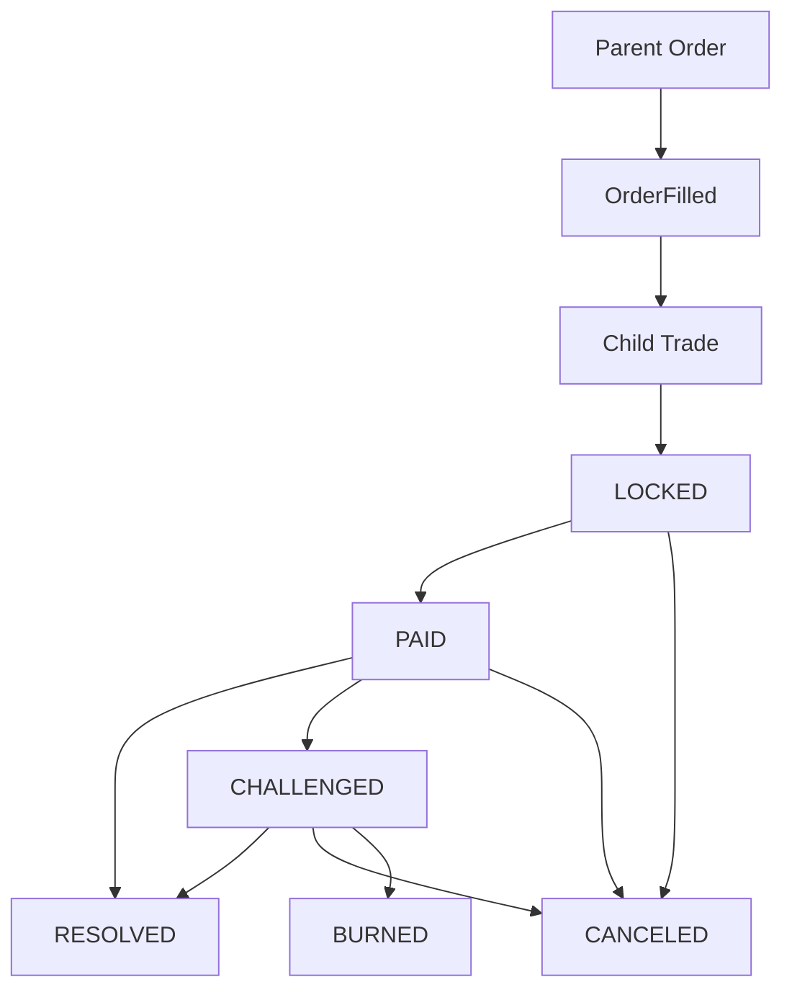

- **Parent Order** = public market/order layer
- **Child Trade** = actual escrow lifecycle (economic state machine)
- **Contract** = single authoritative state machine
- **Backend** = mirror + coordination + operational read layer
- **Frontend** = UX guardrail + contract access layer

### 1.1 Authority boundaries
- Final state transitions and economic payouts are contract-enforced.
- Backend is not an arbiter; it mirrors state and provides coordination surfaces.
- Frontend is not enforcement; it is a guardrail/orchestration layer.

### 1.2 Practical V3 consequence
- Market-facing primitive = parent order.
- Escrow/dispute/release/cancel/burn semantics live at child-trade level.
- Child-trade identity authority comes from `OrderFilled + getTrade(tradeId)`.

---

## 2. Hybrid architecture and technology stack

Araf must satisfy both hard security and practical operations. This yields a Web2.5 model: on-chain authority + off-chain operational acceleration.

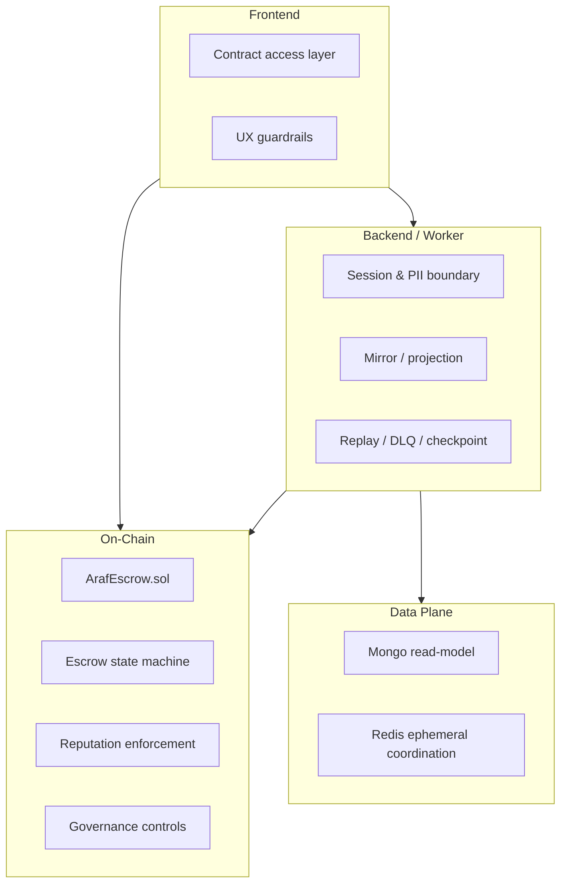

### 2.1 Why hybrid?
Araf must satisfy both hard security and practical operations:
- **On-chain:** custody, state transitions, economics, reputation enforcement
- **Off-chain (Mongo):** read model, performance, PII and operational metadata
- **Redis:** checkpoints, readiness, rate limiting, short-lived coordination

This yields a Web2.5 model: on-chain authority + off-chain operational acceleration.

### 2.2 Layer matrix

| Layer | Primary responsibility | Authority level | Technology |
|---|---|---|---|
| Contract | Escrow state machine, payouts, dispute economics, governance controls | **Authoritative** | Solidity / Base |
| Backend API | Session/security boundaries, projection, coordination | Non-authoritative | Node.js + Express |
| Event Worker | Event mirror, replay, checkpoint/DLQ handling | Non-authoritative | ethers + Mongo + Redis |
| Mongo | Read model / operational cache | Non-authoritative | MongoDB + Mongoose |
| Redis | Ephemeral coordination / runtime safety signals | Non-authoritative | Redis |
| Frontend | Contract write/read orchestration + UX guardrails | Non-authoritative | React + Wagmi + viem |

### 2.3 Non-custodial backend model
- Backend does not hold user-fund custody authority.
- Backend cannot fabricate release/challenge/cancel outcomes against contract rules.
- The optional `RELAYER_PRIVATE_KEY` is only for permissionless maintenance calls (`decayReputation`, `ArafRewards.recordTradeOutcomes`); it cannot move funds or create authority.
- Backend strength lies in coordination, observability, and secure PII boundaries.
- Araf does not decide who is right; split settlement is a dispute-only tool and is available only in `CHALLENGED`.

---

## 3. On-chain public surface (`ArafEscrow.sol`)

The contract is the single authoritative V3 state machine surface. The following function groups define live protocol behavior.

| Surface | Functions | Architectural meaning |
|---|---|---|
| Parent-order write surface | `createSellOrder`, `fillSellOrder`, `cancelSellOrder`, `createBuyOrder`, `fillBuyOrder`, `cancelBuyOrder` | Public market and fill primitive |
| Child-trade lifecycle write surface | `reportPayment`, `releaseFunds`, `challengeTrade`, `autoRelease`, `burnExpired`, `proposeOrApproveCancel`, `revokeCancel`, `expirePaymentWindow`, `proposeSettlement`, `acceptSettlement(tradeId, expectedProposalId)`, `rejectSettlement`, `withdrawSettlement`, `expireSettlement` | Real escrow lifecycle and economic state transitions |
| Liveness / auxiliary write surface | `registerWallet`, `pingMaker`, `pingTakerForChallenge`, `decayReputation` | Entry gate, liveness, and clean-slate maintenance |
| Governance / mutable admin surface (`onlyOwner`) | `setTreasury`, `setFeeConfig`, `setCooldownConfig`, `setTokenConfig`, `setReputationPolicy`, `setReputationTierThresholds`, `pause`, `unpause` (+ `Ownable`: `transferOwnership`, `renounceOwnership`) | Runtime policy and governance control surface |
| Read surface | `getOrder`, `getTrade`, `getReputation`, `getTokenConfig`, `getSettlementProposal`, `getRewardableTrade`, `getFeeConfig`, `getCooldownConfig`, `getCurrentAmounts`, `antiSybilCheck`, `getCooldownRemaining`, `getFirstSuccessfulTradeAt`, `cleanPeriod`, `maxAllowedTier`, `walletRegisteredAt`, `treasury`, `tradeCounter`, `orderCounter` | Verification, observability, and runtime read surface |

### 3.1 Parent-order write surface
- `createSellOrder(token, totalAmount, minFillAmount, tier, orderRef, paymentRiskLevel)` — the seller locks inventory + the full maker bond reserve upfront. Only an active ban is checked for the owner (`MakerBanActive`).
- `createBuyOrder(...)` — the buyer locks only its own full taker bond reserve; since the owner becomes taker in child trades, it passes the taker entry gate.
- `fillSellOrder(orderId, fillAmount, childListingRef)` / `fillBuyOrder(...)` — exact fill; the child trade is born `LOCKED` in the same tx. The final fill sweeps the whole remaining reserve (no rounding drift).
- `cancelSellOrder` / `cancelBuyOrder` — order owner only, only `OPEN`/`PARTIALLY_FILLED`; unfilled inventory (sell) and unused bond reserve are refunded.
- Order validation: `totalAmount > 0`, `0 < minFillAmount ≤ totalAmount`, `tier ≤ 4`, `orderRef ≠ 0`, tier ≤ the owner's effective tier (`TierNotAllowed`), amount ≤ the token's tier cap (`AmountExceedsTierLimit`; Tier 4 is unlimited). A disabled token direction reverts with `TokenDirectionNotAllowed`. Fee-on-transfer inflows revert with `InvalidTransferAmount`.
- Fill validation: `childListingRef ≠ 0`, no self-trade (`SelfTradeForbidden`), `fillAmount ≤ remaining`, `fillAmount ≥ minFillAmount` (except the final remainder).
- At fill time both the filler and the order owner must still qualify for the order tier (`TierNotAllowed`, Tier 0 exempt); the maker-role party is re-checked for an active ban (`MakerBanActive`) and the taker-role party passes the entry gate (ban/age/dust/cooldown). An owner penalized after create can no longer have their open order filled.
- `pause` only stops the `create*` and `fill*` calls of this surface (`whenNotPaused`); order cancellation and every trade path below ignore pause.

### 3.2 Child-trade lifecycle write surface
- `reportPayment(tradeId, ipfsHash)` — taker only, `LOCKED` only, only before `lockedAt + PAYMENT_WINDOW`; the receipt hash is not stored, its canonical record is the `PaymentReported` event.
- `releaseFunds` — maker only, `PAID` or `CHALLENGED`.
- `challengeTrade` — maker only, within the post-ping window (see §7).
- `autoRelease` — taker only, 24h after `pingMaker`.
- `burnExpired` — permissionless, after `challengedAt + MAX_BLEEDING`.
- `expirePaymentWindow` — maker or taker, from `lockedAt + PAYMENT_WINDOW` on.
- `proposeOrApproveCancel` / `revokeCancel` — both parties, `LOCKED`/`PAID`/`CHALLENGED`.
- `proposeSettlement` / `acceptSettlement(tradeId, expectedProposalId)` / `rejectSettlement` / `withdrawSettlement` / `expireSettlement` — `CHALLENGED` only (see §7.6).

> **Bytecode split (EIP-170):** `ArafEscrow` links two external libraries: `ArafReputationLib` (outcome recording, risk
> points, ban/tier ceiling, reputation policy validation) and `ArafSettlementLib` (terminal payout + treasury hooks,
> settlement proposal management). They run via DELEGATECALL on escrow storage; events are emitted from the escrow
> address with identical signatures, access control stays in the escrow, addresses are baked into the bytecode at deploy
> (no upgrade path). Deploy order: `ArafReputationLib` → `ArafSettlementLib` (independent of each other) → linked `ArafEscrow` (`contracts/scripts/deploy.js`).
> Runtime bytecode sizes (solc 0.8.24, `viaIR`, optimizer 200 runs, `cancun`): `ArafEscrow` 22,061 bytes (EIP-170 limit 24,576),
> `ArafReputationLib` 4,705, `ArafSettlementLib` 2,168 bytes. The Hardhat network sets `allowUnlimitedContractSize: false`, so the limit is enforced locally too.

### 3.3 Liveness / auxiliary write surface
- `registerWallet` — starts the wallet-age clock (once; `AlreadyRegistered`).
- `pingMaker` — taker, after `paidAt + GRACE_PERIOD`.
- `pingTakerForChallenge` — maker, after `paidAt + 24h`, once per trade.
- `decayReputation(wallet)` — permissionless clean-slate (see §8.3).

### 3.4 Governance / mutable admin surface
- `setTreasury` (zero address rejected)
- `setFeeConfig` (≤ 2000 bps per side)
- `setCooldownConfig` (≤ 30 days per tier)
- `setTokenConfig` (decimals 1–18 and equal to the token's `decimals()`; all four tier caps > 0)
- `setReputationPolicy`, `setReputationTierThresholds` (bounds in §8.4)
- `pause` / `unpause`

Owner powers per contract (none has a timelock; detailed runbook: [GOVERNANCE_READINESS.md](./GOVERNANCE_READINESS.md)):

| Contract | Owner functions | Code bound |
|---|---|---|
| `ArafEscrow` | `setTreasury`, `setFeeConfig`, `setCooldownConfig`, `setTokenConfig`, `setReputationPolicy`, `setReputationTierThresholds`, `pause`/`unpause` | Fee ≤ 2000 bps; cooldown ≤ 30 days; decimals must match the token; policy bounds §8.4; pause only stops create/fill |
| `ArafRevenueVault` | `setRewardBps`, `setFinalTreasury`, `setRewards` (one-shot), `setSupportedToken`, `setProductPool`, `withdrawTreasuryShare`, `withdrawTreasuryShareToFinal`, `pause`/`unpause` | `rewardBps` 4000–7000; withdrawals only from the treasury reserve; pause only stops sponsor funding |
| `ArafRewards` | `allocateEpochRewards`, `pause`/`unpause` | Source is the vault only; recording, finalize, claim and sweep are not pausable and no recipient can be chosen |

### 3.5 Read surface
- `getOrder`, `getTrade`, `getReputation`, `getTokenConfig`, `getSettlementProposal`
- `getRewardableTrade` (the only data source of ArafRewards)
- `getFeeConfig`, `getCooldownConfig`
- `getCurrentAmounts`
- `antiSybilCheck`, `getCooldownRemaining`, `getFirstSuccessfulTradeAt`, `walletRegisteredAt`
- `cleanPeriod()`, `maxAllowedTier(wallet)`
- Struct mappings are `internal`; data is only read through these named getters. There is no getter for reputation policy points; the values are published through `ReputationPolicyUpdated` / `ReputationTierThresholdsUpdated` events (also emitted by the constructor).

---

## 4. Parent order vs child trade state model

Parent orders carry market visibility; child trades carry the actual escrow lifecycle.

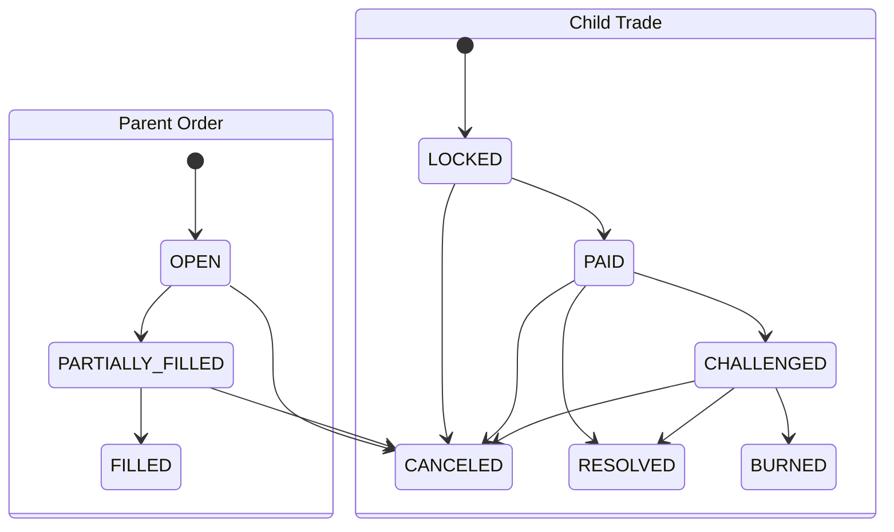

### 4.1 Parent-order states
- `OPEN`
- `PARTIALLY_FILLED`
- `FILLED`
- `CANCELED`

Parent orders carry market visibility and fillability, not escrow dispute semantics.

### 4.2 Child-trade states
- `OPEN` (kept in the enum; the V3 fill path spawns trades directly as `LOCKED`, `OPEN` is never written)
- `LOCKED`
- `PAID`
- `CHALLENGED`
- `RESOLVED`
- `CANCELED`
- `BURNED`

### 4.3 Fill-time child-trade creation
Both `fillSellOrder` and `fillBuyOrder` spawn child trades directly in `LOCKED` state in the same transaction.

### 4.4 Identity relationship
- Parent identity: `orderId`
- Child identity: `tradeId` (`onchain_escrow_id` mirror)
- Link authority: `OrderFilled(orderId, tradeId, ...)` + `getTrade(tradeId)`

---

## 5. Sell flow, buy flow, and role mapping

V3 role mapping is side-dependent, so the owner/maker/taker relationship must be stated explicitly.

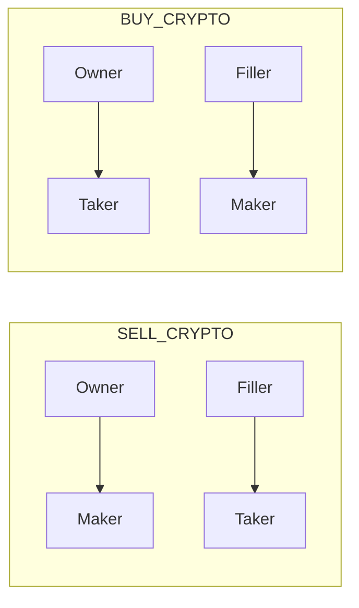

### 5.1 Sell-order flow
1. Owner calls `createSellOrder`
2. Filler calls `fillSellOrder` (taker gate enforced)
3. Child trade enters `LOCKED`
4. Taker calls `reportPayment`
5. Maker resolves with `releaseFunds` or dispute/cancel paths

### 5.2 Buy-order flow
1. Owner calls `createBuyOrder` (owner is eventual taker; gate enforced at create-time)
2. Filler calls `fillBuyOrder`
3. Owner (taker) is re-checked at fill-time
4. Child trade enters `LOCKED`
5. `reportPayment` then resolution/dispute/cancel paths

### 5.3 Side-dependent role mapping
No universal “maker=seller, taker=buyer” rule:
- `SELL_CRYPTO`: owner→maker, filler→taker
- `BUY_CRYPTO`: owner→taker, filler→maker

| Side | Role | Locks | Entry gate | Powers in the trade |
|---|---|---|---|---|
| `SELL_CRYPTO` | Owner = maker (crypto seller) | at create: inventory + full maker bond reserve | active ban at create and fill; tier ≤ effective tier at create, re-checked at fill | `releaseFunds`, `pingTakerForChallenge`, `challengeTrade`, cancel, settlement |
| `SELL_CRYPTO` | Filler = taker (crypto buyer) | at fill: taker bond | taker entry gate + tier | `reportPayment`, `pingMaker`, `autoRelease`, cancel, settlement |
| `BUY_CRYPTO` | Owner = taker (crypto buyer) | at create: full taker bond reserve | taker entry gate + tier at create and fill | `reportPayment`, `pingMaker`, `autoRelease`, cancel, settlement |
| `BUY_CRYPTO` | Filler = maker (crypto seller) | at fill: crypto + maker bond | active ban + tier | `releaseFunds`, `pingTakerForChallenge`, `challengeTrade`, cancel, settlement |

Either party may call `expirePaymentWindow`; `burnExpired` and `expireSettlement` are open to anyone.

---

## 6. Anti-sybil enforcement semantics (V3)

Canonical gate helper: `_enforceTakerEntry(wallet, tier)`

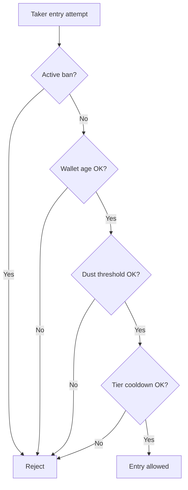

Gate components:
- active ban gate (`bannedUntil`; `TakerBanActive` while `block.timestamp <= bannedUntil`)
- wallet age: `registerWallet` + `WALLET_AGE_MIN` = **2 days** (`WalletTooYoung`)
- native dust threshold: `DUST_LIMIT` = **0.001 ETH** (`InsufficientNativeBalance`)
- tier cooldown: `tier0TradeCooldown` for a Tier 0 order, `tier1TradeCooldown` for Tier 1 (both default to **4 hours**, max 30 days); no cooldown for Tier 2+ (`TierCooldownActive`). `lastTradeAt` is only written for the taker on Tier 0/1 fills.

V3 enforcement points:
- `fillSellOrder` (filler/taker)
- `createBuyOrder` (owner/eventual taker)
- `fillBuyOrder` (owner/taker re-check)

The maker role is only checked for an active ban (`MakerBanActive`): `createSellOrder` (owner), `fillSellOrder` (owner), `fillBuyOrder` (filler). Age/dust/cooldown gates are taker-entry specific; the maker already locks inventory + bond. A tier gate applies as well: the order tier may not exceed the owner's effective tier at create time, nor the effective tier of either the owner or the filler at fill time.

`antiSybilCheck(wallet)` and `getCooldownRemaining(wallet)` are informational only; being parameter-less, they report the larger of the two tier cooldowns, while binding decisions stay in the state-changing functions.

So anti-sybil is no longer lockEscrow-centered legacy; it is child-trade-entry centered in V3.

---

## 7. Dispute / Bleeding Escrow technical flow

This section describes the real V3 economic state machine. After `LOCKED` and `PAID`, normal close, dispute, liveness, cancel, and burn paths all operate at child-trade level.

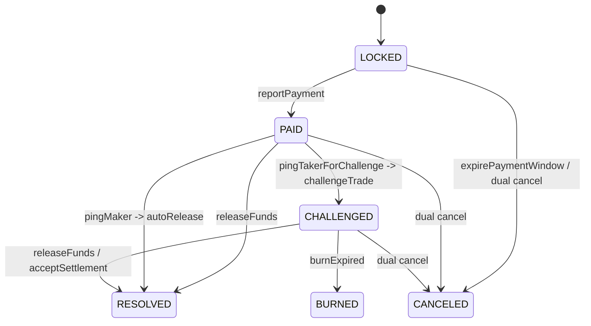

### 7.1 Resolution paths after `LOCKED` and `PAID`
- **Normal close:** maker `releaseFunds`
- **Dispute path:** maker `pingTakerForChallenge` (at the earliest `paidAt + 24h`; before that `PingCooldownNotElapsed`) → 24h response window → `challengeTrade` (maker only). The ping is a claim: if the maker does not open the challenge within `[ping+24h, ping+48h)` (`MAKER_CHALLENGE_WINDOW` = 24h, constant), the ping **lapses**; from second `ping+48h` on, `challengeTrade` reverts with `ChallengeWindowExpired`. The maker may ping once per trade (`AlreadyPinged`).
- **Liveness path:** taker `pingMaker` (after `paidAt + GRACE_PERIOD` = `paidAt + 48h`) → 24h → `autoRelease` (`AUTO_RELEASE_PENALTY_BPS` = 2% from both bonds). While the maker's ping is valid (before `ping+48h`) `pingMaker` reverts with `ConflictingPingPath`; it opens from the second the ping lapses. A maker who pings and goes silent therefore cannot lock a PAID trade forever. In the other direction, once the taker has called `pingMaker`, the maker's `pingTakerForChallenge` reverts with `ConflictingPingPath`.
- **The maker can always release:** `releaseFunds` from `PAID` is open at any time regardless of the ping (clean release); a release from `CHALLENGED` is `DISPUTED_RELEASE` + a maker dispute loss.
- **Mutual cancel:** each party sends its own `proposeOrApproveCancel(tradeId)` tx (no separate signature); before the second consent a party may withdraw its own consent with `revokeCancel(tradeId)` (`CancelRevoked`; `NoCancelConsent` if there is none)
- **Payment window expiry:** `reportPayment` is only accepted before `lockedAt + PAYMENT_WINDOW` (48h) (`PaymentWindowClosed` from the boundary second). If no payment is reported within 48h of LOCKED, either party calls `expirePaymentWindow` (`PaymentWindowActive` before that); the maker is refunded in full, the taker bond pays a 2% liveness penalty and the taker gets a negative reputation signal
- **Terminal burn:** `burnExpired` once `MAX_BLEEDING` (240h) has elapsed since the challenge

### 7.2 Bleeding components
- maker bond decay
- taker bond decay
- post-threshold crypto-side decay

Exact timeline (all times from `challengedAt`, matching `getCurrentAmounts`):

| Window | What decays | Rate | Total by hour 240 |
|---|---|---|---|
| 0–48h (grace) | nothing | — | — |
| 48h–240h | maker bond | 0.26% / hour (`MAKER_BOND_DECAY_BPS_H` = 26) | ≈ 49.9% |
| 48h–240h | taker bond | 0.42% / hour (`TAKER_BOND_DECAY_BPS_H` = 42) | ≈ 80.6% |
| 144h–240h | principal (crypto) | 0.68% / hour (`CRYPTO_DECAY_BPS_H` = 34, ×2) | ≈ 65.3% |
| 240h | `burnExpired` becomes callable; the trade's full balance (decayed part included: `cryptoAmount + makerBond + takerBond`) goes to treasury | — | 100% |

Principal decay starts once `USDT_DECAY_START` (96h) has elapsed after the grace period. `MAX_BLEEDING` (240h) is the total time from the challenge, not the length of principal decay: the principal
only decays for the final 96 hours, so ≈ 34.7% of it is still there to settle on until the burn.

`getCurrentAmounts(tradeId)` exposes authoritative real-time economics. There is no decay in `PAID` (or any state other than `CHALLENGED`); amounts are the trade snapshot.

### 7.3 Challenge and liveness ping semantics
- Ping paths are mutually exclusive (conflict guard). Exception: the maker ping lapses at `challengePingedAt + 24h + MAKER_CHALLENGE_WINDOW`; from that second `challengeTrade` reverts with `ChallengeWindowExpired` and the taker may call `pingMaker`.
`T = challengePingedAt` (at the earliest `paidAt + 24h`):

| Time | Maker `challengeTrade` | Taker `pingMaker` | Maker `releaseFunds` |
|---|---|---|---|
| `T ≤ t < T+24h` | `ResponseWindowActive` | `ConflictingPingPath` | open |
| `T+24h ≤ t < T+48h` | **open** → `CHALLENGED` | `ConflictingPingPath` | open |
| `t ≥ T+48h` (ping lapsed) | `ChallengeWindowExpired` | **open** (under the `paidAt + 48h` rule) → `autoRelease` 24h later | open |

- The lapse is not announced by an event; off-chain code derives it from the `getTrade` fields (`challengePingedByMaker`, `challengePingedAt`, `pingedByTaker`).
- Required wait windows are enforced by state guards.

### 7.4 Burn semantics
- `burnExpired` is permissionless: anyone can finalize a challenged trade once the max window elapses.
- The trade's entire escrow balance (decayed part included) goes to treasury (`RevenueKind.BURN_RESIDUAL`); nothing of that trade stays in the escrow. `EscrowBurned.burnedAmount` is that total; `burnExpired` emits no `BleedingDecayed`.

### 7.5 Cancel semantics
- `proposeOrApproveCancel` consent is proven by msg.sender; consents are valid only for the state they were given in (`reportPayment` / `challengeTrade` reset them).
- Cancel finalization requires both party approvals; a consent can be withdrawn with `revokeCancel` before that.
- **Design note (EIP-712 cancel signature):** The previous version required an EIP-712 signature in `proposeOrApproveCancel(tradeId, deadline, sig)` (`CANCEL_TYPEHASH`, `sigNonces`, `deadline`); it was removed on 2026-09-29 by commit `f4a3298` (PR #112). Because the contract required `recovered == msg.sender`, the signature was produced by the very wallet sending the tx: relaying was impossible and the signature added no protection beyond `msg.sender` authority. The `deadline` was only checked at submission and put no time limit on the given consent; the nonce was practically inert. The protections that replaced it: consent reset in `reportPayment` and `challengeTrade` (a consent given before payment cannot be used after it) and `revokeCancel`. The unused `MAX_CANCEL_DEADLINE` constant is a leftover of that flow.
- A `LOCKED` cancel carries no fee and fully refunds both sides. On a `PAID`/`CHALLENGED` cancel each side's fee (snapshot rate × current crypto) is capped by that side's current bond; in `CHALLENGED` the decayed part also goes to treasury.

### 7.6 Settlement semantics
- A proposal can only be opened in `CHALLENGED` and only by a trade party; only one live proposal exists at a time (`ActiveSettlementProposalExists`; an expired one may be overwritten). `makerShareBps ≤ 10,000`, deadline between `now + 10 minutes` and `now + 7 days`.
- `acceptSettlement(tradeId, expectedProposalId)`: the counterparty passes the `id` of the proposal it saw. If the proposer withdraws and re-proposes, the `id` changes and acceptance reverts with `SettlementProposalMismatch`.
- `rejectSettlement` (counterparty) and `withdrawSettlement` (proposer) act on a live proposal; `expireSettlement` can be called by anyone on an expired one.
- On acceptance the pool = current (post-decay) crypto + both bonds; the maker share is `makerShareBps`, fees are taken from the gross shares, the decayed part goes to treasury.

### 7.7 Terminal payout summary (from code)

| Path | Maker receives | Taker receives | Treasury receives |
|---|---|---|---|
| `releaseFunds` (PAID) | `makerBond − makerFee` (fee capped by bond) | `crypto − takerFee + takerBond` | `takerFee + makerFee` |
| `releaseFunds` (CHALLENGED) | same formula on current (post-decay) amounts | same | fees + decayed part |
| `autoRelease` | `makerBond − 2%` | `crypto + takerBond − 2%` | 2% of both bonds |
| `expirePaymentWindow` | `crypto + makerBond` | `takerBond − 2%` | 2% of the taker bond |
| Mutual cancel (LOCKED) | `crypto + makerBond` | `takerBond` | — |
| Mutual cancel (PAID/CHALLENGED) | `crypto + makerBond − makerFee` | `takerBond − takerFee` | fees (+ decayed part) |
| `acceptSettlement` | maker gross share − maker fee | taker gross share − taker fee | fees + decayed part |
| `burnExpired` | — | — | `crypto + makerBond + takerBond` |

Fees: `takerFee = crypto × takerFeeBpsSnapshot`, `makerFee = crypto × makerFeeBpsSnapshot` (default 15 bps = 0.15%; maker fee is 0 on Tier 0 orders). If the treasury is a contract (`ArafRevenueVault`), the transfer runs as `noteEscrowRevenueIntent` → transfer → `onArafRevenue`; if the hook reverts, the whole transaction reverts with `RevenueHookFailed`.

---

## 8. Reputation / bans / clean-slate

The reputation model in V3 combines tier progression, ban discipline, and a clean-slate maintenance trigger. The engine lives in `ArafReputationLib` (DELEGATECALL; storage and events belong to the escrow).

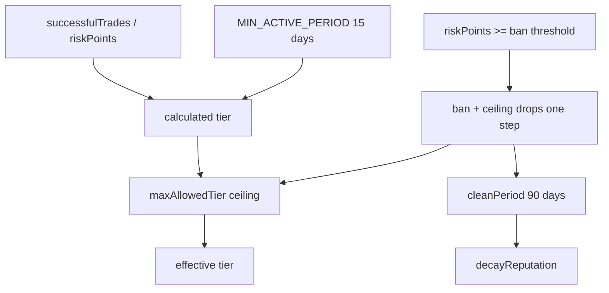

### 8.1 Reputation fields
- `successfulTrades`, `failedDisputes`, `bannedUntil`, `consecutiveBans`, `riskPoints`
- Outcome counters: `manualReleaseCount`, `autoReleaseCount`, `mutualCancelCount`, `disputedResolvedCount`, `burnCount`, `disputeWinCount`, `disputeLossCount`, `partialSettlementCount`
- `lastPositiveEventAt`, `lastNegativeEventAt`; plus `firstSuccessfulTradeAt` (`getFirstSuccessfulTradeAt`) and the penalty ceiling `maxAllowedTier`
- Every terminal outcome emits `ReputationUpdated` for both parties (only for the taker on payment-window expiry).

### 8.2 Outcome → reputation effect (default policy)

| Terminal outcome | Maker | Taker |
|---|---|---|
| `MANUAL_RELEASE` (release from PAID) | +1 success, −8 risk | +1 success, −8 risk |
| `AUTO_RELEASE` | `failedDisputes`+1, +60 risk | +1 success, −8 risk |
| `MUTUAL_CANCEL` | +20 risk | +20 risk |
| `DISPUTED_RELEASE` (release from CHALLENGED) | `failedDisputes`+1, dispute loss, +60 risk | dispute win, +1 success, −10 risk |
| `BURN` | `failedDisputes`+1, +90 risk | `failedDisputes`+1, +90 risk |
| `PARTIAL_SETTLEMENT` | +1 success, 0 points | +1 success, 0 points |
| `PAYMENT_WINDOW_EXPIRED` | unaffected | `failedDisputes`+1, +60 risk |

- **Micro-trade guard:** for trades whose amount, normalized to 6 decimals, is below `MIN_REPUTATION_NOTIONAL` (20e6 = 20 units, e.g. 20 USDT), positive signals (success counter, risk reduction, `firstSuccessfulTradeAt`) are ignored; penalties apply at any size.
- Points can be changed via `setReputationPolicy`; changes only affect later recordings.

### 8.3 Tier, ban and clean-slate
- **Effective tier:** scanning from 4 down to 1, the first tier with `successfulTrades ≥ tierMinSuccessfulTrades[i]` and `riskPoints ≤ tierMaxRiskPoints[i]`. Default thresholds: successes **0 / 15 / 50 / 100 / 200**, max risk **100 / 80 / 50 / 30 / 15** (Tier 0–4). Tier > 0 also requires `MIN_ACTIVE_PERIOD` = **15 days** since the first successful trade. If a penalty ceiling exists, the result is capped by `maxAllowedTier`.
- **Ban:** after a negative signal, if `riskPoints ≥ banRiskPointsThreshold` (**100**): when the user is not currently banned, `consecutiveBans`+1 and the ban lasts `baseBanDuration × 2^(consecutiveBans−1)` (**30 days**, 60, 120 …, at most **365 days**). Under the same condition the tier ceiling drops one step every time (the first penalty seeds it at 4 and lowers it to 3).
- **Ban effect:** taker entry (`TakerBanActive`) and maker roles (`MakerBanActive`: opening a sell order, having one's sell order filled, filling a buy order) are closed. Exit paths of open trades stay available.
- **Bond pricing:** with `riskPoints == 0` and at least one success the bond rate drops by 100 bps; with `riskPoints > 0` it rises by 300 bps (Tier 0 bond is always 0).
- **Clean-slate:** `decayReputation(wallet)` is permissionless; conditions: ban history exists (`NoPriorBanHistory`), `now > bannedUntil + cleanPeriod` (`CleanPeriodNotElapsed`), `consecutiveBans > 0` (`NoBansToReset`). Current `cleanPeriod`: **90 days**. It resets `consecutiveBans`, `riskPoints`, and the tier ceiling (back to 4). Not full amnesty: `failedDisputes`, outcome counters and `bannedUntil` are not erased.
- The backend `reputationDecay` job can trigger this call for candidate wallets after reading the contract's `getReputation()` / `cleanPeriod()` (optional `RELAYER_PRIVATE_KEY`); the decision stays in the contract.

### 8.4 Policy bounds (`setReputationPolicy` / `setReputationTierThresholds`)
- `cleanPeriod` 7–365 days; `baseBanDuration` > 0 and ≤ 365 days; `banRiskPointsThreshold` > 0 and ≤ `tierMaxRiskPoints[0]`; every reward/penalty point value ≤ the ban threshold.
- Tier thresholds require ascending `minSuccessfulTrades`, descending `maxRiskPoints`, and `maxRiskPoints[0] ≥ banRiskPointsThreshold`.

---

## 9. Finalized parameters vs mutable config

This section separates immutable parameters from runtime surfaces that the owner can still adjust. All values are taken from `contracts/src/ArafEscrow.sol` and `ArafReputationLib.sol`.

### 9.0 Parameter-classification table

| Class | Parameters | Notes |
|---|---|---|
| Constants (`constant`; with or without a public getter) | Bond BPS (`MAKER_BOND_TIER*_BPS`, `TAKER_BOND_TIER*_BPS`), `GOOD_REP_DISCOUNT_BPS`, `BAD_REP_PENALTY_BPS`, `AUTO_RELEASE_PENALTY_BPS`, `GRACE_PERIOD`, `PAYMENT_WINDOW`, `MAKER_CHALLENGE_WINDOW`, `USDT_DECAY_START`, `MAX_BLEEDING`, `*_DECAY_BPS_H`, `WALLET_AGE_MIN`, `DUST_LIMIT`, `MIN_ACTIVE_PERIOD`, `MIN_REPUTATION_NOTIONAL`, `MAX_TRADE_COOLDOWN`, `MAX_FEE_CONFIG_BPS` | Not mutable via owner runtime calls. |
| Mutable runtime config | `takerFeeBps`, `makerFeeBps`, `tier0TradeCooldown`, `tier1TradeCooldown`, `treasury`, reputation policy and tier thresholds | Adjustable through the owner governance surface; active-trade fees stay protected by snapshots. |
| Direction-aware token runtime policy | `tokenConfigs[token] => {supported, allowSellOrders, allowBuyOrders, decimals, tierMaxAmountsBaseUnit[4]}` | Token support and tier caps are managed per token. |

### 9.1 Constant values

| Constant | Value | Meaning |
|---|---|---|
| Maker bond (Tier 0–4) | 0% / 8% / 6% / 5% / 2% | By order tier, on the fill amount |
| Taker bond (Tier 0–4) | 0% / 10% / 8% / 5% / 2% | By order tier, on the fill amount |
| `GOOD_REP_DISCOUNT_BPS` / `BAD_REP_PENALTY_BPS` | −100 / +300 bps | Reputation adjustment to the bond rate (Tier 1+) |
| `AUTO_RELEASE_PENALTY_BPS` | 200 bps (2%) | Penalty for `autoRelease` (both bonds) and `expirePaymentWindow` (taker bond) |
| `PAYMENT_WINDOW` | 48h | Time to report payment in `LOCKED` |
| `GRACE_PERIOD` | 48h | Wait after `paidAt` for `pingMaker`; decay-free period after a challenge |
| `MAKER_CHALLENGE_WINDOW` | 24h | Window to open the challenge after ping+24h |
| `USDT_DECAY_START` | 96h | Principal decay start after the grace period |
| `MAX_BLEEDING` | 240h | Total time from `challengedAt` to burn |
| `MAKER/TAKER/CRYPTO_DECAY_BPS_H` | 26 / 42 / 34 (×2) bps/hour | Decay rates |
| `WALLET_AGE_MIN` | 2 days | Registration age for taker entry |
| `DUST_LIMIT` | 0.001 ETH | Native balance for taker entry |
| `MIN_ACTIVE_PERIOD` | 15 days | Time since first success for Tier > 0 |
| `MIN_REPUTATION_NOTIONAL` | 20e6 (6 decimals) | Smallest trade counted for reputation |
| `MAX_TRADE_COOLDOWN` | 30 days | Cooldown setter upper bound |
| `MAX_FEE_CONFIG_BPS` | 2000 bps | Fee setter upper bound (per side) |

The constants `MAX_CANCEL_DEADLINE` (7 days) and `MIN_SETTLEMENT_EXPIRY` are declared in the escrow but unused by escrow code; the settlement deadline bounds (10 minutes – 7 days) are enforced by `ArafSettlementLib`'s own constants.

### 9.2 Mutable runtime config class
- `takerFeeBps`, `makerFeeBps` — default **15 / 15 bps** (0.15%), ≤ 2000 bps per side
- `tier0TradeCooldown`, `tier1TradeCooldown` — default **4h / 4h**, ≤ 30 days
- `treasury` — `setTreasury`
- reputation policy and tier thresholds — `setReputationPolicy`, `setReputationTierThresholds` (defaults in §8)
- direction-aware token config via `setTokenConfig`: `supported`, `allowSellOrders`, `allowBuyOrders`, `decimals` (must equal the token's `decimals()`), four tier caps (Tier 0–3, base units, > 0). Tier 4 has no cap.

### 9.3 Fee snapshot semantics
- Snapshot is captured at order creation; a Tier 0 order deliberately snapshots a maker fee of 0.
- Child trade inherits parent snapshots.
- Later `setFeeConfig` changes do not retroactively rewrite active-trade economics.

### 9.4 Toolchain / deployment assumptions
- `contracts/scripts/deploy.js` order: `ArafReputationLib` → `ArafSettlementLib` → linked `ArafEscrow(treasury)` → `setTokenConfig` for USDT/USDC (6 decimals, sell+buy enabled, tier caps 150 / 1,500 / 7,500 / 30,000 tokens) verified via `getTokenConfig` → `transferOwnership(FINAL_OWNER_ADDRESS)`. The manifest also records the library addresses.
- Public chains require `CONFIRM_PUBLIC_DEPLOY=yes`; in public/custom mode `FINAL_OWNER_ADDRESS` must differ from `TREASURY_ADDRESS`.
- `ArafRevenueVault` + `ArafRewards` are deployed by a separate script (`deployRewards.js`); switching the escrow treasury to the vault is a separate, explicit operation (`rewardsOps.js`).
- The compile target is `cancun` (`hardhat.config.js`): `ArafRevenueVault` keeps the escrow revenue intent in EIP-1153 transient storage (`tstore`/`tload`); the network the vault is deployed on must support EIP-1153.
- Production guidance assumes owner governance key is managed by multisig to reduce key risk.

---

## 10. Runtime connectivity and operational policies

Backend behavior is defined not only by chosen technologies, but also by bootstrap, readiness, and shutdown discipline.

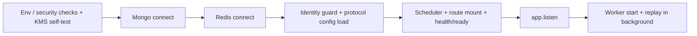

### 10.1 Backend bootstrap ordering (`backend/scripts/app.js`)
1. env/security prechecks (e.g. `SIWE_DOMAIN` cannot be localhost in production) + production KMS self-test
2. Mongo connect
3. Redis connect
4. identity-normalization guard (enforced by default in production) and loading of the mutable protocol config mirror (a load failure does not crash the process; affected routes may return `CONFIG_UNAVAILABLE`)
5. scheduler jobs
6. route mount + `/health`, `/ready`
7. `app.listen`
8. the worker starts via `startInBackground`: connect + replay continue in the background after HTTP starts listening, while `/ready` reports "replaying"

### 10.2 Readiness-first operations
- Liveness (`/health`) answers “is process alive?”.
- Readiness (`/ready`) answers “are dependencies actually ready?”.
- Traffic gating should follow readiness, not liveness alone.

### 10.3 Fail-fast / fail-open choices
- Critical dependency failures follow fail-fast patterns (DB/worker integrity).
- Security boundaries prefer fail-closed semantics (auth/session/PII).

### 10.4 Timeout/connectivity policy
- Mongo uses `maxPoolSize: 100`, `socketTimeoutMS: 20000`, and `serverSelectionTimeoutMS: 5000` for combined worker+API load.
- An unexpected Mongo disconnect triggers a fail-fast restart via `process.exit(1)` to reduce stale/partial-connection drift.
- Redis `isReady` is explicitly treated as distinct from mere connectivity.
- Redis TLS (`rediss://`) and managed-service assumptions are part of runtime configuration behavior.

### 10.5 Graceful shutdown ordering
- zero the AES master key cache, clear scheduler timers
- stop new requests (`server.close`)
- stop worker
- close Mongo/Redis
- controlled process exit (forced exit on timeout)

### 10.6 Scheduler and cleanup jobs
Default intervals can be changed with the `JOB_*_MS` env variables.

| Job | Default interval | Note |
|---|---|---|
| DLQ processing | 60 s | See §11.4 |
| Reputation decay trigger | 24h (first run after 30 s) | Does not run without `RELAYER_PRIVATE_KEY` + `BASE_RPC_URL` |
| Reward outcome recorder | 1h | `ArafRewards.recordTradeOutcomes`; same relayer requirement |
| Stats snapshot | 24h | |
| Receipt & PII snapshot retention cleanup | 30 min | |
| User bank-risk metadata cleanup | 6h | |
| Reference rate ticker | periodic | Informational only; does not affect settlement |
| Reconciliation report | 10 min | On by default in production (`JOB_RECONCILIATION_ENABLED`) |

### 10.7 Operational meaning of health vs ready
- `/health`: is the process alive and is the worker still seeing new blocks? (`503 stale` once the worker passes its last-block threshold)
- `/ready`: Mongo/Redis + config + chain id + worker lag (default max 25 blocks, `WORKER_MAX_LAG_BLOCKS`) + replay safety gate. The result is cached for a few seconds; unauthenticated callers get a redacted view, full detail only with `READY_INTERNAL_TOKEN`.
- During replay/high lag, liveness may be true while readiness is intentionally false.

---

## 11. Event worker / replay / mirror reliability

The worker reads authoritative chain state and projects an operational mirror into Mongo, without becoming authority itself.

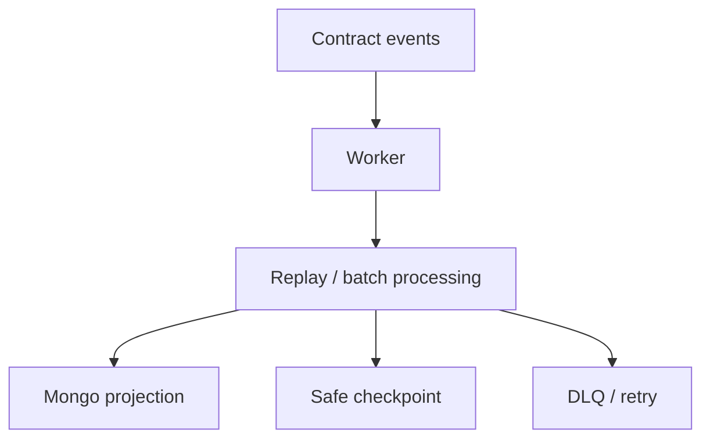

### 11.1 Worker state model
Worker consumes contract events and updates Mongo without becoming authority.

### 11.2 Checkpoint approach
- last processed block (`worker:last_block`) and last safe checkpoint (`worker:last_safe_block`)
- finality depth: 6 blocks by default in production (`WORKER_FINALITY_DEPTH`)
- without a checkpoint, production requires `WORKER_START_BLOCK` or `ARAF_DEPLOYMENT_BLOCK`
- replay-safe startup logic

### 11.3 Replay and batch processing
- block-batch processing (default 1,000 blocks, `WORKER_BLOCK_BATCH_SIZE`; checkpoint at least every 50 blocks, `WORKER_CHECKPOINT_INTERVAL_BLOCKS`)
- if a range cannot be read or a batch fails, the checkpoint does not move; replay stops at the first failed batch
- idempotent mirror intent; the last applied `(blockNumber, logIndex)` is kept per scope so an older event cannot write back
- state-regression guards prevent backward drift; terminal states are never reopened

### 11.3.1 Last-safe-block semantics
- Worker tracks not only last seen block, but also last safe checkpoint block.
- Readiness includes lag between provider head and worker safe checkpoint.
- This prevents “appears alive but silently behind” operational blind spots.

### 11.4 DLQ and poison-event visibility
- an event is first retried in place (5 attempts); unprocessable events go to the DLQ. Entries are unique per `txHash:logIndex` (live DLQ, archive and quarantine index sets)
- the DLQ processor re-drives entries; a successful re-drive acks the event and clears the block's unsafe flag
- past `MAX_REDRIVE_ATTEMPTS` (10) an entry moves to **permanent quarantine** (no TTL, manual review): the event counts as "acked-poison" and no longer blocks the checkpoint; the alarm is `logger.error` + a quarantine counter. The archive is kept for 7 days
- operational logs preserve observability of failure modes

### 11.5 Identity normalization
- on-chain IDs stored with numeric-string discipline
- explicit lookup strategy prevents parent/child identity confusion

### 11.6 OrderFilled + getTrade linkage
Child-trade authority is mirrored through explicit event + getter linkage rather than heuristics. The contract never emits `EscrowCreated` / `EscrowLocked`; the mirror is created as `LOCKED` on `OrderFilled`, and the one-shot payout snapshot is taken in the same step (§12.4.1).

### 11.6.1 Mirrored events and terminal counter
- Escrow events: orders (`OrderCreated/Filled/Canceled`), trade lifecycle (`PaymentReported`, `EscrowReleased`, `DisputeOpened`, `MakerPinged`, `CancelProposed`, `CancelRevoked`, `EscrowCanceled`, `PaymentWindowExpired`, `BleedingDecayed`, `EscrowBurned`), settlement (`SettlementProposed/Rejected/Withdrawn/Expired/Finalized`), reputation/config (`ReputationUpdated`, `FeeConfigUpdated`, `CooldownConfigUpdated`, `TokenConfigUpdated`, `ReputationPolicyUpdated`, `ReputationTierThresholdsUpdated`), `WalletRegistered`, `ProtocolRevenueSent`. Vault events (`EscrowRevenueReceived`, `ExternalRewardFunded`, `ProductRewardFunded`) are read separately from the vault address.
- `CancelRevoked` clears the revoking party's consent flag in `cancel_proposal`; a missing mirror sends the event to retry/DLQ.
- Manual vs auto release is read from the contract's terminal snapshot (`getRewardableTrade`), never inferred; a read error writes no permanent "UNKNOWN" and the event goes to retry/DLQ.
- The terminal transition (`resolved_at` marker) is applied once per trade and writes a **permanent terminal counter** row (`TerminalTradeStat`, unique `trade_key`) in the same operation, so stats survive the Trade document's 1-year TTL.

### 11.7 Mirror-authority warning
- Event worker does not define protocol rules; it only projects authoritative chain state.
- If Mongo mirror fields and contract storage diverge, contract state is authoritative.

---

## 12. Security architecture and trust boundaries

This section centralizes auth, session, PII, and client telemetry boundaries.

### 12.1 Auth model (SIWE + JWT + cookie session)

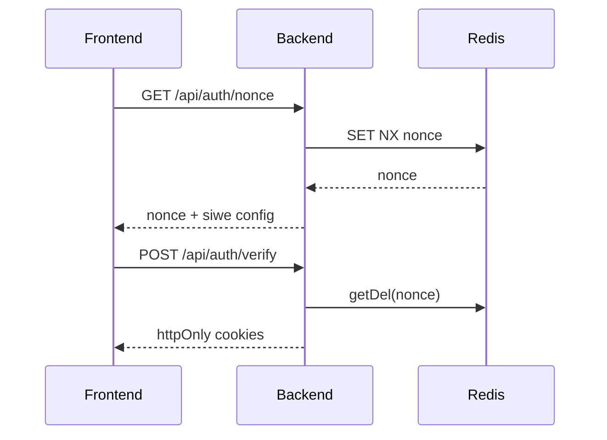

#### 12.1.1 Nonce lifecycle (TTL + consume)
- Nonce is stored in Redis per wallet (`nonce:<wallet>`), with default **5-minute** TTL.
- Under race conditions, Redis is authoritative: if `SET NX` fails, local nonce is not returned; the live Redis nonce is re-read.
- During SIWE verify, nonce is consumed via `getDel`, shrinking replay window.
- SIWE domain/URI checks are enforced at request time (host/origin matching is strict in production).

#### 12.1.2 Session token lifecycle
- Auth JWT cookie (`araf_jwt`) is short-lived by default (configurable; default 15m).
- Refresh cookie (`araf_refresh`) is longer-lived (sliding window default 7 days, absolute per-session cap default 30 days, `REFRESH_ABSOLUTE_TTL_SECS`) and path-scoped to `/api/auth`.
- The model remains httpOnly + sameSite=lax + credentials:include; bearer header is not normal auth authority.

### 12.2 Cookie-only boundary and session-wallet mismatch behavior

| Control step | What is validated | Mismatch result |
|---|---|---|
| `requireAuth` | Cookie JWT validity + blacklist status | 401 / 403 |
| `requireSessionWalletMatch` | `x-wallet-address` == cookie-auth wallet | 409 + session invalidation |
| Session invalidation | JWT blacklist + refresh revoke + cookie clear | Session terminated safely |

> Boundary note: `x-wallet-address` is never an auth source by itself; it is only a cookie-session consistency check.

### 12.3 Refresh-token family invalidation
- On logout and session-wallet mismatch events, refresh family revocation is applied.
- Goal is to invalidate not only the current access context but also refresh-lineage reuse.
- This is “session family termination”, not just “single request denial”.

### 12.4 PII access boundary (trade-scoped token + live-state checks)

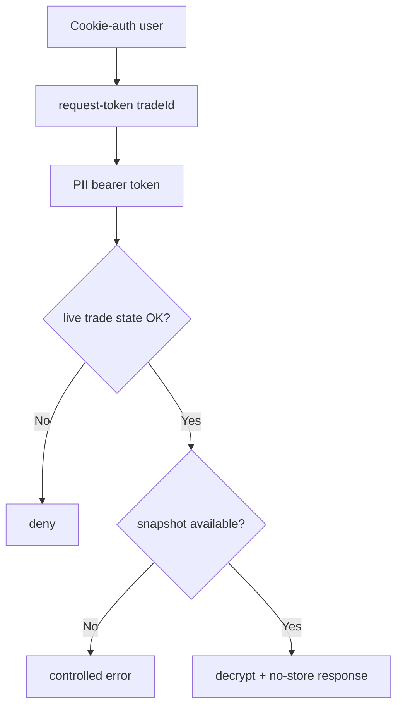

- PII token is scoped to one `tradeId`, not parent order scope.
- `requirePIIToken` enforces token type=`pii`, tradeId match, and token-wallet == cookie-session-wallet.
- Token alone is insufficient; route handlers re-check live trade state (`LOCKED/PAID/CHALLENGED` window).
- Snapshot-first policy: if payout snapshot is missing, endpoint returns controlled error; current-profile fallback is disabled.
- The PII token lifetime defaults to 15 minutes (`PII_TOKEN_EXPIRES_IN`).
- Sensitive PII responses set `Cache-Control: no-store` / `Pragma: no-cache`.

### 12.4.1 Payout-profile gate and one-shot snapshot
- Principle: a party that has not filled in a payout profile must not enter a trade; the snapshot is taken when the trade locks and cannot change for the trade's lifetime.
- The snapshot is ONE-SHOT: `_captureLockedTradeSnapshot` writes only when `payout_snapshot.captured_at` is empty, through an atomic conditional update. Worker replay, DLQ re-drive, or re-processing of the same `OrderFilled` never rewrites an existing snapshot; an incomplete (`is_complete=false`) snapshot is never "completed" later either.
- The gate ("no saved payout profile -> cannot create/fill an order") exists ONLY at the UI and API level: it relies on `/api/auth/me.hasPayoutProfile` (the saved profile, not the draft form) and the market list's `owner_has_payout_profile` boolean, and fails closed when the state is unknown. Calling the contract directly BYPASSES this gate.
- The real safeguard is the rule: **missing snapshot -> PII stays closed, the trade is resolved within the payment window.** A party without a profile leaves the snapshot incomplete, `/api/pii/*` access is not opened, and the trade is resolved inside the payment window (timeout/cancel flow).
- **Profile lock during an active trade:** while the wallet has a `LOCKED`/`PAID`/`CHALLENGED` trade, `PUT /api/auth/profile` cannot write the payout profile (first creation included): `409 BANK_PROFILE_LOCKED_DURING_ACTIVE_TRADE`.

### 12.5 Encryption model
- PII and receipt payload fields are persisted encrypted via AES-256-GCM.
- Key derivation/governance follows HKDF + KMS/Vault-oriented design.
- Plaintext is not persisted; contract receives only hash traces for receipt proof linking.

### 12.6 Rate-limit classes and fallback behavior
- Limiter classes are separated by surface: auth, nonce, market read, stats read, orders read/write, trade-room read, receipt upload, coordination write, PII (profile / taker-name / token / fetch), admin read, feedback, client logs.
- Some of them (orders/room read, receipt upload, coordination write, feedback) apply limits tiered by the user's effective tier.
- When Redis is unavailable the limiters keep protecting through a process-local (in-memory) fallback; no surface, auth/PII included, is deliberately fail-open.

### 12.7 Client-error logging boundary (scrub semantics)
- Frontend telemetry is accepted only via `/api/logs/client-error`.
- Message/stack text is scrubbed by regex redaction for IBAN-like values, wallet addresses, emails, bearer/JWT-like tokens; fields are truncated (message 500, stack 2,000, componentStack 1,000, url/user-agent 200 characters).
- Size limits + rate limits support both data minimization and abuse resistance.

### 12.8 Trust-boundary summary
- Contract = economic/state authority.
- Backend = auth/session/PII coordination + read-model projection.
- Frontend = runtime guardrail and user feedback layer.
- Off-chain data = operational utility, not protocol authority.

---

## 13. Data models (Mongo read-model layer)

> Mongo is not canonical protocol authority; it is still critical for read performance and operational observability.

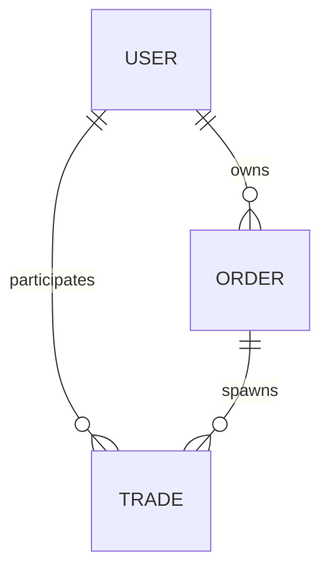

## 13.1 User model (field-aware)

### Identity and payout-profile structure
- `wallet_address` is the primary user identity (lowercase EVM address).
- `payout_profile` is rail-aware:
  - `rail`, `country`
  - `contact.{channel, value_enc}`
  - `payout_details_enc`
  - `fingerprint.{hash, version, last_changed_at}`
  - `updated_at`

### Encryption and public-projection boundary
- `contact.value_enc` and `payout_details_enc` are encrypted at rest; plaintext is not persisted.
- `toPublicProfile()` uses an allowlist strategy to return only safe fields.
- `bank_change_history` and payout details are excluded from public profile surface.

### Bank-profile risk metadata (non-authoritative)
- `profileVersion`
- `lastBankChangeAt`
- `bankChangeCount7d`
- `bankChangeCount30d`
- `bank_change_history` (internal rolling-window support)
- These are anti-fraud/risk signals, not contract enforcement authority.

### Reputation/ban mirror boundary
- `reputation_cache` and ban mirrors (`is_banned`, `banned_until`, `consecutive_bans`, `max_allowed_tier`) support query/UI convenience.
- If mirror state diverges from chain state, on-chain data remains authoritative.
- Reputation extension includes `partialSettlementCount` as an event-taxonomy counter.
- `partialSettlementCount` is not a penalty by itself and does not imply user failure.

## 13.2 Order model (field-aware)

### Identity + lifecycle fields
- `onchain_order_id` (numeric-string identity)
- `owner_address`, `side`, `status`, `tier`, `token_address`

### Financial/snapshot fields
- `amounts.{total_amount, remaining_amount, min_fill_amount}` + `*_num` caches
- `reserves.{remaining_maker_bond_reserve, remaining_taker_bond_reserve}` + `*_num` caches
- `fee_snapshot.{taker_fee_bps, maker_fee_bps}`

### Reference/timer/helper stats fields
- `refs.order_ref` (event-trace and idempotent linkage aid)
- `timers.{created_at_onchain, last_filled_at, canceled_at}`
- `stats.*` (`child_trade_count`, `active/resolved/canceled/burned` breakdown, `total_filled_amount`)

### Mirror boundary
- Remaining/reserve values are not backend-calculated authority; they are worker projections mirrored from contract truth.

## 13.3 Trade model (field-aware)

### Identity and canonical linkage
- `onchain_escrow_id` (primary child-trade identity)
- `parent_order_id`
- `parent_order_side`
- `trade_origin` (`ORDER_CHILD` / `DIRECT_ESCROW`)
- `canonical_refs.{listing_ref, order_ref}` (`listing_ref` is a legacy ABI/event trace field; `order_ref` links the parent order)

### Fill and fee linkage
- `fill_metadata.{fill_amount, filler_address, remaining_amount_after_fill}` (+ numeric caches)
- `fee_snapshot.{taker_fee_bps, maker_fee_bps}`

### BigInt-safe financial strategy
- Authoritative financial fields are string-based:
  - `financials.crypto_amount`
  - `financials.maker_bond`
  - `financials.taker_bond`
  - `financials.total_decayed`
  - `financials.burned_amount`
- `*_num` caches are for UI/aggregation convenience only; not enforcement inputs.

### PII / receipt / payout snapshot fields
- `evidence.ipfs_receipt_hash`
- `evidence.receipt_encrypted`
- `evidence.receipt_timestamp`
- `evidence.receipt_delete_at`
- `evidence.receipt_delete_at` is written as `+30 days` at upload; when the trade turns terminal the worker rewrites it: terminal time `+24h` for `RESOLVED` (release, auto-release, settlement) and `CANCELED` (mutual cancel, payment-window expiry), `+30 days` for `BURNED`. The upload-time 30 days only remains for a trade that never reaches a terminal state.
- `payout_snapshot.{maker,taker,...}` carries lock-time risk context like `profile_version_at_lock`, `bank_change_count_*_at_lock`, `fingerprint_hash_at_lock`.
- `payout_snapshot.{captured_at, snapshot_delete_at, is_complete, incomplete_reason}`: once `captured_at` is set the snapshot is never rewritten (one-shot); a missing profile stays as `is_complete=false` + reason.

### Cancel / chargeback audit fields
- `cancel_proposal.{proposed_by, proposed_at, approved_by, maker_signed, taker_signed}` — a mirror of on-chain `CancelProposed` / `CancelRevoked`; there are no signature or deadline fields (cancel coordination is fully on-chain)
- `chargeback_ack.{acknowledged, acknowledged_by, acknowledged_at, ip_hash}`
- `settlement_proposal` mirrors party-signed partial-settlement lifecycle:
  - `NONE -> PROPOSED -> REJECTED/WITHDRAWN/EXPIRED/FINALIZED`
  - split settlement is **not** a normal close path; proposal/acceptance are valid only in `CHALLENGED`
  - proposer is one trade party; accept/reject requires counterparty action
  - backend stores mirror/audit context only; contract remains settlement authority

### Retention and terminal-TTL separation
- Trade documents in terminal states are removed by a 365-day TTL index on `timers.resolved_at`; cumulative stats remain in `TerminalTradeStat` rows.
- Receipt/snapshot payload minimization uses separate cleanup fields (`receipt_delete_at`, `snapshot_delete_at`) and jobs.
- This separation distinguishes “document lifecycle TTL” from “sensitive payload retention”.

## 13.4 Feedback / stats snapshot layer
- Feedback is a separate operational/user-signal surface.
- Other models: `TerminalTradeStat` (permanent terminal counter), `HistoricalStat`, `RevenueEvent` (vault/escrow revenue mirror), `RewardEpoch`, `RewardClaim`, `RewardFunding`, `RewardEpochAllocationEvent` (reward read-model), `TermsAcceptance` (terms-of-use acceptance).
- Stats/snapshot layer (daily aggregates, dashboard counters) supports observability and decisions, not protocol authority.
- Read-model snapshots do not replace contract state; they improve operator visibility.

---

## 14. Backend route surface and coordination semantics

The V3 backend surface does not manufacture authority; routes apply projection, coordination, and security boundaries.

| Route group | Surface | Meaning |
|---|---|---|
| Orders (`/api/orders`) | `GET /config`, `GET /payment-risk-config`, `GET /`, `GET /my`, `POST /market-meta`, `GET /:id/trades`, `GET /:id` | Market read-model, owner visibility and off-chain market metadata |
| Trades (`/api/trades`) | `GET /my`, `GET /history`, `GET /by-escrow/:onchainId`, `GET /:id`, `GET /:id/settlement-proposal`, `POST /:id/settlement-proposal/preview`, `POST /:id/chargeback-ack` | Child-trade reads, settlement preview and audit helpers |
| Auth (`/api/auth`) | `GET /nonce`, `POST /verify`, `POST /refresh`, `POST /logout`, `GET /me`, `PUT /profile` | Session and wallet-bound auth boundary |
| PII (`/api/pii`) | `GET /my`, `GET /taker-name/:onchainId`, `POST /request-token/:tradeId`, trade-scoped retrieval | Snapshot-first, role-bound sensitive-data access |
| Receipts (`/api/receipts`) | `POST /upload` | One-shot receipt upload for the taker while `LOCKED` |
| Rewards (`/api/rewards`) | epochs, funding, `/:wallet/claimable`, `/:wallet/history`, `/health` | Read-only reward view; recording/claims live in the contract |
| Admin (`/api/admin`) | `GET /revenue`, `/rewards/health`, `/summary`, `/feedback`, `/trades`, `/settlement-proposals` | Read-only observation, open only to sessions in the `ADMIN_WALLETS` list; no protocol authority |
| Logs / stats / feedback / reference rates | `POST /api/logs/client-error`, `GET /api/stats`, `POST /api/feedback`, `GET /api/reference-rates/ticker` | Observability, product feedback and an informational rate ticker |

### 14.1 Orders routes
- parent-order read/config surfaces
- owner-scoped child-trade list/read route

### 14.2 Trades routes
- active/history/by-escrow reads
- cancel coordination is not in the backend: `proposeOrApproveCancel` / `revokeCancel` go straight to the contract and the backend only mirrors the events
- chargeback-ack audit surface (maker only, `PAID`/`CHALLENGED`; never vetoes the on-chain flow)
- settlement-proposal preview + mirror reads are informational and non-authoritative
- preview availability is `CHALLENGED`-only; non-challenged requests are rejected
- backend role: preview, event mirror, read-model, audit/observability
- final settlement economics are on-chain; backend cannot finalize outcomes
- in settlement finalization, fees apply to gross maker/taker split payouts after decay
- backend cannot: determine outcome, override release/cancel/burn/payout, write reputation authority, or transfer funds

### 14.2.1 Payment risk boundary
- `PaymentRiskLevel` is a rail-level complexity signal for UI/read-model use.
- It is not a user trust/reputation score and not an on-chain authority source.

### 14.3 Auth routes
- nonce/verify/refresh/logout/me/profile
- session-wallet mismatch guard behavior

### 14.4 PII routes
- `/my`, `taker-name`, request-token, trade-scoped retrieval
- snapshot-first and role-bound access

### 14.5 Receipts routes
- file validation (magic bytes / MIME match) + encryption + SHA-256 hash storage
- restricted to taker while `LOCKED`; one receipt per trade (overwrite returns `409`)

### 14.6 Logs/stats/feedback
- client error logs
- protocol stats read surface
- feedback intake endpoint

---

## 15. Frontend UX guardrail layer

Frontend is not enforcement, but it is critical as a runtime orchestration and fail-fast UX guardrail layer.

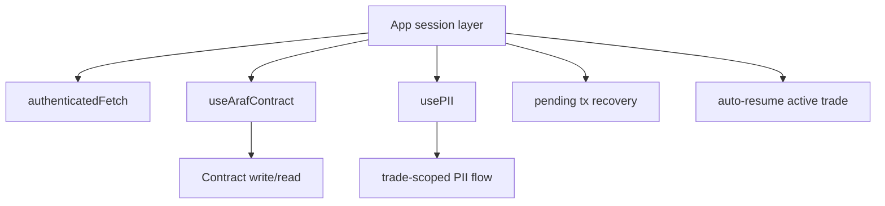

### 15.1 Runtime orchestration: `useArafContract`
- Write preflight checks enforce:
  - wallet client availability
  - valid contract address (`VITE_ESCROW_ADDRESS`)
  - supported chain
- After tx send, receipt is awaited; pending tx hash is persisted in `localStorage(araf_pending_tx)`.
- Fill paths decode `OrderFilled` to extract `tradeId`; frontend does not fabricate trade identity.

### 15.2 Runtime orchestration: `usePII`
- PII flow is two-step:
  1) `pii/request-token/:tradeId`
  2) `pii/:tradeId` (Bearer + cookie session together)
- API path canonicalization is enforced via `buildApiUrl(...)`.
- `authenticatedFetch` centralizes me/refresh-aware behavior.
- Every new PII request aborts previous inflight request with `AbortController`; stale responses cannot overwrite state.
- Sensitive PII state is cleared on unmount/trade switch.

### 15.3 Session-mismatch and recovery UX
- On 409 (`SESSION_WALLET_MISMATCH`), `authenticatedFetch` performs backend logout + local session cleanup.
- On 401, refresh (`auth/refresh`) is attempted; if refresh fails, user is routed back to sign-in flow.
- If connected wallet diverges from authenticated wallet, fail-fast logout/re-entry is applied.

### 15.4 Wrong-network / wrong-address fail-fast
- Unsupported chain blocks contract write calls before tx submission.
- Invalid/zero contract address blocks execution early.
- Goal is clear early failure instead of silent off-chain drift.

### 15.5 Provider/bootstrap notes
- App session layer checks pending tx recovery at startup; stale/invalid hashes are cleaned.
- Same layer can auto-resume the single active trade and route user back to trade room.

### 15.6 Enforcement boundary
Frontend does not replace contract enforcement; it is a guardrail/orchestration layer.

### 15.7 Code layout (`frontend/src`)
- `hooks/`: `useArafContract` (escrow reads/writes), `usePII`, `useRewardsContract`
- `app/providers/`: `SessionProvider` (SIWE session), `AppProviders`, `ThemeProvider`; `app/useAppSessionData.jsx` (`authenticatedFetch`, pending-tx recovery, return to the active trade)
- `app/contexts/`: context-based screens — `marketplace`, `trade-room` (decision model, timeline, primary/secondary actions), `operations`, `profile` (payout profile, active trades, rewards), `settlement`, `admin` (read-only panel)
- `app/actions/`: contract lifecycle and order-creation actions; `app/payoutProfileGate.js`: payout-profile gate (§12.4.1); `app/chainPolicy.js`, `app/apiConfig.js`: chain and API-path policy; `app/copy/`: user-facing copy

---

## 16. Attack vectors and known limitations

### 16.1 Mitigated / reduced risks

| Risk | Mitigation |
|---|---|
| Maker pings and goes silent to hold a PAID trade hostage | The ping lapses at `ping+48h` (`MAKER_CHALLENGE_WINDOW`); the taker uses `pingMaker` → `autoRelease` |
| Bond-free (Tier 0) taker holding a LOCKED trade hostage | `PAYMENT_WINDOW` (48h) + `expirePaymentWindow`; `reportPayment` reverts with `PaymentWindowClosed` afterwards |
| Settlement split changed right before acceptance | `acceptSettlement(tradeId, expectedProposalId)`; mismatch reverts with `SettlementProposalMismatch` |
| Owner repoints rewards to drain the reward reserve | `ArafRevenueVault.setRewards` is one-shot (`RewardsAlreadySet`) |
| Wrong token decimals corrupting tier caps / reward notional | `setTokenConfig` verifies the token's `decimals()` on-chain (`InvalidDecimals`) |
| Decayed value locked forever in the escrow on burn | `burnExpired` sends the trade's full balance to treasury |
| Filling the order of an owner penalized after create | The owner's ban and effective tier are re-checked at fill time |
| Backend authority confusion (partially reduced) | documentation + route projection boundaries + worker mirror warnings narrow the chance that backend is treated as adjudicator. |
| Session/account confusion | cookie-wallet ↔ header-wallet mismatch now triggers request denial + refresh-family revoke + cookie clear chain. |
| PII overexposure | trade-scoped token + role/state/session triple checks + snapshot-first + no-store response semantics. |
| API-path drift | canonical path helper usage reduces silent endpoint mismatch risks. |
| Wrong-network tx risk (UX layer) | chain/address preflight guards fail fast before write submission. |

### 16.2 Remaining / open risks

| Risk | Description |
|---|---|
| Governance key risk | mutable fee/cooldown/token config/reputation policy/treasury surfaces remain owner-controlled without a timelock and require multisig/ops discipline. |
| `renounceOwnership` | The inherited `Ownable` function is not disabled; calling it locks owner surfaces (pause included) permanently. |
| Fake receipt / off-chain payment ambiguity | encrypted receipt + hash trace raises fraud cost but cannot cryptographically prove fiat transfer truth. |
| Chargeback reality | banking reversals/disputes can make off-chain finality differ from on-chain expectations. |
| Lingering cancel consent | cancel coordination is on-chain (no signature/deadline). A given consent stays valid, as long as the state does not change, until the counterparty adds the second consent; a user who changes their mind must withdraw it with `revokeCancel` (`reportPayment` / `challengeTrade` already reset consents). |
| The payout-profile gate lives only in the UI/API | it can be bypassed by calling the contract directly; the safeguard is the missing snapshot → PII closed → payment window rule (§12.4.1). |
| Backend mirror interpreted as authority | operators/integrators may still mistake Mongo/cache as source of truth. |
| Frontend wrong-network/wrong-address configuration risk | guardrails do not fully eliminate deployment/env misconfiguration risk. |
| Operator/documentation misunderstanding risk | legacy mental models (“listing-first”, “backend is arbiter”) can still cause operational errors. |

### 16.3 Conscious limitations (oracle-free model)
- Oracle-free design intentionally does not prove fiat transfer truth fully on-chain.
- The system applies economic pressure + time-decay incentives, not absolute subjective arbitration.
- This reduces centralized oracle dependence but does not eliminate social/operational dispute risk.

---

## 17. Legacy concepts (historical / deprecated / non-canonical)

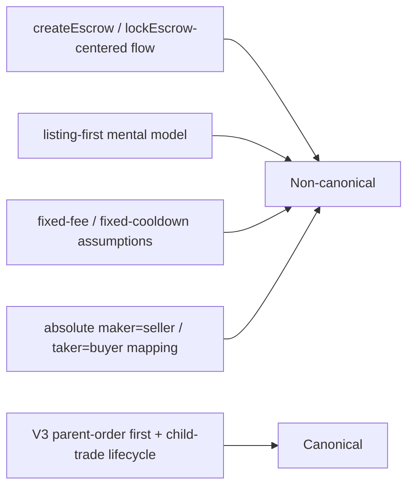

The following are not part of live V3 canonical behavior:
- createEscrow/lockEscrow-centered flow
- listing-first market primitive assumption
- fixed-fee/fixed-cooldown assumptions
- absolute maker=seller / taker=buyer mapping
- old single-dimension token-support language

Legacy references should be treated as historical context only; operational decisions must follow source-of-truth code and this V3 reference.

---

## 17b. Payment rail switches (admin)

Rail availability lives in one Mongo document (`PaymentRailSetting`, optimistic `version`), read through a 15 s in-process cache (`services/paymentRails.js`, invalidated on local writes; DB read failure falls back to last known / all-enabled). No record means every rail defined in `paymentRailRiskConfig.js` is enabled. Every change is appended to the immutable `PaymentRailAudit` collection (admin wallet, previous/new value, reason, HMAC'd IP). Disabling a rail blocks only NEW work: profile create/change, market-meta, and filling orders whose owner sits on a closed rail (`owner_rail_enabled=false`). Active trades, payout snapshots and the PII flow are untouched. The contract does not know rails; this is a UI/API gate and can be bypassed by calling the contract directly.

---

## 18. Final role of this document

This architecture document deliberately serves both:
1. an executive V3 canonical model
2. a deep technical reference (security, data models, runtime reliability, guardrails, attack surface)

So it is neither a shallow summary nor a stale legacy dump; it is a modern, operationally mature V3 architecture reference.

*Araf Protocol — V3 Order-First canonical docs*

