

# 🌀 Araf Protokolü
### Kanonik Mimari & Teknik Referans — V3 Order-First

[-0052FF?style=flat-square&logo=coinbase)](.)

---

*Parent-order first market modeli ile çalışan, child-trade seviyesinde gerçek escrow lifecycle yürüten, non-custodial ve oracle-free P2P protocol.*

> **"Contract decides. Off-chain only mirrors, coordinates, and accelerates."**

---

## 📋 İçindekiler

| # | Bölüm |
|---|---|
| 1 | [Executive canonical model](#1-executive-canonical-model) |
| 2 | [Hibrit mimari ve teknoloji stack](#2-hibrit-mimari-ve-teknoloji-stack) |
| 3 | [On-chain public surface](#3-on-chain-public-surface-arafescrowsol) |
| 4 | [Parent order vs child trade state modeli](#4-parent-order-vs-child-trade-state-modeli) |
| 5 | [Sell flow, Buy flow ve role mapping](#5-sell-flow-buy-flow-ve-role-mapping) |
| 6 | [Anti-sybil enforcement semantiği](#6-anti-sybil-enforcement-semantiği-v3) |
| 7 | [Dispute / Bleeding Escrow teknik akışı](#7-disputebleeding-escrow-teknik-akışı) |
| 8 | [Reputation / bans / clean-slate](#8-reputation--bans--clean-slate) |
| 9 | [Finalized parameters ve mutable config ayrımı](#9-finalized-parameters-ve-mutable-config-ayrımı) |
| 10 | [Runtime bağlantı ve operasyon politikaları](#10-runtime-bağlantı-ve-operasyon-politikaları) |
| 11 | [Event worker / replay / mirror reliability](#11-event-worker--replay--mirror-reliability) |
| 12 | [Güvenlik mimarisi ve trust boundaries](#12-güvenlik-mimarisi-ve-trust-boundaries) |
| 13 | [Veri modelleri](#13-veri-modelleri-mongo-read-model-katmanı) |
| 14 | [Backend route surface ve coordination semantiği](#14-backend-route-surface-ve-coordination-semantiği) |
| 15 | [Frontend UX guardrail katmanı](#15-frontend-ux-guardrail-katmanı) |
| 16 | [Saldırı vektörleri ve bilinen sınırlamalar](#16-saldırı-vektörleri-ve-bilinen-sınırlamalar) |
| 17 | [Legacy concepts](#17-legacy-concepts-historical--deprecated--non-canonical) |
| 18 | [Sonuç: bu dokümanın rolü](#18-sonuç-bu-dokümanın-rolü) |

---

## 1. Executive canonical model

Araf V3’te pazar primitive’i artık listing değil, **parent order**’dır.

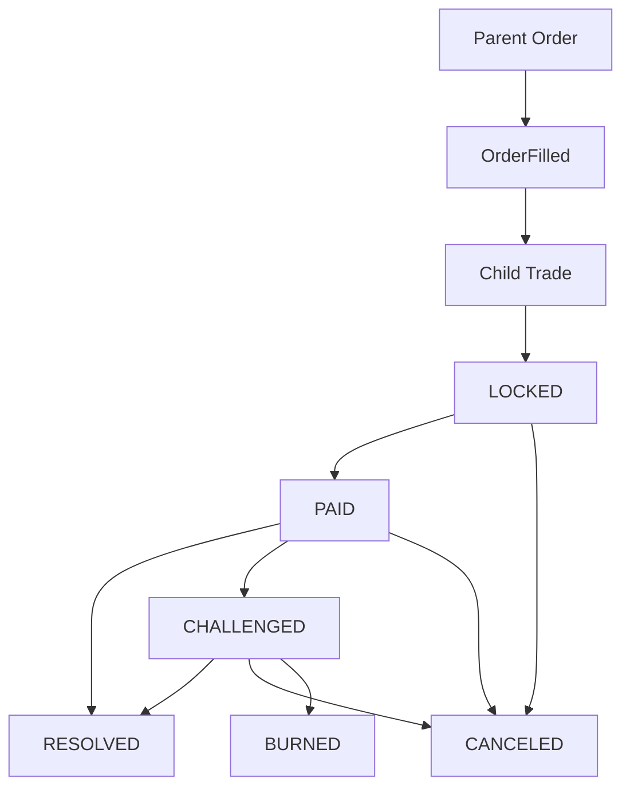

- **Parent Order** = kamusal market/order katmanı
- **Child Trade** = gerçek escrow lifecycle (ekonomik state machine)
- **Contract** = tek authoritative state machine
- **Backend** = mirror + coordination + operational read layer
- **Frontend** = UX guardrail + contract access layer

### 1.1 Otorite sınırları
- On-chain state transition ve ekonomik dağıtımın nihai belirleyicisi kontrattır.
- Backend “hakem” değildir; state üretmez, yalnızca mirror eder ve operasyonel koordinasyon sağlar.
- Frontend enforcement katmanı değildir; kullanıcıyı doğru akışa zorlayan guardrail katmanıdır.

### 1.2 V3’ün pratik sonucu
- Market yüzeyinde konuşulan nesne parent order’dır.
- Dispute, release, cancel, burn gibi escrow yaşam döngüsü child trade seviyesinde yürür.
- Kimlik doğrulamada authority: `OrderFilled + getTrade(tradeId)` kombinasyonu.

---

## 2. Hibrit mimari ve teknoloji stack

Araf hem güvenlik hem operasyonel gereksinimleri birlikte taşır. Bu nedenle mimari “Web2.5” hibrittir: on-chain authority + off-chain operational acceleration.

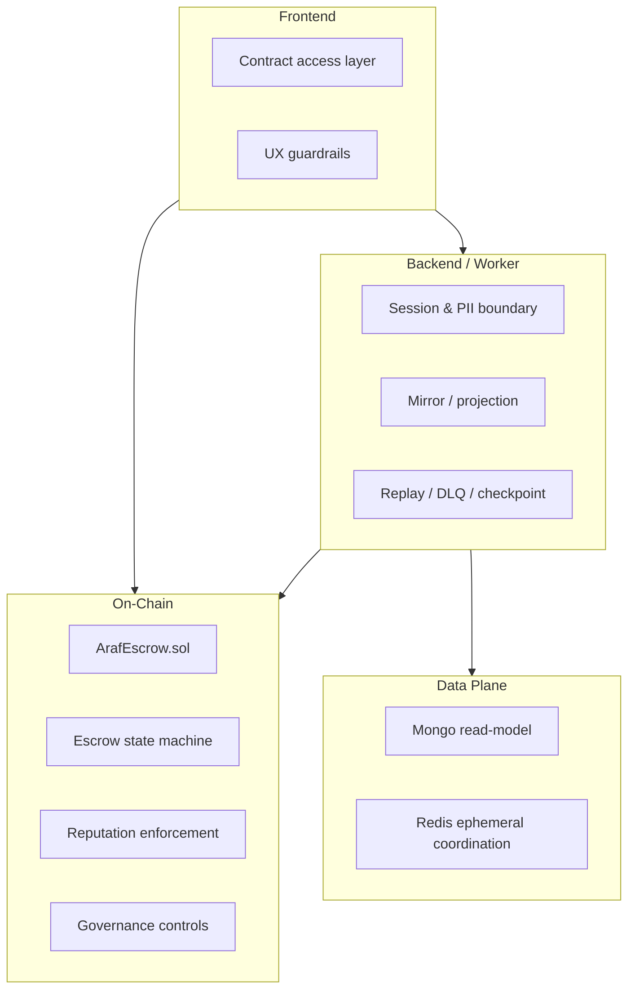

### 2.1 Neden hibrit tasarım?
- **On-chain:** fon custody, state transition, ekonomik kurallar, reputasyon enforcement
- **Off-chain (Mongo):** read model, performans, PII ve operasyonel metadata
- **Redis:** checkpoint, readiness, rate limit, kısa ömürlü koordinasyon

### 2.2 Katman matrisi

| Katman | Ana sorumluluk | Authority seviyesi | Teknoloji |
|---|---|---|---|
| Contract | Escrow state machine, payout, dispute economics, governance controls | **Authoritative** | Solidity / Base |
| Backend API | Session, projection, coordination, PII güvenlik sınırı | Non-authoritative | Node.js + Express |
| Event Worker | Event mirror, replay, checkpoint/DLQ | Non-authoritative | ethers + Mongo + Redis |
| Mongo | Read model / operasyonel cache | Non-authoritative | MongoDB + Mongoose |
| Redis | Ephemeral coordination / safety signals | Non-authoritative | Redis |
| Frontend | Contract write/read orchestration + UX guardrails | Non-authoritative | React + Wagmi + viem |

### 2.3 Non-custodial backend modeli
- Backend kullanıcı fonlarını hareket ettiren custody anahtarı taşımaz.
- Backend, kontrat adına release/challenge/cancel sonucu “uyduramaz”.
- Opsiyonel `RELAYER_PRIVATE_KEY` yalnız permissionless bakım çağrıları içindir (`decayReputation`, `ArafRewards.recordTradeOutcomes`); bu anahtar fon hareket ettiremez ve yetki üretmez.
- Backend’in güçlü olduğu yer: session/policy/PII access boundary ve operasyonel görünürlük.
- Araf kimin haklı olduğuna karar vermez; split settlement normal kapanış yolu değildir ve yalnız `CHALLENGED` dispute safhasında kullanılabilir.

---

## 3. On-chain public surface (`ArafEscrow.sol`)

Kontrat, V3’ün tek authoritative state machine yüzeyidir. Aşağıdaki fonksiyon kümeleri canlı protocol davranışını tanımlar.

| Surface | Fonksiyonlar | Mimari anlam |
|---|---|---|
| Parent-order write surface | `createSellOrder`, `fillSellOrder`, `cancelSellOrder`, `createBuyOrder`, `fillBuyOrder`, `cancelBuyOrder` | Kamusal market ve fill primitive’i |
| Child-trade lifecycle write surface | `reportPayment`, `releaseFunds`, `challengeTrade`, `autoRelease`, `burnExpired`, `proposeOrApproveCancel`, `revokeCancel`, `expirePaymentWindow`, `proposeSettlement`, `acceptSettlement(tradeId, expectedProposalId)`, `rejectSettlement`, `withdrawSettlement`, `expireSettlement` | Gerçek escrow lifecycle ve ekonomik state geçişleri |
| Liveness / yardımcı write surface | `registerWallet`, `pingMaker`, `pingTakerForChallenge`, `decayReputation` | Entry gate, liveness ve clean-slate bakım yüzeyi |
| Governance / mutable admin surface (`onlyOwner`) | `setTreasury`, `setFeeConfig`, `setCooldownConfig`, `setTokenConfig`, `setReputationPolicy`, `setReputationTierThresholds`, `pause`, `unpause` (+ `Ownable`: `transferOwnership`, `renounceOwnership`) | Runtime policy ve governance kontrol yüzeyi |
| Read surface | `getOrder`, `getTrade`, `getReputation`, `getTokenConfig`, `getSettlementProposal`, `getRewardableTrade`, `getFeeConfig`, `getCooldownConfig`, `getCurrentAmounts`, `antiSybilCheck`, `getCooldownRemaining`, `getFirstSuccessfulTradeAt`, `cleanPeriod`, `maxAllowedTier`, `walletRegisteredAt`, `treasury`, `tradeCounter`, `orderCounter` | Doğrulama, görünürlük ve runtime read yüzeyi |

### 3.1 Parent-order write surface
- `createSellOrder(token, totalAmount, minFillAmount, tier, orderRef, paymentRiskLevel)` — satıcı envanteri + toplam maker bond rezervini peşin kilitler. Order sahibi için yalnız aktif ban kontrol edilir (`MakerBanActive`).
- `createBuyOrder(...)` — alıcı yalnız kendi toplam taker bond rezervini kilitler; sahibi child trade'de taker olacağı için taker giriş kapısından geçer.
- `fillSellOrder(orderId, fillAmount, childListingRef)` / `fillBuyOrder(...)` — exact fill; child trade aynı tx'te `LOCKED` doğar. Son fill kalan rezervin tamamını süpürür (yuvarlama birikmez).
- `cancelSellOrder` / `cancelBuyOrder` — yalnız order sahibi, yalnız `OPEN`/`PARTIALLY_FILLED`; doldurulmamış envanter (sell) ve kullanılmamış bond rezervi iade edilir.
- Order doğrulaması: `totalAmount > 0`, `0 < minFillAmount ≤ totalAmount`, `tier ≤ 4`, `orderRef ≠ 0`, tier ≤ sahibinin efektif tier'ı (`TierNotAllowed`), tutar ≤ token'ın tier tavanı (`AmountExceedsTierLimit`; Tier 4 sınırsız). Token yönü kapalıysa `TokenDirectionNotAllowed`. Fee-on-transfer token girişleri `InvalidTransferAmount` ile reddedilir.
- Fill doğrulaması: `childListingRef ≠ 0`, self-trade yasak (`SelfTradeForbidden`), `fillAmount ≤ remaining`, `fillAmount ≥ minFillAmount` (son kalan kısım hariç).
- Fill anında hem filler'ın hem order sahibinin efektif tier'ı order tier'ına yetmeli (`TierNotAllowed`, Tier 0 hariç); maker rolündeki taraf için aktif ban `MakerBanActive` ile, taker rolündeki için giriş kapısı (ban/yaş/dust/cooldown) ile yeniden kontrol edilir. Create sonrası ceza alan sahibin açık order'ı böylece doldurulamaz.
- `pause` yalnız bu yüzeydeki `create*` ve `fill*` çağrılarını durdurur (`whenNotPaused`); order iptali ve aşağıdaki tüm trade yolları pause'dan etkilenmez.

### 3.2 Child-trade lifecycle write surface
- `reportPayment(tradeId, ipfsHash)` — yalnız taker, yalnız `LOCKED`, yalnız `lockedAt + PAYMENT_WINDOW` öncesi; dekont hash'i storage'a yazılmaz, kanonik kaydı `PaymentReported` event'idir.
- `releaseFunds` — yalnız maker, `PAID` veya `CHALLENGED`.
- `challengeTrade` — yalnız maker, ping sonrası pencere içinde (bkz. §7).
- `autoRelease` — yalnız taker, `pingMaker` + 24 saat sonra.
- `burnExpired` — permissionless, `challengedAt + MAX_BLEEDING` sonrası.
- `expirePaymentWindow` — maker veya taker, `lockedAt + PAYMENT_WINDOW` anından itibaren.
- `proposeOrApproveCancel` / `revokeCancel` — iki taraf, `LOCKED`/`PAID`/`CHALLENGED`.
- `proposeSettlement` / `acceptSettlement(tradeId, expectedProposalId)` / `rejectSettlement` / `withdrawSettlement` / `expireSettlement` — yalnız `CHALLENGED` (bkz. §7.6).

> **Bytecode ayrımı (EIP-170):** `ArafEscrow` iki external library'ye linklenir: `ArafReputationLib` (sonuç kaydı, risk puanı,
> ban/tier tavanı, reputation politika setter doğrulaması) ve `ArafSettlementLib` (terminal payout + treasury hook'ları,
> settlement teklif yönetimi). Library'ler DELEGATECALL ile escrow storage'ında çalışır; event'ler escrow adresinden aynı
> imzalarla yayınlanır, yetki kontrolleri escrow'da kalır, adresler deploy anında bytecode'a gömülür (upgrade yolu yok).
> Deploy sırası: `ArafReputationLib` → `ArafSettlementLib` (ikisi bağımsız) → linkli `ArafEscrow` (`contracts/scripts/deploy.js`).
> Runtime bytecode boyutları (solc 0.8.24, `viaIR`, optimizer 200 run, `cancun`): `ArafEscrow` 22.061 bayt (EIP-170 sınırı 24.576),
> `ArafReputationLib` 4.705, `ArafSettlementLib` 2.168 bayt. Hardhat ağında `allowUnlimitedContractSize: false` ile sınır yerelde de zorlanır.

### 3.3 Liveness / yardımcı write surface
- `registerWallet` — cüzdan yaşı sayacını başlatır (tek kez; `AlreadyRegistered`).
- `pingMaker` — taker, `paidAt + GRACE_PERIOD` sonrası.
- `pingTakerForChallenge` — maker, `paidAt + 24 saat` sonrası, trade başına bir kez.
- `decayReputation(wallet)` — permissionless clean-slate (bkz. §8.3).

### 3.4 Governance / mutable admin surface
- `setTreasury` (sıfır adres yasak)
- `setFeeConfig` (taraf başına ≤ 2000 bps)
- `setCooldownConfig` (her tier için ≤ 30 gün)
- `setTokenConfig` (decimals 1–18 ve token'ın `decimals()` değerine eşit; dört tier tavanı > 0)
- `setReputationPolicy`, `setReputationTierThresholds` (sınırlar §8.4)
- `pause` / `unpause`

Kontrata göre owner yetkileri (hiçbirinde zaman kilidi yoktur; ayrıntılı runbook: [GOVERNANCE_READINESS.md](./GOVERNANCE_READINESS.md)):

| Kontrat | Owner fonksiyonları | Kod sınırı |
|---|---|---|
| `ArafEscrow` | `setTreasury`, `setFeeConfig`, `setCooldownConfig`, `setTokenConfig`, `setReputationPolicy`, `setReputationTierThresholds`, `pause`/`unpause` | Fee ≤ 2000 bps; cooldown ≤ 30 gün; decimals token'la eşleşmeli; politika sınırları §8.4; pause yalnız create/fill |
| `ArafRevenueVault` | `setRewardBps`, `setFinalTreasury`, `setRewards` (tek seferlik), `setSupportedToken`, `setProductPool`, `withdrawTreasuryShare`, `withdrawTreasuryShareToFinal`, `pause`/`unpause` | `rewardBps` 4000–7000; çekim yalnız treasury rezervinden; pause yalnız sponsor fonlamasını durdurur |
| `ArafRewards` | `allocateEpochRewards`, `pause`/`unpause` | Kaynak yalnız vault; kayıt, finalize, claim ve sweep pause edilemez ve alıcı seçilemez |

### 3.5 Read surface
- `getOrder`, `getTrade`, `getReputation`, `getTokenConfig`, `getSettlementProposal`
- `getRewardableTrade` (ArafRewards'ın tek veri kaynağı)
- `getFeeConfig`, `getCooldownConfig`
- `getCurrentAmounts`
- `antiSybilCheck`, `getCooldownRemaining`, `getFirstSuccessfulTradeAt`, `walletRegisteredAt`
- `cleanPeriod()`, `maxAllowedTier(wallet)`
- Struct mapping'leri `internal`'dır; veri yalnız bu adlandırılmış getter'larla okunur. Reputation politika puanları için ayrı getter yoktur; değerler `ReputationPolicyUpdated` / `ReputationTierThresholdsUpdated` event'leriyle (constructor'da da) yayınlanır.

---

## 4. Parent order vs child trade state modeli

Parent order market görünürlüğünü taşır; child trade ise gerçek escrow lifecycle’ı taşır.

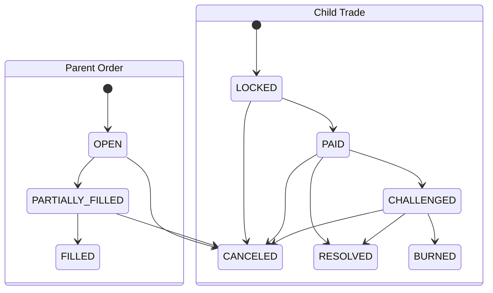

### 4.1 Parent order state
- `OPEN`
- `PARTIALLY_FILLED`
- `FILLED`
- `CANCELED`

Parent order market görünürlüğünü taşır; escrow uyuşmazlığı çözmez.

### 4.2 Child trade state
- `OPEN` (enum'da durur; V3 fill path’i trade'i doğrudan `LOCKED` üretir, `OPEN` hiç yazılmaz)
- `LOCKED`
- `PAID`
- `CHALLENGED`
- `RESOLVED`
- `CANCELED`
- `BURNED`

### 4.3 Fill anında child trade yaratımı
Hem `fillSellOrder` hem `fillBuyOrder` akışında child trade aynı tx içinde doğrudan `LOCKED` oluşur. Böylece eski create+lock zinciri yerine tek adımda escrow entry gerçekleşir.

### 4.4 Kimlik ilişkisi
- Parent order identity: `orderId`
- Child trade identity: `tradeId` (`onchain_escrow_id` mirror)
- Link authority: `OrderFilled(orderId, tradeId, ...)` + `getTrade(tradeId)`

---

## 5. Sell flow, Buy flow ve role mapping

V3’te role mapping side-dependent olduğu için bu bölümde “owner kim, maker kim, taker kim?” ilişkisi netleştirilmelidir.

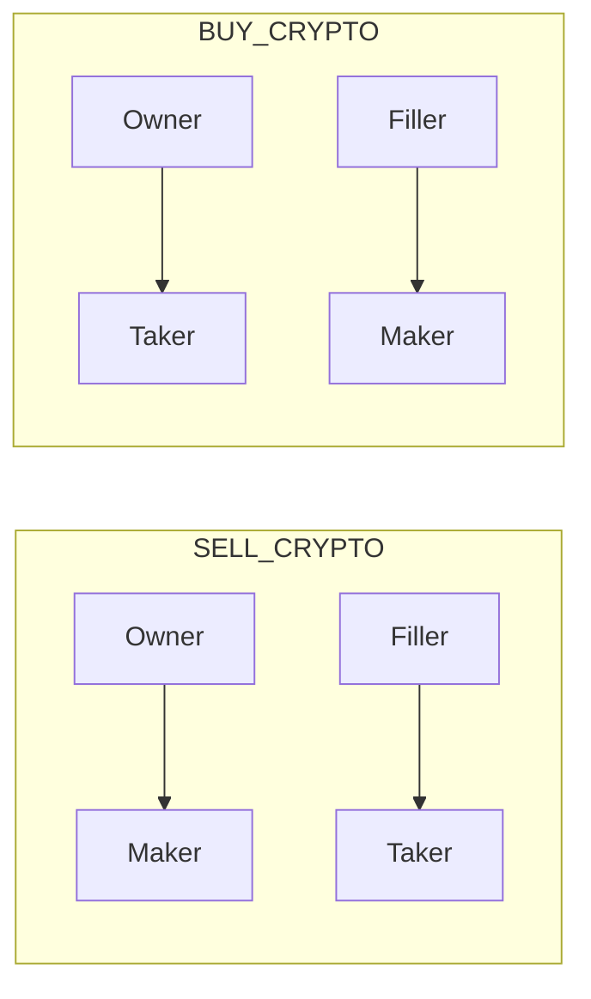

### 5.1 Sell flow
1. Owner `createSellOrder`
2. Filler `fillSellOrder` (taker gate uygulanır)
3. Child trade `LOCKED`
4. Taker `reportPayment`
5. Maker `releaseFunds` veya dispute/cancel yolları

### 5.2 Buy flow
1. Owner `createBuyOrder` (owner eventual taker olduğu için gate create-time’da uygulanır)
2. Filler `fillBuyOrder`
3. Owner (taker) fill-time’da yeniden gate kontrolünden geçer
4. Child trade `LOCKED`
5. `reportPayment` → `releaseFunds` / dispute / cancel

### 5.3 Side-dependent role mapping
Mutlak “maker=seller, taker=buyer” yoktur:
- `SELL_CRYPTO`: owner→maker, filler→taker
- `BUY_CRYPTO`: owner→taker, filler→maker

| Yön | Rol | Kilitlediği | Giriş kapısı | Trade'deki yetkileri |
|---|---|---|---|---|
| `SELL_CRYPTO` | Owner = maker (kripto satıcısı) | create'te envanter + toplam maker bond rezervi | create ve fill anında aktif ban; create'te tier ≤ efektif tier, fill'de tekrar | `releaseFunds`, `pingTakerForChallenge`, `challengeTrade`, iptal, settlement |
| `SELL_CRYPTO` | Filler = taker (kripto alıcısı) | fill'de taker bond | taker giriş kapısı + tier | `reportPayment`, `pingMaker`, `autoRelease`, iptal, settlement |
| `BUY_CRYPTO` | Owner = taker (kripto alıcısı) | create'te toplam taker bond rezervi | create ve fill anında taker giriş kapısı + tier | `reportPayment`, `pingMaker`, `autoRelease`, iptal, settlement |
| `BUY_CRYPTO` | Filler = maker (kripto satıcısı) | fill'de kripto + maker bond | aktif ban + tier | `releaseFunds`, `pingTakerForChallenge`, `challengeTrade`, iptal, settlement |

Her iki taraf `expirePaymentWindow` çağırabilir; `burnExpired` ve `expireSettlement` herkese açıktır.

---

## 6. Anti-sybil enforcement semantiği (V3)

Kanonik gate helper: `_enforceTakerEntry(wallet, tier)`

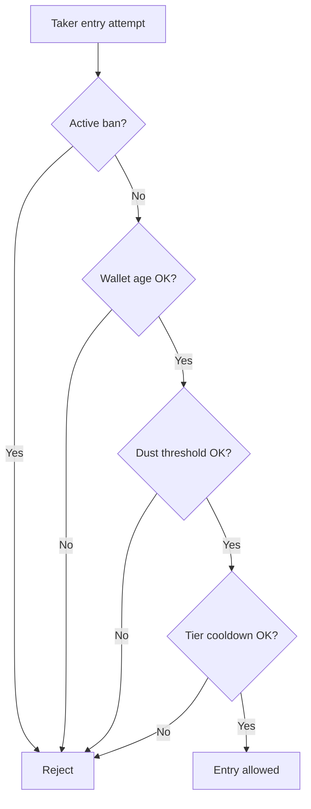

Gate bileşenleri:
- aktif ban kontrolü (`bannedUntil`; `block.timestamp <= bannedUntil` ise `TakerBanActive`)
- wallet age: `registerWallet` + `WALLET_AGE_MIN` = **2 gün** (`WalletTooYoung`)
- native balance dust eşiği: `DUST_LIMIT` = **0,001 ETH** (`InsufficientNativeBalance`)
- tier bazlı cooldown: order tier'ı 0 ise `tier0TradeCooldown`, 1 ise `tier1TradeCooldown` (varsayılan ikisi de **4 saat**, üst sınır 30 gün); Tier 2+ için cooldown yoktur (`TierCooldownActive`). `lastTradeAt` yalnız Tier 0/1 fill'lerinde taker için yazılır.

V3 uygulama noktaları:
- `fillSellOrder` (filler taker)
- `createBuyOrder` (owner eventual taker)
- `fillBuyOrder` (owner taker re-check)

Maker rolü için yalnız aktif ban bakılır (`MakerBanActive`): `createSellOrder` (owner), `fillSellOrder` (owner), `fillBuyOrder` (filler). Yaş/dust/cooldown kapıları taker girişine özgüdür; maker zaten envanter + bond kilitler. Tier kapısı ayrıca uygulanır: order tier'ı create anında sahibinin, fill anında hem sahibinin hem filler'ın efektif tier'ını aşamaz.

`antiSybilCheck(wallet)` ve `getCooldownRemaining(wallet)` yalnız bilgi amaçlıdır; parametresiz oldukları için iki tier cooldown'unun büyüğünü raporlar, bağlayıcı karar state-changing fonksiyonlardadır.

Sonuç: anti-sybil enforcement lockEscrow-merkezli legacy değildir; V3 child-trade entry path merkezlidir.

---

## 7. Dispute/Bleeding Escrow teknik akışı

Bu bölüm V3’ün gerçek ekonomik state machine’ini açıklar. `LOCKED` ve `PAID` sonrası normal çözüm, dispute, liveness, cancel ve burn yolları child trade seviyesinde çalışır.

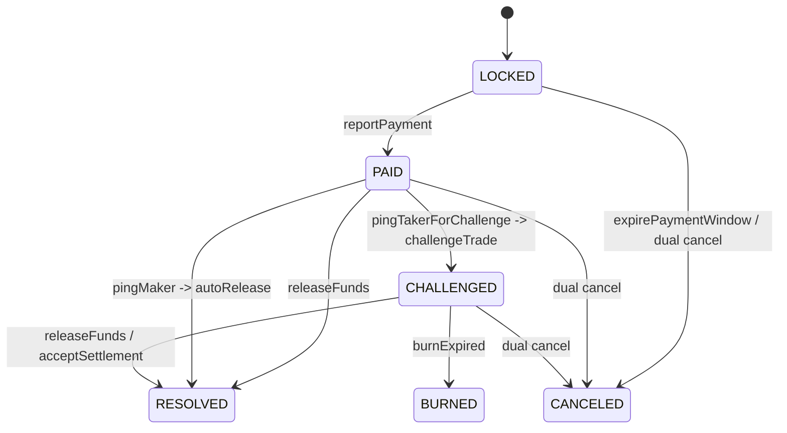

### 7.1 `LOCKED` ve `PAID` sonrası çözüm yolları
- **Normal kapanış:** maker `releaseFunds`
- **Dispute hattı:** maker `pingTakerForChallenge` (en erken `paidAt + 24 saat`; öncesinde `PingCooldownNotElapsed`) → 24 saat cevap penceresi → `challengeTrade` (yalnız maker). Ping bir iddiadır: maker challenge'ı `[ping+24sa, ping+48sa)` aralığında (`MAKER_CHALLENGE_WINDOW` = 24 saat, sabit) açmazsa ping **düşer**; `ping+48sa` saniyesinden itibaren `challengeTrade` `ChallengeWindowExpired` ile reddedilir. Maker trade başına tek ping atabilir (`AlreadyPinged`).
- **Liveness hattı:** taker `pingMaker` (`paidAt + GRACE_PERIOD` = `paidAt + 48 saat` sonrası) → 24 saat → `autoRelease` (iki bond'dan `AUTO_RELEASE_PENALTY_BPS` = %2). Maker'ın pingi geçerliyken (`ping+48sa` öncesi) `pingMaker` `ConflictingPingPath` ile reddedilir; ping düştüğü saniyeden itibaren açılır. Böylece ping atıp susan maker PAID trade'i süresiz kilitleyemez. Ters yönde, taker `pingMaker` attıysa maker'ın `pingTakerForChallenge`'ı `ConflictingPingPath` ile reddedilir.
- **Maker her zaman release edebilir:** `PAID`'den `releaseFunds` ping'den bağımsız her an açıktır (clean release); `CHALLENGED`'dan release `DISPUTED_RELEASE` + maker dispute kaybıdır.
- **Mutual cancel:** her iki taraf kendi `proposeOrApproveCancel(tradeId)` işlemini gönderir (ayrı imza yok); ikinci onay gelmeden önce taraf kendi onayını `revokeCancel(tradeId)` ile geri çekebilir (`CancelRevoked`; onay yoksa `NoCancelConsent`)
- **Ödeme penceresi aşımı:** `reportPayment` yalnız `lockedAt + PAYMENT_WINDOW` (48 saat) öncesinde kabul edilir (sınır saniyesinden itibaren `PaymentWindowClosed`). LOCKED'da 48 saat içinde ödeme bildirilmezse taraflardan biri `expirePaymentWindow` çağırır (öncesinde `PaymentWindowActive`); maker tam iade alır, taker bond'undan %2 liveness cezası + negatif itibar sinyali
- **Terminal burn:** challenge sonrası `MAX_BLEEDING` (240 saat) dolunca `burnExpired`

### 7.2 Bleeding bileşenleri
- maker bond decay
- taker bond decay
- belirli eşik sonrası crypto side decay

Kesin zaman çizelgesi (tüm süreler `challengedAt`'ten itibaren, `getCurrentAmounts` ile birebir):

| Aralık | Ne erir | Oran | 240. saate kadar toplam |
|---|---|---|---|
| 0–48 saat (grace) | hiçbir şey | — | — |
| 48–240 saat | maker bond | saatte %0,26 (`MAKER_BOND_DECAY_BPS_H` = 26) | ≈ %49,9 |
| 48–240 saat | taker bond | saatte %0,42 (`TAKER_BOND_DECAY_BPS_H` = 42) | ≈ %80,6 |
| 144–240 saat | ana para (kripto) | saatte %0,68 (`CRYPTO_DECAY_BPS_H` = 34, ×2) | ≈ %65,3 |
| 240. saat | `burnExpired` çağrılabilir; trade'in tüm bakiyesi (erimiş kısım dahil: `cryptoAmount + makerBond + takerBond`) hazineye gider | — | %100 |

Ana para erimesi, grace sonrası `USDT_DECAY_START` (96 saat) dolunca başlar. `MAX_BLEEDING` (240 saat) challenge'dan itibaren toplam süredir, ana paranın erime süresi değildir: ana para
yalnız son 96 saatte erir; bu yüzden yakılma anına kadar yaklaşık %34,7'si uzlaşmaya konu olarak durur.

`getCurrentAmounts(tradeId)`, o anki ekonomik bakiyeyi kanonik olarak çıkarır. `PAID` (ve `CHALLENGED` dışındaki her state) için erime yoktur; tutarlar trade snapshot'ıdır.

### 7.3 Challenge ve liveness ping semantiği
- Ping yolları birbirini dışlayan şekilde tasarlanır (conflicting path koruması). İstisna: maker pingi `challengePingedAt + 24 saat + MAKER_CHALLENGE_WINDOW` anında düşer; o saniyeden itibaren `challengeTrade` `ChallengeWindowExpired` verir ve taker `pingMaker` çağırabilir.
`T = challengePingedAt` (en erken `paidAt + 24 saat`):

| Zaman | Maker `challengeTrade` | Taker `pingMaker` | Maker `releaseFunds` |
|---|---|---|---|
| `T ≤ t < T+24sa` | `ResponseWindowActive` | `ConflictingPingPath` | açık |
| `T+24sa ≤ t < T+48sa` | **açık** → `CHALLENGED` | `ConflictingPingPath` | açık |
| `t ≥ T+48sa` (ping düştü) | `ChallengeWindowExpired` | **açık** (`paidAt + 48 saat` kuralıyla) → 24 saat sonra `autoRelease` | açık |

- Ping'in düşmesi event ile duyurulmaz; off-chain taraf `getTrade` alanlarından (`challengePingedByMaker`, `challengePingedAt`, `pingedByTaker`) hesaplar.
- Bekleme pencereleri state-guard ile enforce edilir.

### 7.4 Burn semantiği
- `burnExpired` permissionless'tır: challenge süresi dolan state’i herkes finalize edebilir.
- Trade'in escrow'daki tüm bakiyesi (erimiş kısım dahil) treasury'ye gider (`RevenueKind.BURN_RESIDUAL`); burn sonrası escrow'da o trade'e ait bakiye kalmaz. `EscrowBurned.burnedAmount` bu toplamdır; `burnExpired` `BleedingDecayed` yaymaz.

### 7.5 Cancel semantiği
- `proposeOrApproveCancel` onayı msg.sender ile kanıtlanır; onaylar yalnız verildikleri state için geçerlidir (`reportPayment` / `challengeTrade` sıfırlar).
- Her iki taraf onayı tamamlanmadan cancel finalize edilmez; tamamlanmadan önce verilen onay `revokeCancel` ile geri alınabilir.
- `LOCKED` iptalinde fee yoktur, iki taraf tam iade alır. `PAID`/`CHALLENGED` iptalinde her tarafın fee'si (snapshot oranı × güncel kripto) kendi güncel bond'uyla sınırlanarak kesilir; `CHALLENGED`'da erimiş kısım da hazineye gider.

### 7.6 Settlement semantiği
- Teklif yalnız `CHALLENGED`'da ve yalnız trade taraflarınca açılır; aynı anda tek canlı teklif olur (`ActiveSettlementProposalExists`; süresi dolmuş teklifin üzerine yazılabilir). `makerShareBps ≤ 10.000`, son geçerlilik `now + 10 dakika` ile `now + 7 gün` arası.
- `acceptSettlement(tradeId, expectedProposalId)`: karşı taraf gördüğü teklifin `id`'sini verir. Teklif sahibi withdraw + yeniden teklif ile oranı değiştirirse `id` değişir ve kabul `SettlementProposalMismatch` ile revert eder.
- `rejectSettlement` (karşı taraf) ve `withdrawSettlement` (teklif sahibi) canlı teklifte; `expireSettlement` süresi dolmuş teklifte herkes tarafından çağrılır.
- Kabulde havuz = güncel (erime sonrası) kripto + iki bond; maker payı `makerShareBps`, fee'ler gross paylardan kesilir, erimiş kısım hazineye gider.

### 7.7 Terminal dağıtım özeti (koddan)

| Yol | Maker alır | Taker alır | Treasury alır |
|---|---|---|---|
| `releaseFunds` (PAID) | `makerBond − makerFee` (fee bond ile sınırlı) | `crypto − takerFee + takerBond` | `takerFee + makerFee` |
| `releaseFunds` (CHALLENGED) | aynı formül, güncel (erime sonrası) tutarlarla | aynı | fee'ler + erimiş kısım |
| `autoRelease` | `makerBond − %2` | `crypto + takerBond − %2` | iki bond'un %2'si |
| `expirePaymentWindow` | `crypto + makerBond` | `takerBond − %2` | taker bond'unun %2'si |
| Mutual cancel (LOCKED) | `crypto + makerBond` | `takerBond` | — |
| Mutual cancel (PAID/CHALLENGED) | `crypto + makerBond − makerFee` | `takerBond − takerFee` | fee'ler (+ erimiş kısım) |
| `acceptSettlement` | maker gross payı − maker fee | taker gross payı − taker fee | fee'ler + erimiş kısım |
| `burnExpired` | — | — | `crypto + makerBond + takerBond` |

Fee'ler: `takerFee = crypto × takerFeeBpsSnapshot`, `makerFee = crypto × makerFeeBpsSnapshot` (varsayılan 15 bps = %0,15; Tier 0 order'da maker fee 0). Treasury bir kontratsa (`ArafRevenueVault`) aktarım `noteEscrowRevenueIntent` → transfer → `onArafRevenue` sırasıyla yapılır; hook revert ederse tüm işlem `RevenueHookFailed` ile geri alınır.

---

## 8. Reputation / bans / clean-slate

Reputation modeli V3’te tier progression, ban disiplini ve clean-slate bakım çağrısını birlikte taşır. Motor `ArafReputationLib` içindedir (DELEGATECALL; storage ve event'ler escrow'a aittir).

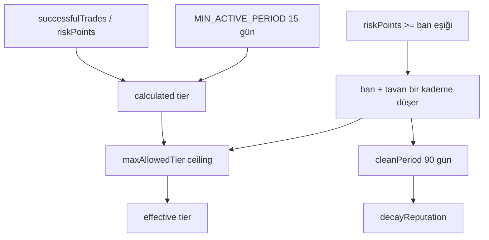

### 8.1 Reputation alanları
- `successfulTrades`, `failedDisputes`, `bannedUntil`, `consecutiveBans`, `riskPoints`
- Sonuç sayaçları: `manualReleaseCount`, `autoReleaseCount`, `mutualCancelCount`, `disputedResolvedCount`, `burnCount`, `disputeWinCount`, `disputeLossCount`, `partialSettlementCount`
- `lastPositiveEventAt`, `lastNegativeEventAt`; ayrıca `firstSuccessfulTradeAt` (`getFirstSuccessfulTradeAt`) ve ceza tavanı `maxAllowedTier`
- Her terminal sonuçta iki taraf için (ödeme penceresi aşımında yalnız taker için) `ReputationUpdated` yayınlanır.

### 8.2 Sonuç → itibar etkisi (varsayılan politika)

| Terminal sonuç | Maker | Taker |
|---|---|---|
| `MANUAL_RELEASE` (PAID'den release) | +1 başarı, −8 risk | +1 başarı, −8 risk |
| `AUTO_RELEASE` | `failedDisputes`+1, +60 risk | +1 başarı, −8 risk |
| `MUTUAL_CANCEL` | +20 risk | +20 risk |
| `DISPUTED_RELEASE` (CHALLENGED'dan release) | `failedDisputes`+1, dispute kaybı, +60 risk | dispute kazancı, +1 başarı, −10 risk |
| `BURN` | `failedDisputes`+1, +90 risk | `failedDisputes`+1, +90 risk |
| `PARTIAL_SETTLEMENT` | +1 başarı, 0 puan | +1 başarı, 0 puan |
| `PAYMENT_WINDOW_EXPIRED` | etkilenmez | `failedDisputes`+1, +60 risk |

- **Mikro işlem koruması:** 6 ondalığa normalize edilmiş tutarı `MIN_REPUTATION_NOTIONAL` (20e6 = 20 birim, ör. 20 USDT) altında kalan trade'lerde pozitif sinyaller (başarı sayacı, risk düşüşü, `firstSuccessfulTradeAt`) yok sayılır; cezalar her büyüklükte uygulanır.
- Puanlar `setReputationPolicy` ile değiştirilebilir; değişiklik yalnız sonraki kayıtları etkiler.

### 8.3 Tier, ban ve clean-slate
- **Efektif tier:** 4'ten 1'e doğru, `successfulTrades ≥ tierMinSuccessfulTrades[i]` ve `riskPoints ≤ tierMaxRiskPoints[i]` sağlayan ilk tier. Varsayılan eşikler: başarı **0 / 15 / 50 / 100 / 200**, azami risk **100 / 80 / 50 / 30 / 15** (Tier 0–4). Tier > 0 için ilk başarılı işlemden bu yana `MIN_ACTIVE_PERIOD` = **15 gün** geçmiş olmalı. Ceza tavanı varsa sonuç `maxAllowedTier` ile sınırlanır.
- **Ban:** negatif sinyal sonrası `riskPoints ≥ banRiskPointsThreshold` (**100**) ise: kullanıcı o an banlı değilse `consecutiveBans`+1 ve ban süresi `baseBanDuration × 2^(consecutiveBans−1)` (**30 gün**, 60, 120 …, en çok **365 gün**). Aynı koşulda her seferinde tier tavanı bir kademe düşer (ilk ceza 4'ten başlatıp 3'e indirir).
- **Ban etkisi:** taker girişi (`TakerBanActive`) ve maker rolleri (`MakerBanActive`: sell order açma, sell order'ın doldurulması, buy order'ı doldurma) kapanır. Açık trade'lerin kapanış yolları açık kalır.
- **Bond fiyatlaması:** `riskPoints == 0` ve en az bir başarı varsa bond oranı 100 bps düşer; `riskPoints > 0` ise 300 bps artar (Tier 0 bond'u her durumda 0).
- **Clean-slate:** `decayReputation(wallet)` permissionless'tır; koşullar: ban geçmişi var (`NoPriorBanHistory`), `now > bannedUntil + cleanPeriod` (`CleanPeriodNotElapsed`), `consecutiveBans > 0` (`NoBansToReset`). Güncel `cleanPeriod`: **90 gün**. Sıfırlananlar: `consecutiveBans`, `riskPoints`, tier tavanı (4'e döner). Bu tam af değildir; `failedDisputes`, sonuç sayaçları ve `bannedUntil` silinmez.
- Backend'in `reputationDecay` job'ı aday cüzdanlar için kontratın `getReputation()` / `cleanPeriod()` okumasıyla bu çağrıyı tetikleyebilir (opsiyonel `RELAYER_PRIVATE_KEY`); karar yine kontrattadır.

### 8.4 Politika sınırları (`setReputationPolicy` / `setReputationTierThresholds`)
- `cleanPeriod` 7–365 gün; `baseBanDuration` > 0 ve ≤ 365 gün; `banRiskPointsThreshold` > 0 ve ≤ `tierMaxRiskPoints[0]`; her ödül/ceza puanı ≤ ban eşiği.
- Tier eşiklerinde `minSuccessfulTrades` artan, `maxRiskPoints` azalan olmalı ve `maxRiskPoints[0] ≥ banRiskPointsThreshold`.

---

## 9. Finalized parameters ve mutable config ayrımı

Bu bölüm immutable parametreler ile runtime’da owner tarafından değiştirilebilen yüzeyleri ayırır. Tüm değerler `contracts/src/ArafEscrow.sol` ve `ArafReputationLib.sol`'den alınmıştır.

### 9.0 Parametre sınıflandırma tablosu

| Sınıf | Parametreler | Not |
|---|---|---|
| Sabitler (`constant`; public getter'ı olanlar ve internal olanlar) | Bond BPS'leri (`MAKER_BOND_TIER*_BPS`, `TAKER_BOND_TIER*_BPS`), `GOOD_REP_DISCOUNT_BPS`, `BAD_REP_PENALTY_BPS`, `AUTO_RELEASE_PENALTY_BPS`, `GRACE_PERIOD`, `PAYMENT_WINDOW`, `MAKER_CHALLENGE_WINDOW`, `USDT_DECAY_START`, `MAX_BLEEDING`, `*_DECAY_BPS_H`, `WALLET_AGE_MIN`, `DUST_LIMIT`, `MIN_ACTIVE_PERIOD`, `MIN_REPUTATION_NOTIONAL`, `MAX_TRADE_COOLDOWN`, `MAX_FEE_CONFIG_BPS` | Runtime’da owner çağrısıyla değişmez. |
| Mutable runtime config | `takerFeeBps`, `makerFeeBps`, `tier0TradeCooldown`, `tier1TradeCooldown`, `treasury`, reputation politikası ve tier eşikleri | Owner governance surface ile değişebilir; aktif trade'lerin fee'si snapshot ile korunur. |
| Direction-aware token runtime policy | `tokenConfigs[token] => {supported, allowSellOrders, allowBuyOrders, decimals, tierMaxAmountsBaseUnit[4]}` | Token desteği ve tier tavanları token bazında yönetilir. |

### 9.1 Sabit değerler

| Sabit | Değer | Anlam |
|---|---|---|
| Maker bond (Tier 0–4) | %0 / %8 / %6 / %5 / %2 | Order tier'ına göre, fill tutarı üzerinden |
| Taker bond (Tier 0–4) | %0 / %10 / %8 / %5 / %2 | Order tier'ına göre, fill tutarı üzerinden |
| `GOOD_REP_DISCOUNT_BPS` / `BAD_REP_PENALTY_BPS` | −100 / +300 bps | Bond oranına itibar düzeltmesi (Tier 1+) |
| `AUTO_RELEASE_PENALTY_BPS` | 200 bps (%2) | `autoRelease` (iki bond) ve `expirePaymentWindow` (taker bond) cezası |
| `PAYMENT_WINDOW` | 48 saat | `LOCKED`'da ödeme bildirme süresi |
| `GRACE_PERIOD` | 48 saat | `pingMaker` için `paidAt` sonrası bekleme; challenge sonrası erimesiz süre |
| `MAKER_CHALLENGE_WINDOW` | 24 saat | Ping+24 saatten sonra challenge açma penceresi |
| `USDT_DECAY_START` | 96 saat | Grace sonrası ana para erimesinin başlaması |
| `MAX_BLEEDING` | 240 saat | `challengedAt`'ten burn'e kadar toplam süre |
| `MAKER/TAKER/CRYPTO_DECAY_BPS_H` | 26 / 42 / 34 (×2) bps/saat | Erime hızları |
| `WALLET_AGE_MIN` | 2 gün | Taker girişi için kayıt yaşı |
| `DUST_LIMIT` | 0,001 ETH | Taker girişi için native bakiye |
| `MIN_ACTIVE_PERIOD` | 15 gün | Tier > 0 için ilk başarıdan bu yana süre |
| `MIN_REPUTATION_NOTIONAL` | 20e6 (6 ondalık) | İtibara sayılan en küçük trade |
| `MAX_TRADE_COOLDOWN` | 30 gün | Cooldown setter üst sınırı |
| `MAX_FEE_CONFIG_BPS` | 2000 bps | Fee setter üst sınırı (taraf başına) |

`MAX_CANCEL_DEADLINE` (7 gün) ve `MIN_SETTLEMENT_EXPIRY` sabitleri escrow'da tanımlıdır ama escrow kodunda kullanılmaz; settlement süre sınırları (10 dakika – 7 gün) `ArafSettlementLib` içindeki kendi sabitleriyle uygulanır.

### 9.2 Mutable runtime config
- `takerFeeBps`, `makerFeeBps` — varsayılan **15 / 15 bps** (%0,15), taraf başına ≤ 2000 bps
- `tier0TradeCooldown`, `tier1TradeCooldown` — varsayılan **4 saat / 4 saat**, ≤ 30 gün
- `treasury` — `setTreasury`
- reputation politikası ve tier eşikleri — `setReputationPolicy`, `setReputationTierThresholds` (varsayılanlar §8)
- direction-aware token config (`setTokenConfig`): `supported`, `allowSellOrders`, `allowBuyOrders`, `decimals` (token'ın `decimals()` değerine eşit olmalı), dört tier tavanı (Tier 0–3, base unit, > 0). Tier 4 tavanı yoktur.

### 9.3 Fee snapshot semantiği
- Snapshot order create anında alınır; Tier 0 order'da maker fee snapshot'ı bilinçli olarak 0'dır.
- Child trade, parent snapshot’ını taşır.
- Sonraki `setFeeConfig` aktif trade economics’ini geriye dönük değiştirmez.

### 9.4 Toolchain / deployment assumptions
- `contracts/scripts/deploy.js` sırası: `ArafReputationLib` → `ArafSettlementLib` → linkli `ArafEscrow(treasury)` → USDT/USDC için `setTokenConfig` (6 ondalık, sell+buy açık, tier tavanları 150 / 1.500 / 7.500 / 30.000 token) ve `getTokenConfig` ile doğrulama → `transferOwnership(FINAL_OWNER_ADDRESS)`. Manifest library adreslerini de kaydeder.
- Public ağda `CONFIRM_PUBLIC_DEPLOY=yes` zorunludur; public/custom modda `FINAL_OWNER_ADDRESS` ile `TREASURY_ADDRESS` aynı olamaz.
- `ArafRevenueVault` + `ArafRewards` ayrı script'le (`deployRewards.js`) kurulur; escrow treasury'nin vault'a çevrilmesi ayrı ve açık bir operasyondur (`rewardsOps.js`).
- Derleme hedefi `cancun`'dur (`hardhat.config.js`): `ArafRevenueVault` escrow gelir niyetini EIP-1153 transient storage'da (`tstore`/`tload`) tutar; vault'un deploy edildiği ağ EIP-1153'ü desteklemelidir.
- Production rehberinde owner key’in multisig altında tutulması governance risk azaltımı için varsayımdır.

---

## 10. Runtime bağlantı ve operasyon politikaları

Backend davranışı yalnız teknoloji seçimiyle değil, bootstrap, readiness ve shutdown disipliniyle tanımlanır.

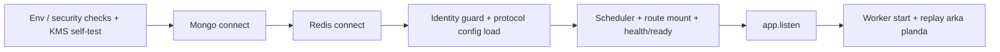

### 10.1 Bootstrap sırası (backend, `backend/scripts/app.js`)
1. Env ve güvenlik kontrolleri (ör. production'da `SIWE_DOMAIN` localhost olamaz) + production KMS self-test
2. Mongo bağlantısı
3. Redis bağlantısı
4. Kimlik normalizasyonu guard'ı (production'da varsayılan enforce) ve mutable protocol config mirror'ının yüklenmesi (yüklenemezse süreç çökmez; ilgili route'lar `CONFIG_UNAVAILABLE` dönebilir)
5. Scheduler job'ları
6. Route mount + `/health`, `/ready`
7. `app.listen`
8. Worker `startInBackground` ile başlar: bağlan + replay HTTP dinlemeye başladıktan sonra arka planda sürer, bu sırada `/ready` "replaying" raporlar

### 10.2 Readiness-first yaklaşımı
- Liveness (`/health`) süreç ayakta mı sorusuna bakar.
- Readiness (`/ready`) bağımlılıkların gerçekten hazır olup olmadığını doğrular.
- Trafik açma kararı readiness’e göre verilmelidir.

### 10.3 Fail-fast / fail-open kararları
- Kritik bağımlılık kopuşlarında fail-fast yaklaşımı uygulanır (özellikle DB/worker bütünlüğü için).
- Güvenlik sınırında fail-open yerine fail-closed tercih edilir (ör. auth/session sınırları).

### 10.4 Timeout ve bağlantı politikaları
- Mongo tarafında `maxPoolSize: 100`, `socketTimeoutMS: 20000`, `serverSelectionTimeoutMS: 5000` ayarları worker+API yükünü birlikte kaldıracak şekilde kullanılır.
- Beklenmeyen Mongo kopuşunda `process.exit(1)` ile fail-fast yeniden başlatma tercih edilir (stale/yarım bağlantı drift’ini azaltmak için).
- Redis tarafında `isReady` sinyali `connected` durumundan ayrı ele alınır; middleware kararları buna göre verilir.
- Redis TLS (`rediss://`) ve managed servis senaryoları runtime config’te dikkate alınır.

### 10.5 Graceful shutdown sırası
- AES master key önbelleğini sıfırla, scheduler interval/timeout’larını temizle
- Yeni istekleri kes (`server.close`)
- Worker’ı durdur
- Mongo/Redis bağlantılarını kapat
- süreçten kontrollü çık (zaman aşımında zorla çıkış)

### 10.6 Scheduler / cleanup jobs
Varsayılan aralıklar `JOB_*_MS` env'leriyle değiştirilebilir.

| Job | Varsayılan aralık | Not |
|---|---|---|
| DLQ processing | 60 sn | Bkz. §11.4 |
| Reputation decay tetikleyicisi | 24 saat (ilk çalışma 30 sn sonra) | `RELAYER_PRIVATE_KEY` + `BASE_RPC_URL` yoksa çalışmaz |
| Reward outcome recorder | 1 saat | `ArafRewards.recordTradeOutcomes`; aynı relayer koşulu |
| Stats snapshot | 24 saat | |
| Receipt & PII snapshot retention cleanup | 30 dk | |
| User bank risk metadata cleanup | 6 saat | |
| Referans kur şeridi | periyodik | Yalnız bilgilendirme; settlement'i etkilemez |
| Reconciliation raporu | 10 dk | Production'da varsayılan açık (`JOB_RECONCILIATION_ENABLED`) |

### 10.7 Health vs ready operasyonel anlamı
- `/health`: süreç ayakta mı ve worker yeni blok görüyor mu? (worker son blok eşiğini aşarsa `503 stale`)
- `/ready`: Mongo/Redis + config + chain id + worker lag (varsayılan en çok 25 blok, `WORKER_MAX_LAG_BLOCKS`) + replay durumu güvenli mi? (traffic gate). Sonuç birkaç saniye önbelleklenir; kimliksiz çağrıya redakte görünüm döner, ayrıntı yalnız `READY_INTERNAL_TOKEN` ile.
- Worker replay veya yüksek lag durumunda liveness true kalsa bile readiness false olabilir; bu bilinçli tasarım tercihidir.

---

## 11. Event worker / replay / mirror reliability

Worker zincirden authoritative state’i okur, Mongo’ya operational mirror üretir; fakat authority olmaz.

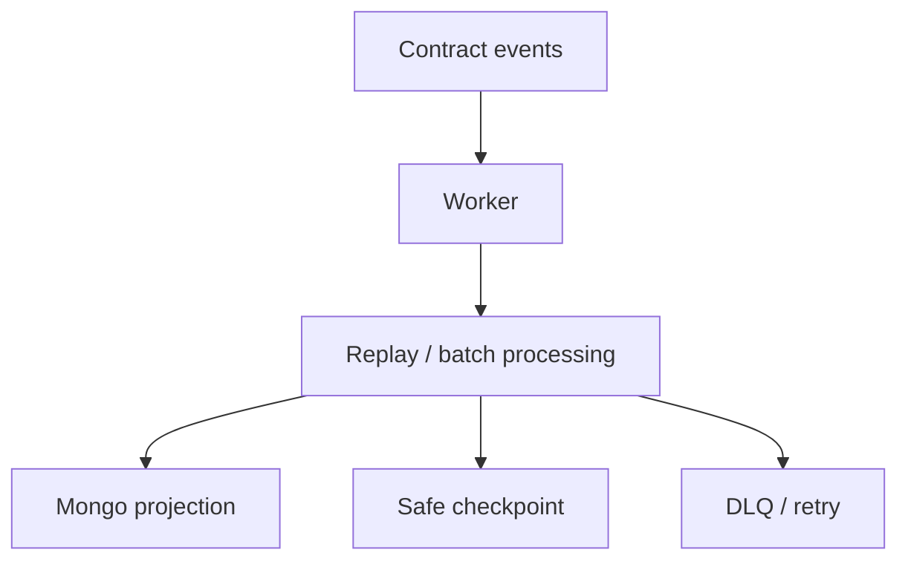

### 11.1 Worker state mantığı
Worker kontrat event’lerini consume eder, Mongo’yu authoritative olmadan günceller.

### 11.2 Checkpoint yaklaşımı
- son işlenen blok (`worker:last_block`) ve son güvenli checkpoint (`worker:last_safe_block`)
- finality derinliği: production'da varsayılan 6 blok (`WORKER_FINALITY_DEPTH`)
- checkpoint yoksa production'da `WORKER_START_BLOCK` veya `ARAF_DEPLOYMENT_BLOCK` zorunludur
- replay başlangıç güvenliği

### 11.3 Replay ve batch işleme
- bloklar batch halinde işlenir (varsayılan 1.000 blok, `WORKER_BLOCK_BATCH_SIZE`; checkpoint en az 50 blokta bir, `WORKER_CHECKPOINT_INTERVAL_BLOCKS`)
- bir aralık okunamazsa ya da bir batch başarısız olursa checkpoint ilerletilmez; replay ilk başarısız batch'te durur
- replay’de idempotent davranış hedeflenir; scope başına son uygulanan `(blockNumber, logIndex)` tutulur, daha eski event geri yazamaz
- state regression guard’larıyla geriye düşüş engellenir; terminal state'ler geri açılmaz

### 11.3.1 Last-safe-block semantiği
- Worker yalnız son görülen blok değil, son güvenli checkpoint bloğunu da izler.
- Ready kararı, provider block yüksekliği ile worker safe checkpoint farkını (lag) hesaba katar.
- Bu yaklaşım “işleniyor gibi görünüp geride kalma” durumunu operasyonel olarak görünür kılar.

### 11.4 DLQ ve poison event görünürlüğü
- event önce yerinde yeniden denenir (5 deneme); işlenemeyen event DLQ’ya taşınır. Kayıt `txHash:logIndex` anahtarıyla tekildir (canlı DLQ, arşiv ve karantina indeks setleri)
- DLQ işlemcisi kayıtları yeniden sürer; başarılı re-drive event'i ack'ler ve bloğun unsafe bayrağını kaldırır
- `MAX_REDRIVE_ATTEMPTS` (10) aşılırsa kayıt **kalıcı karantinaya** alınır (TTL yok, manuel inceleme): event "acked-poison" sayılır, checkpoint onun yüzünden takılmaz; alarm `logger.error` + karantina sayacı ile verilir. Arşiv 7 gün tutulur
- operasyonel görünürlük için log/metric izi korunur

### 11.5 Kimlik normalizasyonu
- on-chain id alanları numeric-string disipliniyle tutulur
- parent order id ve child trade id karışmasını önleyen explicit lookup stratejisi uygulanır

### 11.6 OrderFilled + getTrade linkage
Child trade authority worker tarafında heuristik yerine explicit event+getter kombinasyonuyla mirror edilir. Kontrat `EscrowCreated` / `EscrowLocked` yayınlamaz; mirror `OrderFilled` anında `LOCKED` olarak kurulur ve tek seferlik payout snapshot aynı adımda alınır (§12.4.1).

### 11.6.1 Mirror edilen event'ler ve terminal sayaç
- Escrow event'leri: order (`OrderCreated/Filled/Canceled`), trade lifecycle (`PaymentReported`, `EscrowReleased`, `DisputeOpened`, `MakerPinged`, `CancelProposed`, `CancelRevoked`, `EscrowCanceled`, `PaymentWindowExpired`, `BleedingDecayed`, `EscrowBurned`), settlement (`SettlementProposed/Rejected/Withdrawn/Expired/Finalized`), reputation/config (`ReputationUpdated`, `FeeConfigUpdated`, `CooldownConfigUpdated`, `TokenConfigUpdated`, `ReputationPolicyUpdated`, `ReputationTierThresholdsUpdated`), `WalletRegistered`, `ProtocolRevenueSent`. Vault event'leri (`EscrowRevenueReceived`, `ExternalRewardFunded`, `ProductRewardFunded`) vault adresinden ayrıca okunur.
- `CancelRevoked` ilgili tarafın `cancel_proposal` onay bayrağını geri alır; mirror yoksa event retry/DLQ'ya gider.
- Manuel/otomatik release ayrımı heuristikle değil kontratın terminal snapshot'ından (`getRewardableTrade`) okunur; okuma hatası kalıcı "UNKNOWN" yazmaz, event retry/DLQ'ya gider.
- Terminal geçiş (`resolved_at` işareti) trade başına bir kez uygulanır ve aynı işlemde **kalıcı terminal sayaç** satırı (`TerminalTradeStat`, `trade_key` tekil) yazılır; Trade belgesi 1 yıllık TTL ile silinse de istatistik geriye gitmez.

### 11.7 Mirror authority uyarısı
- Event worker, protokol kuralı üretmez; yalnız authoritative zincir durumunu operasyonel modele taşır.
- Mongo’daki bir alan ile kontrat storage çelişirse otorite kontrattadır.

---

## 12. Güvenlik mimarisi ve trust boundaries

Bu bölüm auth, session, PII ve client telemetry gibi güvenlik sınırlarını tek yerde toplar.

### 12.1 Auth modeli (SIWE + JWT + cookie session)

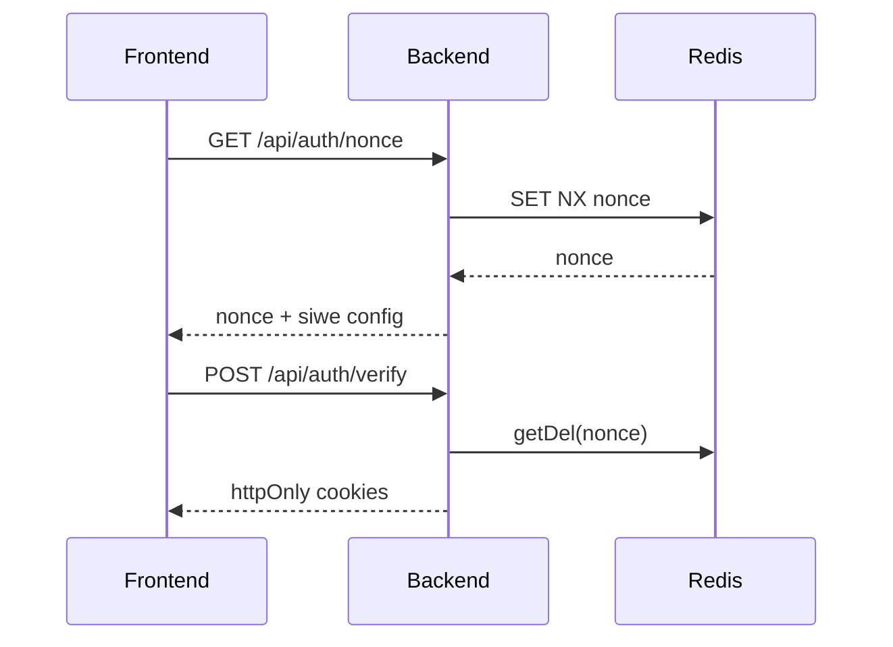

#### 12.1.1 Nonce lifecycle (TTL + consume)
- Nonce Redis’te wallet bazlı tutulur (`nonce:<wallet>`), varsayılan TTL **5 dakika**dır.
- Yarış durumunda nonce authority’si Redis’tir: `SET NX` başarısızsa yerel üretilen değer döndürülmez; Redis’te yaşayan nonce yeniden okunur.
- SIWE verify sırasında nonce `getDel` ile consume edilir; replay penceresi daraltılır.
- SIWE domain/URI doğrulaması request-time’da yapılır (özellikle production’da host/origin eşleşmesi zorunlu).

#### 12.1.2 Session token lifecycle
- Auth JWT cookie (`araf_jwt`) varsayılan kısa ömürlüdür (konfigürasyonla; default 15m).
- Refresh cookie (`araf_refresh`) daha uzun ömürlüdür (kayan pencere default 7 gün, oturum başına mutlak üst sınır default 30 gün, `REFRESH_ABSOLUTE_TTL_SECS`) ve `/api/auth` path scope’u ile sınırlandırılır.
- Cookie modeli httpOnly + sameSite=lax + credentials:include çizgisini korur; header bearer normal auth authority üretmez.

### 12.2 Cookie-only auth boundary ve session-wallet mismatch davranışı

| Kontrol adımı | Ne kontrol edilir | Mismatch sonucu |
|---|---|---|
| `requireAuth` | Cookie JWT geçerli mi + blacklist durumu | 401 / 403 |
| `requireSessionWalletMatch` | `x-wallet-address` == cookie-auth wallet | 409 + session invalidation |
| Session invalidation | JWT blacklist + refresh revoke + cookie clear | Session güvenli kapatılır |

> Önemli sınır: `x-wallet-address` tek başına auth kaynağı değildir; yalnız cookie-auth oturumla eşleşme kontrolüdür.

### 12.3 Refresh token family invalidation
- Logout ve session-wallet mismatch olaylarında refresh family revoke edilir.
- Amaç yalnız aktif access token’ı değil, refresh zincirinin yeniden kullanım riskini de kırmaktır.
- Böylece “tek request reddi” yerine “oturum soy ağacı iptali” uygulanır.

### 12.4 PII access boundary (trade-scoped token + canlı state kontrolü)

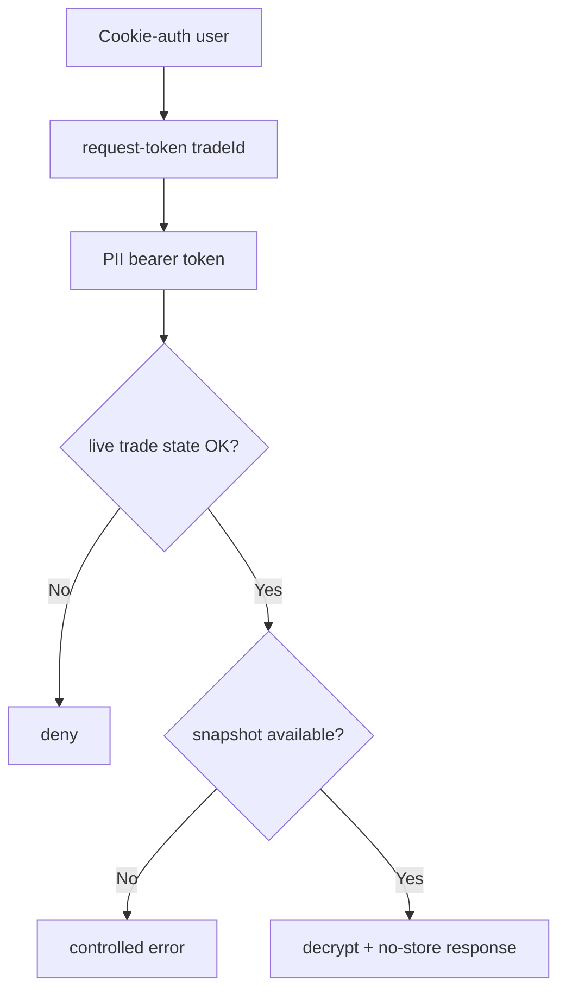

- PII token parent order’a değil, tek bir `tradeId`’ye scoped üretilir.
- `requirePIIToken` token type=`pii`, tradeId eşleşmesi ve token wallet == cookie session wallet koşullarını birlikte doğrular.
- Token tek başına yeterli değildir; route tekrar canlı trade state kontrolü yapar (`LOCKED/PAID/CHALLENGED` penceresi).
- Snapshot-first politika: payout snapshot yoksa controlled hata döner; current profile fallback kapalıdır.
- PII token ömrü varsayılan 15 dakikadır (`PII_TOKEN_EXPIRES_IN`).
- Hassas PII yanıtları `Cache-Control: no-store` / `Pragma: no-cache` ile döndürülür.

### 12.4.1 Ödeme profili kapısı ve tek seferlik snapshot
- İlke: ödeme profilini doldurmayan taraf işleme girmemeli; snapshot işlem kilitlendiği anda alınır ve işlem süresince değiştirilemez.
- Snapshot TEK SEFERLİDİR: `_captureLockedTradeSnapshot`, yalnız `payout_snapshot.captured_at` boşsa, atomik koşullu güncellemeyle yazar. Worker replay, DLQ re-drive ya da aynı `OrderFilled`'ın tekrar işlenmesi mevcut snapshot'ı yeniden yazmaz; eksik (`is_complete=false`) snapshot da sonradan "tamamlanmaz".
- Kapı (emir oluşturma/doldurma için "kayıtlı ödeme profili yok → işlem yok") YALNIZ arayüz ve API düzeyindedir: karar `/api/auth/me.hasPayoutProfile` (kayıtlı profil; taslak form değil) ve pazar listesindeki `owner_has_payout_profile` boolean'ına dayanır, durum bilinmiyorsa kapalıdır. Kontrat doğrudan çağrılarak bu kapı ATLANABİLİR.
- Asıl güvence kuraldır: **eksik snapshot → PII kapalı, işlem ödeme penceresinde çözülür.** Profili olmayan taraf için snapshot eksik kalır, `/api/pii/*` erişimi açılmaz ve işlem ödeme penceresi içinde (zamanaşımı/iptal akışıyla) çözülür.
- **Aktif işlemde profil kilidi:** cüzdanın `LOCKED`/`PAID`/`CHALLENGED` trade'i varken `PUT /api/auth/profile` ödeme profilini yazamaz (ilk oluşturma dahil): `409 BANK_PROFILE_LOCKED_DURING_ACTIVE_TRADE`.

### 12.5 Şifreleme modeli
- PII ve receipt payload alanları AES-256-GCM ile şifrelenmiş saklanır.
- Key türetme/yönetim tarafında HKDF + KMS/Vault tabanlı model hedeflenir.
- Kontrat tarafına plaintext yazılmaz; receipt için zincire yalnız hash izi taşınır.

### 12.6 Rate-limit sınıfları ve fallback davranışı
- Limiter sınıfları yüzeye göre ayrılır: auth, nonce, market read, stats read, orders read/write, trade room read, receipt upload, coordination write, PII (profil / taker-name / token / fetch), admin read, feedback, client logs.
- Bir kısmı (orders/room read, receipt upload, coordination write, feedback) kullanıcının efektif tier'ına göre kademeli sınır uygular.
- Redis yoksa limiter'lar süreç-içi (in-memory) fallback ile korunmaya devam eder; auth/PII dahil hiçbir yüzey bilinçli olarak fail-open değildir.

### 12.7 Client-error logging boundary (scrub semantiği)
- Frontend telemetry yalnız `/api/logs/client-error` endpoint’ine gider.
- Mesaj/stack alanlarında regex scrub ile IBAN, wallet, email, bearer/JWT benzeri duyarlı parçalar redakte edilir; alanlar kırpılır (mesaj 500, stack 2.000, componentStack 1.000, url/user-agent 200 karakter).
- Log boyutu sınırları ve rate-limit birlikte kullanılarak hem veri minimizasyonu hem abuse direnci sağlanır.

### 12.8 Trust boundary özeti
- Contract: economic/state authority.
- Backend: auth/session/PII koordinasyonu + read-model projection.
- Frontend: runtime guardrail ve kullanıcı geri bildirimi katmanı.
- Off-chain veri: operasyonel fayda; protocol authority değildir.

---

## 13. Veri modelleri (Mongo read-model katmanı)

> Mongo canonical protocol authority değildir; ama yüksek performanslı read-model ve operasyonel observability için kritik katmandır.

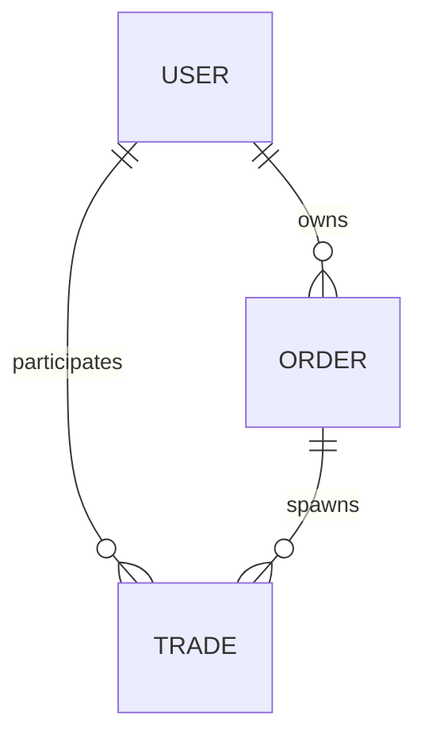

### 13.1 User modeli (field-aware)

#### Kimlik ve payout profile yapısı
- `wallet_address` birincil kullanıcı kimliğidir (lowercase EVM address).
- `payout_profile` yapısı rail-aware tutulur:
  - `rail`, `country`
  - `contact.{channel, value_enc}`
  - `payout_details_enc`
  - `fingerprint.{hash, version, last_changed_at}`
  - `updated_at`

#### Şifreleme ve public projection sınırı
- `contact.value_enc` ve `payout_details_enc` şifreli saklanır; plaintext kalıcı depoda tutulmaz.
- `toPublicProfile()` allowlist yaklaşımıyla yalnız güvenli alanları döndürür.
- `bank_change_history` ve payout detayları public profile’a sızdırılmaz.

#### Banka profil risk metadata’sı (authority değil)
- `profileVersion`
- `lastBankChangeAt`
- `bankChangeCount7d`
- `bankChangeCount30d`
- `bank_change_history` (rolling pencere hesabı için internal dizi)
- Bu alanlar anti-fraud/risk sinyalidir; kontrat enforcement authority’si değildir.

#### Reputation/ban mirror sınırı
- `reputation_cache` ve ban mirror alanları (`is_banned`, `banned_until`, `consecutive_bans`, `max_allowed_tier`) query/UI kolaylığı içindir.
- Kontrat ile çelişki durumunda otorite on-chain veridedir.
- Reputation extension içinde `partialSettlementCount` event-taxonomy amaçlı sayaçtır.
- `partialSettlementCount` tek başına ceza/failure anlamına gelmez.

### 13.2 Order modeli (field-aware)

#### Kimlik + lifecycle alanları
- `onchain_order_id` (numeric-string kimlik)
- `owner_address`, `side`, `status`, `tier`, `token_address`

#### Finansal/snapshot alanları
- `amounts.{total_amount, remaining_amount, min_fill_amount}` + `*_num` cache
- `reserves.{remaining_maker_bond_reserve, remaining_taker_bond_reserve}` + `*_num` cache
- `fee_snapshot.{taker_fee_bps, maker_fee_bps}`

#### Referans, timer ve yardımcı istatistik alanları
- `refs.order_ref` (event trace / idempotent ilişkilendirme için)
- `timers.{created_at_onchain, last_filled_at, canceled_at}`
- `stats.*` (`child_trade_count`, `active/resolved/canceled/burned` dağılımı, `total_filled_amount`)

#### Mirror sınırı
- Remaining/reserve değerleri backend’de hesaplanan authority değil; worker’ın kontrattan taşıdığı projeksiyon verisidir.

### 13.3 Trade modeli (field-aware)

#### Kimlik ve canonical ilişki
- `onchain_escrow_id` (child trade birincil kimliği)
- `parent_order_id`
- `parent_order_side`
- `trade_origin` (`ORDER_CHILD` / `DIRECT_ESCROW`)
- `canonical_refs.{listing_ref, order_ref}` (`listing_ref` legacy ABI/event trace alanıdır; `order_ref` parent order bağını taşır)

#### Fill ve fee ilişkisi
- `fill_metadata.{fill_amount, filler_address, remaining_amount_after_fill}` (+ num cache’ler)
- `fee_snapshot.{taker_fee_bps, maker_fee_bps}`

#### BigInt-safe finansal strateji
- Otoritatif finansal alanlar string tutulur:
  - `financials.crypto_amount`
  - `financials.maker_bond`
  - `financials.taker_bond`
  - `financials.total_decayed`
  - `financials.burned_amount`
- `*_num` alanları yalnız UI/aggregation kolaylığı içindir; enforcement input’u değildir.

#### PII / receipt / payout snapshot alanları
- `evidence.ipfs_receipt_hash`
- `evidence.receipt_encrypted`
- `evidence.receipt_timestamp`
- `evidence.receipt_delete_at`
- `evidence.receipt_delete_at` dekont yüklemesinden 30 gün sonrasına ayarlanır.
- `payout_snapshot.{maker,taker,...}` altında lock-time `profile_version_at_lock`, `bank_change_count_*_at_lock`, `fingerprint_hash_at_lock` gibi risk bağlamı alanları tutulur.
- `payout_snapshot.{captured_at, snapshot_delete_at, is_complete, incomplete_reason}`: `captured_at` doluysa snapshot bir daha yazılmaz (tek seferlik); eksik profil `is_complete=false` + gerekçe olarak kalır.

#### Cancel / chargeback audit alanları
- `cancel_proposal.{proposed_by, proposed_at, approved_by, maker_signed, taker_signed}` — on-chain `CancelProposed` / `CancelRevoked` mirror'ıdır; ayrı imza ya da deadline alanı yoktur (iptal koordinasyonu tamamen on-chain)
- `chargeback_ack.{acknowledged, acknowledged_by, acknowledged_at, ip_hash}`
- `settlement_proposal` taraf-imzalı partial-settlement lifecycle mirror’ını taşır:
  - `NONE -> PROPOSED -> REJECTED/WITHDRAWN/EXPIRED/FINALIZED`
  - split settlement **normal close path değildir**; proposal/accept yalnız `CHALLENGED` state’inde geçerlidir
  - proposer trade taraflarından biridir; accept/reject yalnız karşı tarafla tamamlanır
  - backend yalnız mirror/audit tutar; settlement authority kontratta kalır

#### Retention ve terminal TTL ayrımı
- Trade dokümanı terminal state’lerde `timers.resolved_at` üzerinden 365 günlük TTL index ile temizlenir; kümülatif istatistik `TerminalTradeStat` satırlarında kalır.
- Receipt/snapshot alanları için ayrı cleanup alanları (`receipt_delete_at`, `snapshot_delete_at`) ve job’lar kullanılır.
- Bu ayrım “belge yaşam döngüsü” ile “hassas payload minimizasyonu”nu birbirinden ayırır.

### 13.4 Feedback / stats/snapshot katmanı
- Feedback modeli ürün geri bildirimi için ayrı operational yüzeydir.
- Diğer modeller: `TerminalTradeStat` (kalıcı terminal sayaç), `HistoricalStat`, `RevenueEvent` (vault/escrow gelir mirror'ı), `RewardEpoch`, `RewardClaim`, `RewardFunding`, `RewardEpochAllocationEvent` (ödül read-model'i), `TermsAcceptance` (kullanım koşulları onayı).
- Stats/snapshot katmanı (daily aggregates, dashboard counters) karar desteği üretir; protocol authority üretmez.
- Read-model snapshot’ları kontrat state’inin yerini almaz; yalnız operatör görünürlüğünü artırır.

---

## 14. Backend route surface ve coordination semantiği

V3 backend yüzeyi authority üretmez; route’lar projection, coordination ve güvenlik sınırlarını uygular.

| Route grubu | Yüzey | Anlam |
|---|---|---|
| Orders (`/api/orders`) | `GET /config`, `GET /payment-risk-config`, `GET /`, `GET /my`, `POST /market-meta`, `GET /:id/trades`, `GET /:id` | Market read-model, owner görünürlüğü ve off-chain pazar metadata'sı |
| Trades (`/api/trades`) | `GET /my`, `GET /history`, `GET /by-escrow/:onchainId`, `GET /:id`, `GET /:id/settlement-proposal`, `POST /:id/settlement-proposal/preview`, `POST /:id/chargeback-ack` | Child-trade okuma, settlement önizleme ve audit yardımcı yüzeyi |
| Auth (`/api/auth`) | `GET /nonce`, `POST /verify`, `POST /refresh`, `POST /logout`, `GET /me`, `PUT /profile` | Session ve wallet-bound auth authority sınırı |
| PII (`/api/pii`) | `GET /my`, `GET /taker-name/:onchainId`, `POST /request-token/:tradeId`, trade-scoped retrieve | Snapshot-first, role-bound hassas veri erişimi |
| Receipts (`/api/receipts`) | `POST /upload` | Taker + `LOCKED` state için tek seferlik dekont yükleme |
| Rewards (`/api/rewards`) | epoch, funding, `/:wallet/claimable`, `/:wallet/history`, `/health` | Salt-okunur ödül görünümü; kayıt/claim kontratta |
| Admin (`/api/admin`) | `GET /revenue`, `/rewards/health`, `/summary`, `/feedback`, `/trades`, `/settlement-proposals` | Yalnız `ADMIN_WALLETS` listesindeki oturumlara açık, salt-okunur gözlem; hiçbir protokol yetkisi yoktur |
| Logs / stats / feedback / reference rates | `POST /api/logs/client-error`, `GET /api/stats`, `POST /api/feedback`, `GET /api/reference-rates/ticker` | Observability, ürün geri bildirimi ve bilgilendirme amaçlı kur şeridi |

### 14.1 Orders routes
- Parent order read/config yüzeyi
- Owner-scope child-trade list/read yüzeyi

### 14.2 Trades routes
- active/history/by-escrow kimlikli okuma
- iptal koordinasyonu backend'de değildir: `proposeOrApproveCancel` / `revokeCancel` doğrudan kontrata gönderilir, backend yalnız event'leri mirror eder
- chargeback ack audit surface (yalnız maker, `PAID`/`CHALLENGED`; on-chain akışa veto uygulamaz)
- settlement-proposal preview + mirror read yüzeyi bilgilendirme/non-authoritative amaçlıdır
- preview yalnız `CHALLENGED` trade için açıktır; non-challenged istekler reddedilir
- backend rolü: preview, event mirror, read-model, audit/observability
- nihai settlement ekonomisi on-chain belirlenir; backend outcome finalize edemez
- settlement finalization’da fee, decay sonrası gross maker/taker split payout üzerinden uygulanır
- backend’in rolü olmayanlar: outcome belirleme, release/cancel/burn/payout override, reputation authority yazma, fon transferi

### 14.2.1 Payment risk sınırı
- `PaymentRiskLevel`, payment rail complexity sinyalidir (UI/read-model).
- Kullanıcı güven/reputation skoru değildir; on-chain authority kaynağı olamaz.

### 14.3 Auth routes
- nonce/verify/refresh/logout/me/profile
- session-wallet mismatch guard

### 14.4 PII routes
- `/my`, `taker-name`, request-token, trade-scoped retrieve
- snapshot-first ve role-bound access

### 14.5 Receipts routes
- file validation (magic byte / MIME eşleşmesi) + encryption + SHA-256 hash
- yalnız taker + `LOCKED` state kabulü; trade başına tek dekont (üzerine yazma `409`)

### 14.6 Logs/stats/feedback
- client error logs
- protocol stats read surface
- feedback intake

---

## 15. Frontend UX guardrail katmanı

Frontend enforcement değildir; ama runtime orchestration ve fail-fast UX guardrail katmanı olarak kritik rol oynar.

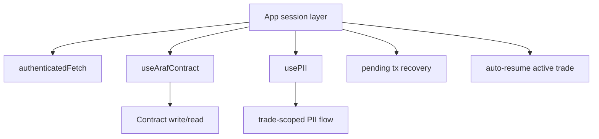

### 15.1 Runtime orchestration: `useArafContract`
- Tüm write çağrılarında preflight guard:
  - wallet client var mı
  - kontrat adresi geçerli mi (`VITE_ESCROW_ADDRESS`)
  - chain destekli mi
- İşlem gönderildikten sonra receipt beklenir; pending tx hash’i `localStorage(araf_pending_tx)` altında saklanır.
- Fill akışlarında `OrderFilled` event decode edilerek `tradeId` çıkarılır; frontend trade kimliği uydurmaz, receipt’ten okur.

### 15.2 Runtime orchestration: `usePII`
- PII akışı 2 adımlıdır:
  1) `pii/request-token/:tradeId`
  2) `pii/:tradeId` (Bearer + cookie session birlikte)
- API path canonicalization `buildApiUrl(...)` üstünden zorlanır.
- `authenticatedFetch` ile me/refresh orkestrasyonu merkezileştirilir.
- Her yeni PII isteğinde önceki request `AbortController` ile iptal edilir; stale response state’i ezemez.
- Unmount/trade değişiminde hassas PII state temizlenir.

### 15.3 Session mismatch ve recovery UX
- `authenticatedFetch` 409 (`SESSION_WALLET_MISMATCH`) gördüğünde backend logout + local session cleanup uygular.
- 401 durumunda `auth/refresh` denenir; başarısızsa kullanıcı yeniden imza akışına yönlendirilir.
- Bağlı cüzdan ile authenticated wallet ayrışırsa fail-fast logout/re-entry davranışı uygulanır.

### 15.4 Wrong-network / wrong-address fail-fast
- Desteklenmeyen chain’de kontrat write çağrısı başlamadan hata verilir.
- Geçersiz/sıfır kontrat adresi durumunda işlem başlatılmaz.
- Amaç zincir dışı silent-failure yerine kullanıcıya erken ve net hata geri bildirimi vermektir.

### 15.5 Provider/bootstrap notları
- App session katmanı açılışta pending tx recovery kontrolü yapar; 24 saatten eski/bozuk hash’ler temizlenir.
- Aynı katman aktif trade’i otomatik resume ederek kullanıcıyı doğru trade room’a döndürebilir.

### 15.6 Frontend enforcement sınırı
Frontend kontratın yerine geçmez; enforcement kontrattadır. Frontend guardrail/orchestration katmanıdır.

### 15.7 Kod yerleşimi (`frontend/src`)
- `hooks/`: `useArafContract` (escrow okuma/yazma), `usePII`, `useRewardsContract`
- `app/providers/`: `SessionProvider` (SIWE oturumu), `AppProviders`, `ThemeProvider`; `app/useAppSessionData.jsx` (`authenticatedFetch`, pending tx kurtarma, aktif trade'e dönüş)
- `app/contexts/`: bağlam bazlı ekranlar — `marketplace`, `trade-room` (karar modeli, zaman çizelgesi, birincil/ikincil aksiyonlar), `operations`, `profile` (ödeme profili, aktif trade'ler, ödüller), `settlement`, `admin` (salt-okunur panel)
- `app/actions/`: kontrat yaşam döngüsü ve order oluşturma aksiyonları; `app/payoutProfileGate.js`: ödeme profili kapısı (§12.4.1); `app/chainPolicy.js`, `app/apiConfig.js`: zincir ve API yolu politikası; `app/copy/`: kullanıcı metinleri

---

## 16. Saldırı vektörleri ve bilinen sınırlamalar

### 16.1 Azaltılmış / mitigated riskler

| Risk | Azaltım |
|---|---|
| Maker'ın ping atıp susarak PAID trade'i rehin tutması | Ping `ping+48sa`'te düşer (`MAKER_CHALLENGE_WINDOW`), taker `pingMaker` → `autoRelease` yolunu kullanır |
| Bond'suz (Tier 0) taker'ın LOCKED trade'i rehin tutması | `PAYMENT_WINDOW` (48 saat) + `expirePaymentWindow`; `reportPayment` pencere sonrası `PaymentWindowClosed` |
| Settlement oranının kabul öncesi değiştirilmesi | `acceptSettlement(tradeId, expectedProposalId)`; uyuşmazlıkta `SettlementProposalMismatch` |
| Owner'ın rewards adresini değiştirip ödül rezervini çekmesi | `ArafRevenueVault.setRewards` tek seferlik (`RewardsAlreadySet`) |
| Yanlış token decimals ile tier tavanı / ödül notional'ı bozulması | `setTokenConfig` token'ın `decimals()` değerini zincirde doğrular (`InvalidDecimals`) |
| Burn'de erimiş kısmın escrow'da kalıcı kilitlenmesi | `burnExpired` trade'in tüm bakiyesini hazineye gönderir |
| Create sonrası cezalanan order sahibinin order'ının doldurulması | Fill anında sahibin ban'ı ve efektif tier'ı yeniden kontrol edilir |
| Backend authority confusion (kısmen azaltıldı) | doküman + route projection sınırları + worker mirror uyarıları ile backend’in “hakem” gibi yorumlanma riski daraltıldı. |
| Session/account confusion | cookie wallet ↔ header wallet mismatch durumunda request reddi + refresh family revoke + cookie clear zinciri uygulanır. |
| PII overexposure | trade-scoped token + role/state/session üçlü kontrolü + snapshot-first + no-store semantiği. |
| API path drift | frontend canonical path helper kullanımıyla farklı endpoint kökü kaynaklı sessiz hatalar azaltıldı. |
| Wrong-network tx riski (UX düzeyinde) | chain/address preflight guard’ları ile işlem başlamadan fail-fast. |

### 16.2 Kalan / open riskler

| Risk | Açıklama |
|---|---|
| Governance key risk | mutable fee/cooldown/token config/reputation politikası/treasury yüzeyi owner kontrolündedir; zaman kilidi yoktur, multisig ve operasyon disiplini gerektirir. |
| `renounceOwnership` | `Ownable` mirası kapatılmamıştır; çağrılırsa owner yüzeyleri (pause dahil) kalıcı kilitlenir. |
| Fake receipt / off-chain payment ambiguity | dekont hash’i ve encrypted payload fraud’u pahalılaştırır ama fiat transferin maddi gerçekliğini matematiksel kanıtlamaz. |
| Chargeback reality | bankacılık katmanındaki geri alma/itiraz süreçleri zincir üstü finaliteyi dış dünyada tartışmalı hale getirebilir. |
| Açık kalan iptal onayı | iptal koordinasyonu on-chain'dir (imza/deadline yok). Verilen onay, state değişmedikçe karşı taraf ikinci onayı verene kadar geçerli kalır; kullanıcı vazgeçerse `revokeCancel` ile geri çekmelidir (`reportPayment` / `challengeTrade` onayları zaten sıfırlar). |
| Ödeme profili kapısı yalnız UI/API'dedir | kontrat doğrudan çağrılarak atlanabilir; güvence eksik snapshot → PII kapalı → ödeme penceresi kuralıdır (§12.4.1). |
| Backend mirror’in authority sanılması | operatör veya entegratör, Mongo/state cache’i yanlışlıkla source-of-truth okuyabilir. |
| Frontend wrong-network/wrong-address configuration riski | guardrail’e rağmen yanlış env/config dağıtımı kullanıcıyı yanıltabilir. |
| Operator/doc misunderstanding riski | eski listing-first veya “backend hakemdir” gibi mental model kalıntıları operasyonel hataya yol açabilir. |

### 16.3 Bilinçli sınırlamalar (oracle-free model)
- Oracle-free tasarım gereği fiat transferin “gerçekten yapıldı mı” sorusu kontrat içinde kesin doğrulanmaz.
- Sistem mutlak hakemlik yerine ekonomik teşvik/ceza ve zaman-bazlı decay mekanizmasıyla kötü davranışı pahalılaştırır.
- Bu bilinçli sınır, merkezi oracle/arbiter güven varsayımını azaltırken sosyal/operasyonel uyuşmazlık riskini tamamen yok etmez.

---

## 17. Legacy concepts (historical / deprecated / non-canonical)

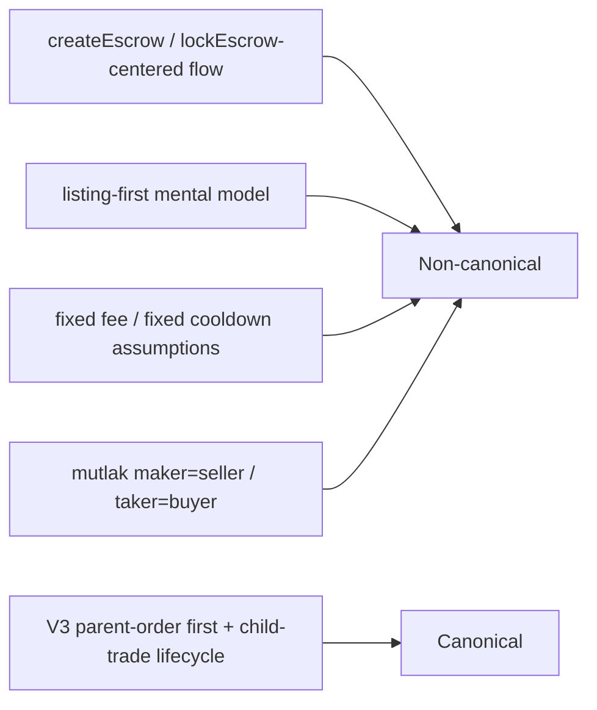

Aşağıdakiler canlı V3 mimarinin canonical yüzeyi değildir:
- createEscrow/lockEscrow merkezli anlatı
- listing-first market primitive
- fixed fee/fixed cooldown varsayımları
- maker=seller, taker=buyer mutlaklığı
- old single-dimension token support dili

Legacy içerik yalnız tarihsel bağlam için tutulmalı; operasyonel kararlar bu doküman + source-of-truth kod üzerinden verilmelidir.

---

## 18. Sonuç: bu dokümanın rolü

Bu metin iki rolü aynı anda taşır:
1. V3 canonical modelin kısa ve net çerçevesi
2. Ekip içi operasyonel/teknik referans (security, data model, runtime reliability, guardrails, attack surface)

Dolayısıyla doküman ne yalnız “özet”, ne de stale legacy metin kopyasıdır; güncel V3 gerçekliğe hizalanmış kapsamlı teknik referanstır.

*Araf Protokolü — V3 Order-First canonical docs*

