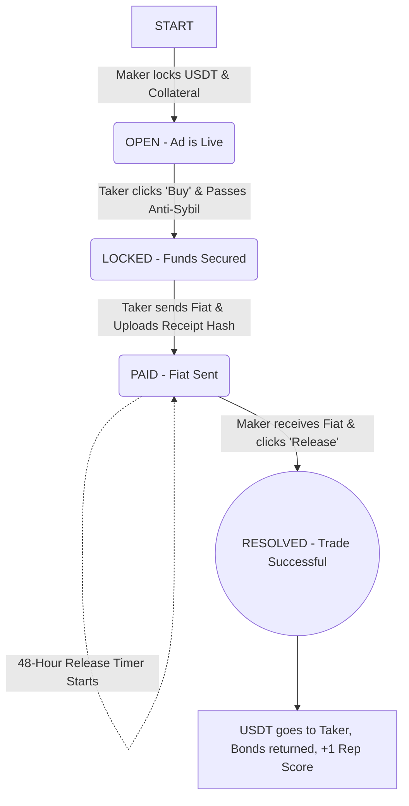
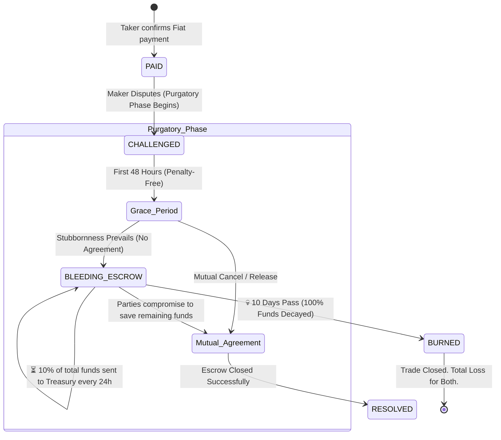
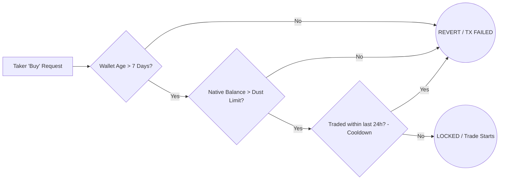
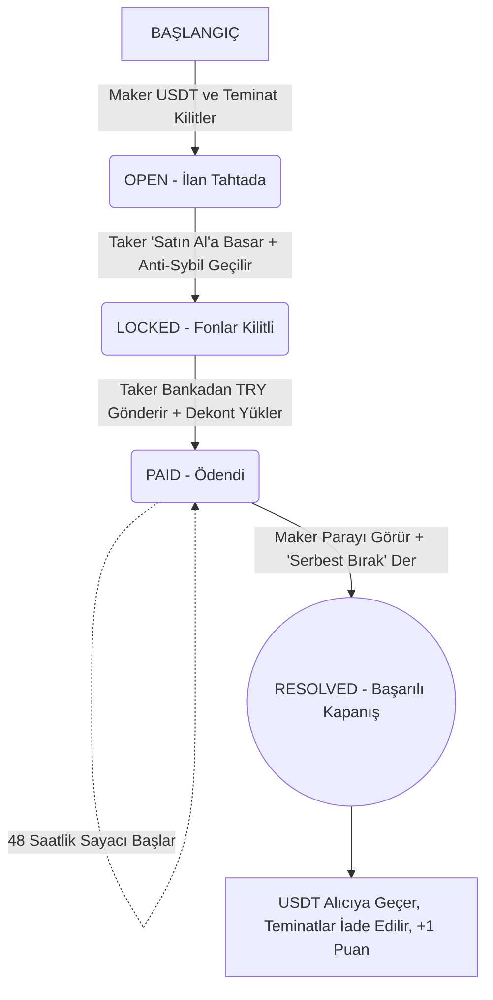
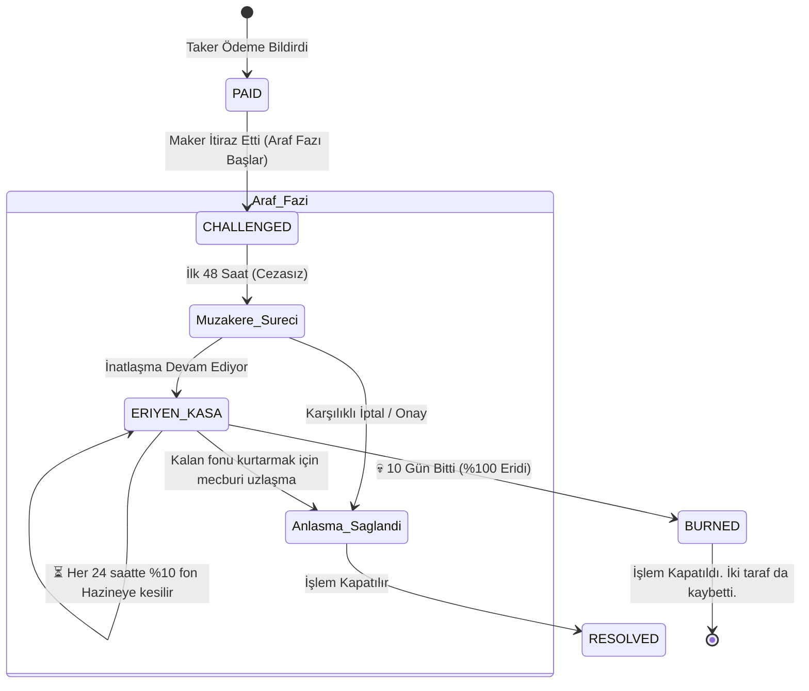
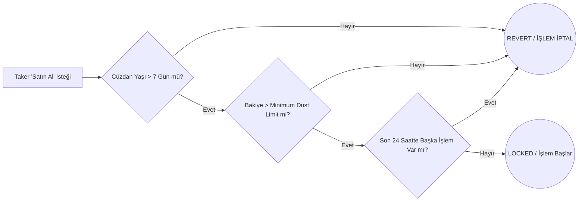

```markdown
# 🔄 Araf Protocol - Visual Workflows & Diagrams

This document contains the visual flowcharts of the Araf Protocol's smart contract logic, Game Theory mechanics, and Anti-Sybil shield.
*(Bu doküman, Araf Protocol'ün akıllı kontrat mantığını, Oyun Teorisi mekaniklerini ve Anti-Sybil kalkanını gösteren görsel iş akışlarını içerir.)*

---

## 🇬🇧 ENGLISH WORKFLOWS

### 1. Standard Trade Flow (The Happy Path)
The standard, dispute-free process where both Maker and Taker act honestly.



### 2. Dispute & Time-Decay Burn (Purgatory Phase)

The Game Theory mechanism that makes scamming unprofitable.



### 3. Anti-Sybil Shield (Taker Entry Logic)

The on-chain filters protecting the 0% bond entry for Tier 1 users from bot networks.



---

## 🇹🇷 TÜRKÇE İŞ AKIŞLARI

### 1. Standart İşlem Akışı (Mutlu Senaryo)

Hem Satıcının (Maker) hem de Alıcının (Taker) dürüst davrandığı ve uyuşmazlık çıkmayan standart süreç.



### 2. Uyuşmazlık, Araf ve Eriyen Kasa (Oyun Teorisi)

Dolandırıcılığı ve şantajı matematiksel olarak kârsız hale getiren oyun teorisi mekanizması.



### 3. Anti-Sybil Kalkanı (Troll Koruması)

Tier 1 kullanıcıları için %0 teminat girişini bot ağlarından koruyan zincir-içi filtreler.


